# API集成与适配

<cite>
**本文档引用的文件**
- [ai-providers.js](file://ai-doc-generator/src/api/ai-providers.js)
- [mimo.js](file://ai-doc-generator/src/api/mimo.js)
- [App.jsx](file://ai-doc-generator/src/App.jsx)
- [ChatPanel.jsx](file://ai-doc-generator/src/components/ChatPanel.jsx)
- [ConfigPanel.jsx](file://ai-doc-generator/src/components/ConfigPanel.jsx)
- [package.json](file://ai-doc-generator/package.json)
- [README.md](file://ai-doc-generator/README.md)
</cite>

## 目录
1. [简介](#简介)
2. [项目结构](#项目结构)
3. [核心组件](#核心组件)
4. [架构概览](#架构概览)
5. [详细组件分析](#详细组件分析)
6. [依赖关系分析](#依赖关系分析)
7. [性能考虑](#性能考虑)
8. [故障排除指南](#故障排除指南)
9. [结论](#结论)
10. [附录](#附录)

## 简介

AI提供商API集成系统是一个基于React的多AI提供商集成平台，支持7种主流AI服务提供商的统一API接口设计。该系统通过适配器模式实现了不同AI提供商API的标准化，提供了统一的调用接口、错误处理机制、重试逻辑和超时控制。

系统的核心设计理念是"统一接口，差异化适配"，即通过PROVIDERS配置对象统一管理各个AI提供商的差异，同时保持对外接口的一致性。这种设计使得开发者可以轻松地在不同AI提供商之间切换，而无需修改业务逻辑代码。

## 项目结构

该项目采用模块化的前端架构，主要分为以下几个核心模块：

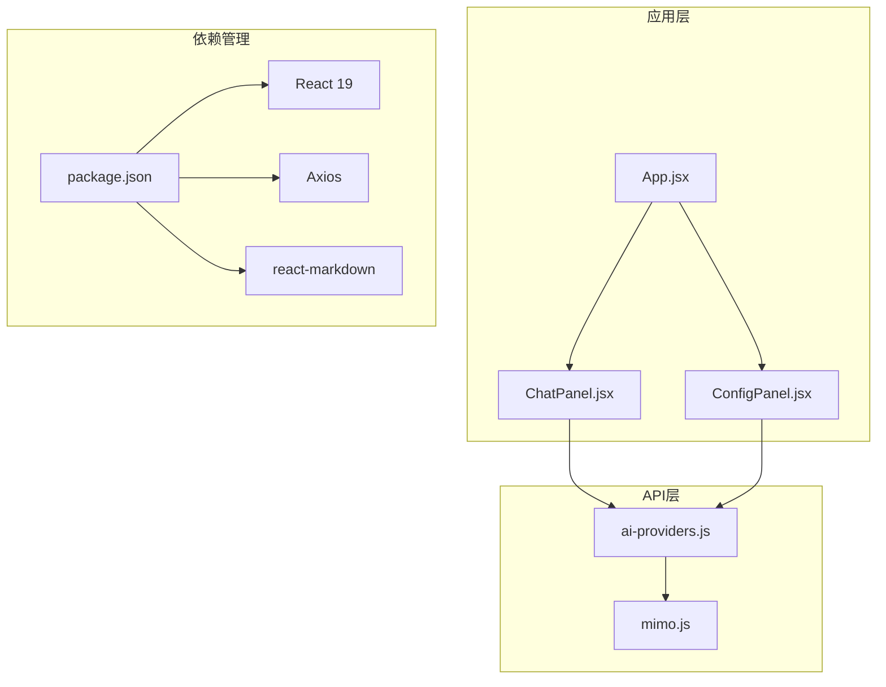

**图表来源**
- [App.jsx:1-37](file://ai-doc-generator/src/App.jsx#L1-L37)
- [ai-providers.js:1-344](file://ai-doc-generator/src/api/ai-providers.js#L1-L344)
- [package.json:1-28](file://ai-doc-generator/package.json#L1-L28)

**章节来源**
- [App.jsx:1-37](file://ai-doc-generator/src/App.jsx#L1-L37)
- [package.json:1-28](file://ai-doc-generator/package.json#L1-L28)

## 核心组件

### PROVIDERS配置对象

PROVIDERS配置对象是整个系统的核心，它定义了所有支持的AI提供商及其配置信息。每个提供商都包含以下关键属性：

- **name**: 提供商的显示名称
- **apiUrl**: API端点地址
- **models**: 支持的模型列表
- **icon**: 供应商图标

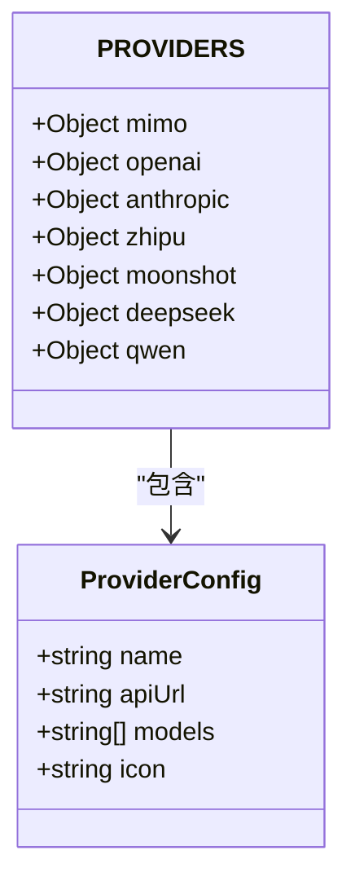

**图表来源**
- [ai-providers.js:4-47](file://ai-providers.js#L4-L47)

**章节来源**
- [ai-providers.js:4-47](file://ai-doc-generator/src/api/ai-providers.js#L4-L47)

### 统一API调用函数

`callAIProvider`函数实现了统一的API调用接口，支持所有7种AI提供商。该函数的核心特点是通过条件判断来处理不同提供商的API差异。

**章节来源**
- [ai-providers.js:60-181](file://ai-doc-generator/src/api/ai-providers.js#L60-L181)

## 架构概览

系统采用分层架构设计，通过适配器模式实现API标准化：

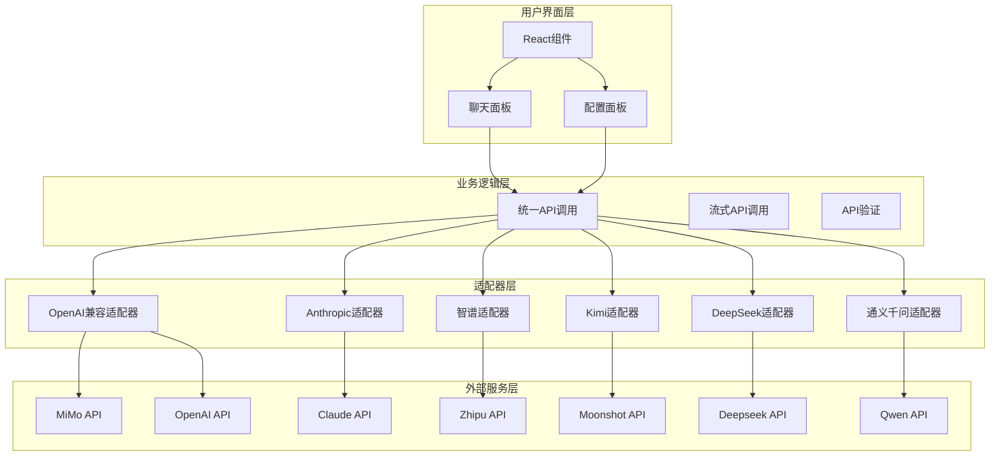

**图表来源**
- [ai-providers.js:50-181](file://ai-doc-generator/src/api/ai-providers.js#L50-L181)
- [ChatPanel.jsx:13-46](file://ai-doc-generator/src/components/ChatPanel.jsx#L13-L46)

## 详细组件分析

### 统一API调用实现

#### 请求构建策略

系统针对不同AI提供商采用了差异化的请求构建策略：

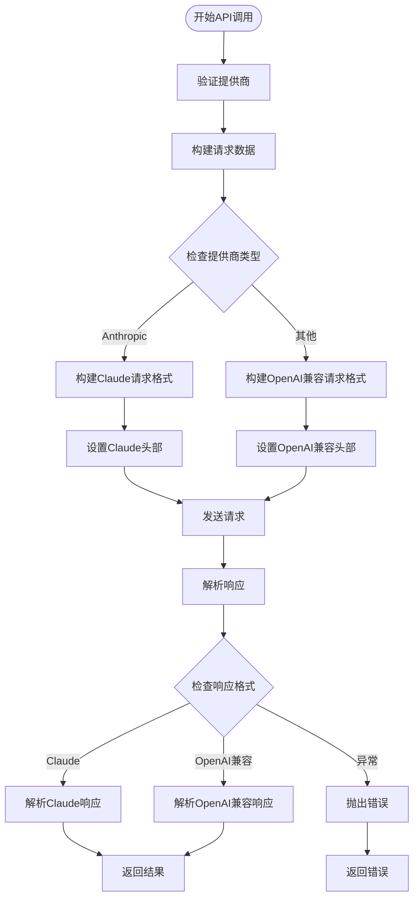

**图表来源**
- [ai-providers.js:80-145](file://ai-doc-generator/src/api/ai-providers.js#L80-L145)

#### 错误处理机制

系统实现了多层次的错误处理机制：

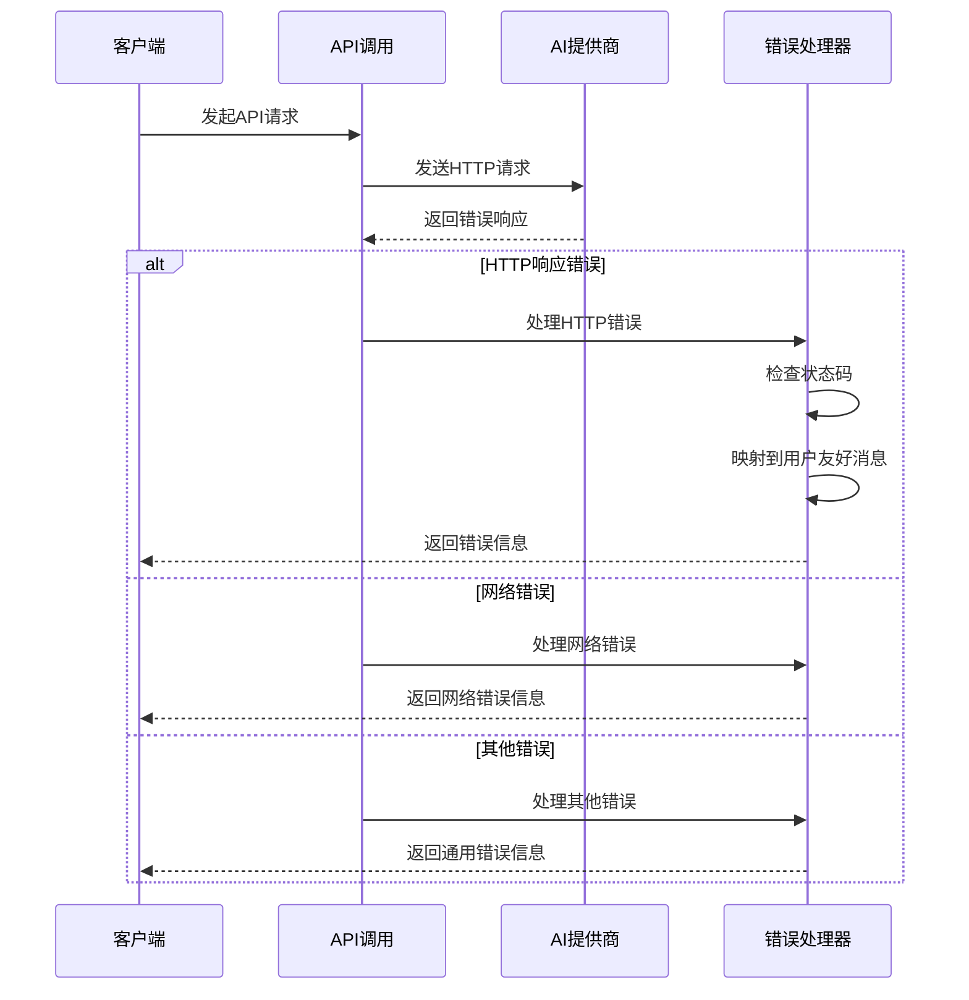

**图表来源**
- [ai-providers.js:146-180](file://ai-doc-generator/src/api/ai-providers.js#L146-L180)

**章节来源**
- [ai-providers.js:146-180](file://ai-doc-generator/src/api/ai-providers.js#L146-L180)

### 流式输出支持

#### SSE流式传输实现

系统支持Server-Sent Events (SSE)流式传输，实现实时输出效果：

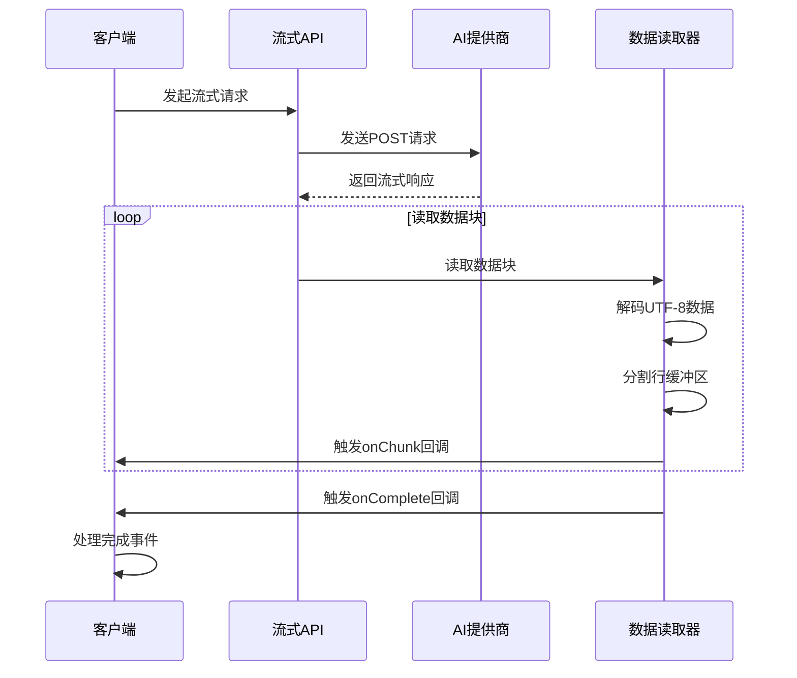

**图表来源**
- [ai-providers.js:190-309](file://ai-doc-generator/src/api/ai-providers.js#L190-L309)

**章节来源**
- [ai-providers.js:190-309](file://ai-doc-generator/src/api/ai-providers.js#L190-L309)

### 各AI提供商适配器分析

#### Anthropic Claude适配器

Claude适配器实现了独特的请求格式和响应解析：

| 属性 | Claude格式 | OpenAI兼容格式 |
|------|------------|----------------|
| 模型参数 | `model` | `model` |
| 最大令牌数 | `max_tokens` | `max_tokens` |
| 温度控制 | `temperature` | `temperature` |
| 系统提示 | `system` | `messages[0].content` |
| 用户消息 | `messages` | `messages` |
| 流式支持 | `stream: true` | `stream: true` |

**章节来源**
- [ai-providers.js:85-101](file://ai-doc-generator/src/api/ai-providers.js#L85-L101)
- [ai-providers.js:133-143](file://ai-doc-generator/src/api/ai-providers.js#L133-L143)

#### OpenAI兼容适配器

OpenAI兼容适配器支持多个提供商的统一处理：

```mermaid
classDiagram
class OpenAICompatibleAdapter {
+buildRequestData()
+parseResponse()
+setHeaders()
}
class MiMoProvider {
+apiUrl : "https : //api.mimo.xiaomimimo.com/v1/chat/completions"
+models : ["mimo-v2.5", "mimo-vision"]
}
class OpenAIProvider {
+apiUrl : "https : //api.openai.com/v1/chat/completions"
+models : ["gpt-4o", "gpt-4o-mini"]
}
class ZhipuProvider {
+apiUrl : "https : //open.bigmodel.cn/api/paas/v4/chat/completions"
+models : ["glm-4", "glm-3-turbo"]
}
class MoonshotProvider {
+apiUrl : "https : //api.moonshot.cn/v1/chat/completions"
+models : ["moonshot-v1-8k"]
}
class DeepseekProvider {
+apiUrl : "https : //api.deepseek.com/chat/completions"
+models : ["deepseek-chat"]
}
class QwenProvider {
+apiUrl : "https : //dashscope.aliyuncs.com/compatible-mode/v1/chat/completions"
+models : ["qwen-max", "qwen-plus"]
}
OpenAICompatibleAdapter --> MiMoProvider
OpenAICompatibleAdapter --> OpenAIProvider
OpenAICompatibleAdapter --> ZhipuProvider
OpenAICompatibleAdapter --> MoonshotProvider
OpenAICompatibleAdapter --> DeepseekProvider
OpenAICompatibleAdapter --> QwenProvider
```

**图表来源**
- [ai-providers.js:102-125](file://ai-doc-generator/src/api/ai-providers.js#L102-L125)

**章节来源**
- [ai-providers.js:102-125](file://ai-doc-generator/src/api/ai-providers.js#L102-L125)

### 用户界面组件

#### 配置面板设计

配置面板提供了直观的用户界面来管理API配置：

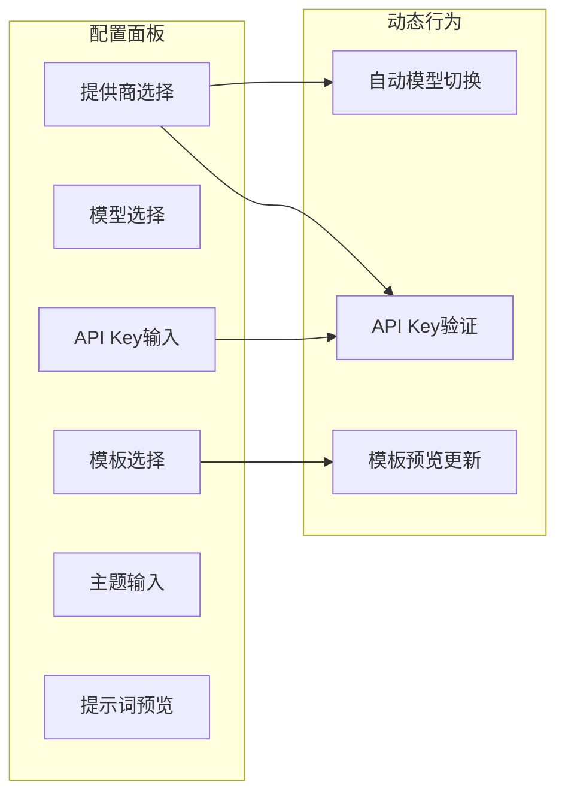

**图表来源**
- [ConfigPanel.jsx:13-26](file://ai-doc-generator/src/components/ConfigPanel.jsx#L13-L26)
- [ConfigPanel.jsx:28-33](file://ai-doc-generator/src/components/ConfigPanel.jsx#L28-L33)

**章节来源**
- [ConfigPanel.jsx:13-26](file://ai-doc-generator/src/components/ConfigPanel.jsx#L13-L26)
- [ConfigPanel.jsx:28-33](file://ai-doc-generator/src/components/ConfigPanel.jsx#L28-L33)

#### 聊天面板实现

聊天面板实现了完整的对话交互功能：

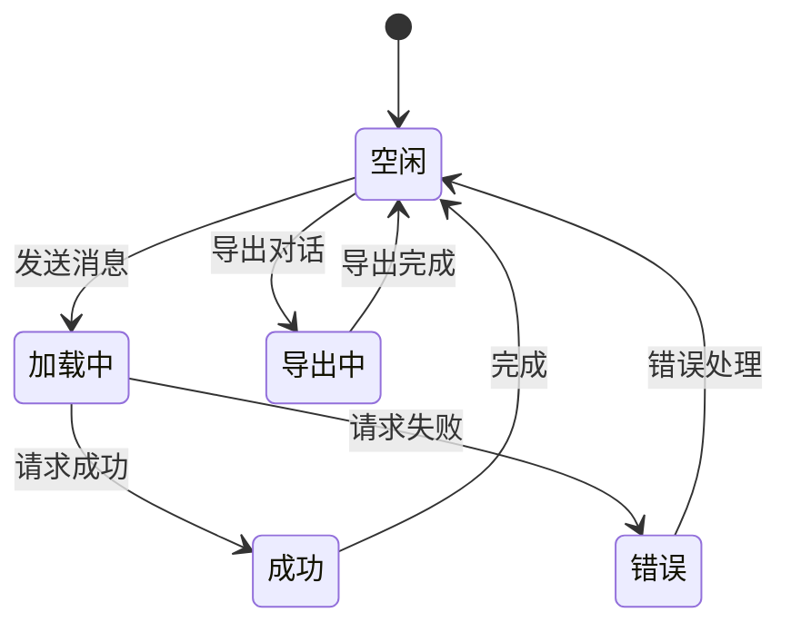

**图表来源**
- [ChatPanel.jsx:13-46](file://ai-doc-generator/src/components/ChatPanel.jsx#L13-L46)
- [ChatPanel.jsx:55-75](file://ai-doc-generator/src/components/ChatPanel.jsx#L55-L75)

**章节来源**
- [ChatPanel.jsx:13-46](file://ai-doc-generator/src/components/ChatPanel.jsx#L13-L46)
- [ChatPanel.jsx:55-75](file://ai-doc-generator/src/components/ChatPanel.jsx#L55-L75)

## 依赖关系分析

### 外部依赖管理

项目使用现代化的前端技术栈，主要依赖包括：

```mermaid
graph TB
subgraph "核心依赖"
React[React 19.2.5]
ReactDOM[React DOM]
Axios[Axios 1.15.2]
end
subgraph "UI增强"
Markdown[react-markdown 10.1.0]
Highlight[rehype-highlight 7.0.2]
Icons[lucide-react 1.14.0]
end
subgraph "开发工具"
Vite[Vite 5.4.11]
Plugin[@vitejs/plugin-react 4.3.4]
end
subgraph "代码高亮"
HLJS[highlight.js 11.11.1]
end
React --> ReactDOM
React --> Markdown
Markdown --> Highlight
Markdown --> HLJS
Vite --> Plugin
Axios --> React
```

**图表来源**
- [package.json:14-26](file://ai-doc-generator/package.json#L14-L26)

**章节来源**
- [package.json:14-26](file://ai-doc-generator/package.json#L14-L26)

### 组件间依赖关系

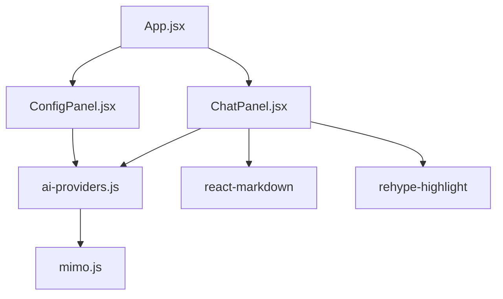

**图表来源**
- [App.jsx:1-37](file://ai-doc-generator/src/App.jsx#L1-L37)
- [ChatPanel.jsx:1-6](file://ai-doc-generator/src/components/ChatPanel.jsx#L1-L6)

**章节来源**
- [App.jsx:1-37](file://ai-doc-generator/src/App.jsx#L1-L37)

## 性能考虑

### 超时控制

系统实现了多层超时控制机制：

- **HTTP请求超时**: 默认60秒超时时间
- **流式请求超时**: 通过fetch的AbortController实现
- **响应解析超时**: 防止长时间无响应

### 错误重试策略

虽然当前实现未包含自动重试逻辑，但系统为未来的重试机制预留了扩展点：

```javascript
// 建议的重试机制实现
const retryConfig = {
  maxRetries: 3,
  baseDelay: 1000,
  maxDelay: 10000,
  retryableStatusCodes: [429, 500, 502, 503, 504]
}
```

### 内存管理

流式处理实现了高效的内存管理：

- **缓冲区管理**: 使用增量缓冲区避免内存溢出
- **数据流处理**: 逐块处理数据，减少内存占用
- **资源清理**: 及时释放读取器和解码器资源

## 故障排除指南

### 常见问题诊断

#### API Key验证

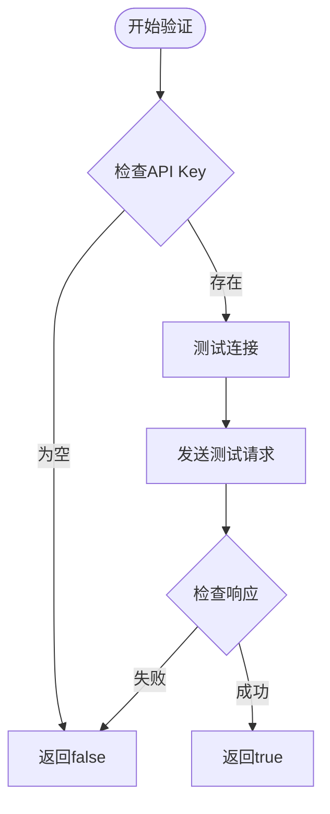

**图表来源**
- [ai-providers.js:317-329](file://ai-doc-generator/src/api/ai-providers.js#L317-L329)

#### 错误状态码映射

| 状态码 | 错误类型 | 用户友好消息 |
|--------|----------|-------------|
| 401 | 认证失败 | API Key无效或已过期，请检查后重试 |
| 403 | 权限不足 | 权限不足，请确认账户状态 |
| 404 | 端点不存在 | API端点不存在，请检查配置 |
| 429 | 请求频率过高 | 请求过于频繁，请稍后重试 |
| 500 | 服务器错误 | 服务器错误，请稍后重试 |

**章节来源**
- [ai-providers.js:146-179](file://ai-doc-generator/src/api/ai-providers.js#L146-L179)

### 调试技巧

1. **启用详细日志**: 在开发环境中启用Axios拦截器
2. **网络监控**: 使用浏览器开发者工具监控网络请求
3. **响应验证**: 检查API响应的结构和字段完整性
4. **超时测试**: 测试不同网络环境下的超时行为

## 结论

AI提供商API集成系统通过统一的适配器模式成功实现了7种不同AI提供商的标准化集成。该系统具有以下优势：

- **高度可扩展**: 新增AI提供商只需扩展PROVIDERS配置对象
- **统一接口**: 保持对外API的一致性，简化业务逻辑
- **健壮性**: 完善的错误处理和超时控制机制
- **用户体验**: 支持流式输出和实时预览

系统的架构设计为未来的功能扩展奠定了良好的基础，包括自动重试机制、缓存策略和更复杂的错误恢复机制。

## 附录

### 新增AI提供商扩展指南

#### 配置格式要求

```javascript
// 在PROVIDERS对象中添加新的提供商配置
export const PROVIDERS = {
  // ... 现有提供商配置
  
  newProvider: {
    name: '新提供商名称',
    apiUrl: 'https://api.newprovider.com/v1/chat/completions',
    models: ['model1', 'model2'],
    icon: '🌟'
  }
}
```

#### 认证方式支持

系统支持两种主要的认证方式：

1. **Bearer Token认证**（OpenAI兼容）
2. **API Key认证**（Anthropic）

#### 响应处理扩展

如果新提供商的响应格式与现有格式不兼容，需要在`callAIProvider`函数中添加相应的解析逻辑：

```javascript
// 在响应解析部分添加新提供商的处理逻辑
} else if (provider === 'newProvider') {
  // 新提供商特定的响应解析
  return response.data.choices[0].message.content
}
```

#### 流式输出支持

如果新提供商支持SSE流式传输，需要在`callAIProviderStream`函数中添加相应的处理逻辑：

```javascript
// 在流式处理部分添加新提供商的支持
} else if (provider === 'newProvider') {
  // 新提供商特定的流式数据解析
  content = parsed.choices?.[0]?.delta?.content || ''
}
```

**章节来源**
- [ai-providers.js:4-47](file://ai-doc-generator/src/api/ai-providers.js#L4-L47)
- [ai-providers.js:50-181](file://ai-doc-generator/src/api/ai-providers.js#L50-L181)

### API调用示例

#### 基本文本生成

```javascript
const response = await callAIProvider({
  provider: 'openai',
  apiKey: 'your-api-key',
  model: 'gpt-4o',
  prompt: '请生成一份关于React的技术文档',
  history: []
})
```

#### 流式输出处理

```javascript
await callAIProviderStream({
  provider: 'anthropic',
  apiKey: 'your-api-key',
  model: 'claude-3-opus',
  prompt: '请解释什么是人工智能',
  onChunk: (chunk) => console.log(chunk),
  onComplete: () => console.log('生成完成'),
  onError: (error) => console.error('发生错误:', error)
})
```

#### API Key验证

```javascript
const isValid = await validateApiKey('openai', 'your-api-key')
if (isValid) {
  console.log('API Key有效')
} else {
  console.log('API Key无效')
}
```