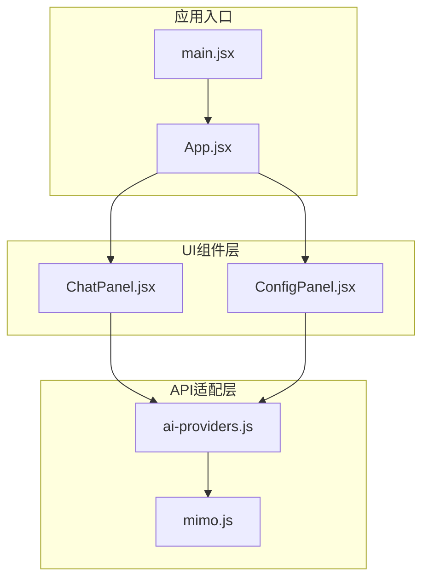
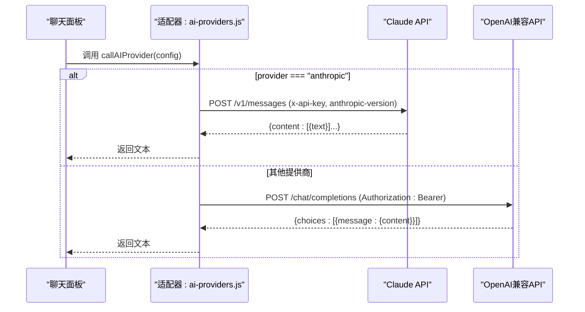
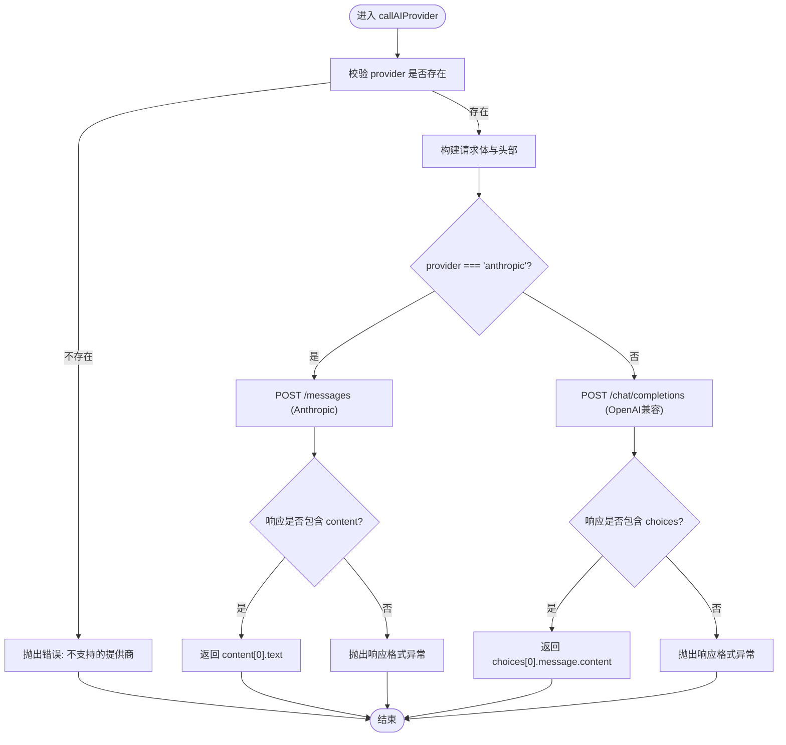
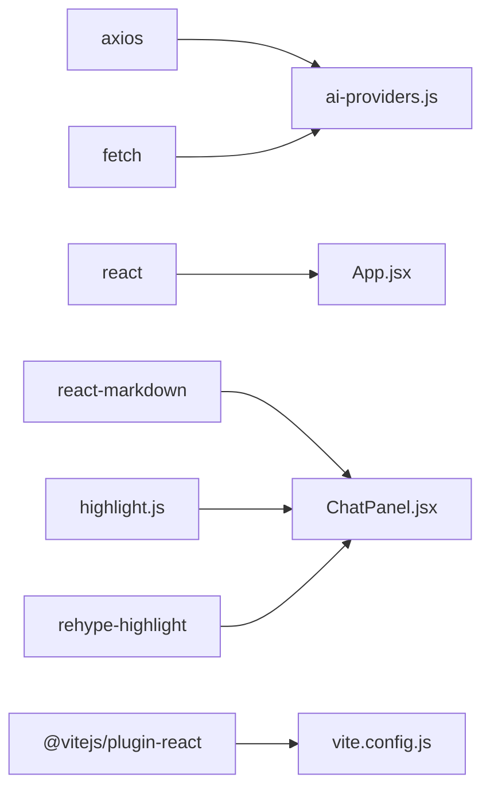

# 多提供商适配器模式

<cite>
**本文引用的文件**
- [ai-providers.js](file://ai-doc-generator/src/api/ai-providers.js)
- [mimo.js](file://ai-doc-generator/src/api/mimo.js)
- [App.jsx](file://ai-doc-generator/src/App.jsx)
- [ChatPanel.jsx](file://ai-doc-generator/src/components/ChatPanel.jsx)
- [ConfigPanel.jsx](file://ai-doc-generator/src/components/ConfigPanel.jsx)
- [main.jsx](file://ai-doc-generator/src/main.jsx)
- [vite.config.js](file://ai-doc-generator/vite.config.js)
- [package.json](file://ai-doc-generator/package.json)
- [README.md](file://ai-doc-generator/README.md)
</cite>

## 目录
1. [简介](#简介)
2. [项目结构](#项目结构)
3. [核心组件](#核心组件)
4. [架构总览](#架构总览)
5. [详细组件分析](#详细组件分析)
6. [依赖关系分析](#依赖关系分析)
7. [性能考虑](#性能考虑)
8. [故障排除指南](#故障排除指南)
9. [结论](#结论)
10. [附录](#附录)

## 简介
本项目实现了“多提供商适配器模式”，通过统一的适配层对接多家AI大模型提供商，包括小米MiMo、OpenAI、Anthropic Claude、智谱AI、月之暗面Kimi、DeepSeek、阿里云通义千问。该模式的核心目标是：
- 统一API调用接口，屏蔽各提供商的请求格式、认证方式、响应结构差异
- 支持动态切换提供商与模型，便于横向对比与迁移
- 提供流式与非流式两种调用方式，满足不同场景需求
- 保持良好的扩展性，便于新增提供商或调整参数映射

## 项目结构
项目采用前端单页应用（React + Vite）组织，核心逻辑集中在API适配层与UI组件层：
- API适配层：统一管理提供商配置、请求构建、响应解析与错误处理
- UI组件层：配置面板用于选择提供商/模型/API Key与模板；聊天面板负责对话展示与交互
- 应用入口与构建配置：React渲染入口、Vite开发服务器配置

图表来源
- [main.jsx:1-11](file://ai-doc-generator/src/main.jsx#L1-L11)
- [App.jsx:1-37](file://ai-doc-generator/src/App.jsx#L1-L37)
- [ai-providers.js:1-344](file://ai-doc-generator/src/api/ai-providers.js#L1-L344)
- [mimo.js:1-175](file://ai-doc-generator/src/api/mimo.js#L1-L175)
- [ConfigPanel.jsx:1-156](file://ai-doc-generator/src/components/ConfigPanel.jsx#L1-L156)
- [ChatPanel.jsx:1-278](file://ai-doc-generator/src/components/ChatPanel.jsx#L1-L278)

章节来源
- [package.json:1-28](file://ai-doc-generator/package.json#L1-L28)
- [vite.config.js:1-11](file://ai-doc-generator/vite.config.js#L1-L11)

## 核心组件
- 适配器核心：统一的提供商配置、请求构建、响应解析与错误处理
- 单一提供商封装：MiMo专用API封装，保留独立调用能力
- UI组件：配置面板（提供商/模型/API Key/模板）、聊天面板（对话展示与导出）

章节来源
- [ai-providers.js:1-344](file://ai-doc-generator/src/api/ai-providers.js#L1-L344)
- [mimo.js:1-175](file://ai-doc-generator/src/api/mimo.js#L1-L175)
- [ConfigPanel.jsx:1-156](file://ai-doc-generator/src/components/ConfigPanel.jsx#L1-L156)
- [ChatPanel.jsx:1-278](file://ai-doc-generator/src/components/ChatPanel.jsx#L1-L278)

## 架构总览
适配器模式通过“统一接口 + 分支策略”实现多提供商兼容：
- 统一接口：callAIProvider、callAIProviderStream、validateApiKey、getModelsForProvider
- 分支策略：针对Anthropic Claude进行差异化请求/响应处理；其余提供商遵循OpenAI兼容格式
- 参数映射：temperature、max_tokens、system prompt、消息数组等参数在不同提供商间进行映射
- 错误处理：对HTTP状态码与提供商特定错误进行归一化处理

图表来源
- [ai-providers.js:60-181](file://ai-doc-generator/src/api/ai-providers.js#L60-L181)

## 详细组件分析

### 适配器核心：ai-providers.js
- 提供商配置：集中维护7家提供商的基础信息（名称、API端点、可用模型、图标）
- 统一调用函数：callAIProvider
  - 请求构建：根据provider选择Anthropic或OpenAI兼容格式；统一注入system prompt、temperature、max_tokens
  - 认证头：Anthropic使用x-api-key与anthropic-version；其他提供商使用Authorization: Bearer
  - 响应解析：Anthropic取content[0].text；其他取choices[0].message.content
  - 错误处理：对401/403/404/429/500等状态码进行人性化提示，并尝试提取提供商返回的错误信息
- 流式调用：callAIProviderStream
  - 与非流式类似，但启用stream=true并通过ReadableStream逐块解析SSE-like数据
  - 支持onChunk/onComplete/onError回调
- 辅助函数：validateApiKey、getModelsForProvider

图表来源
- [ai-providers.js:60-181](file://ai-doc-generator/src/api/ai-providers.js#L60-L181)

章节来源
- [ai-providers.js:1-344](file://ai-doc-generator/src/api/ai-providers.js#L1-L344)

### 单一提供商封装：mimo.js
- 独立的MiMo API封装，保留原有调用方式，便于对比与迁移
- 包含非流式与流式调用、API Key验证
- 与适配器核心的差异点：固定system prompt、固定模型、更直接的错误映射

章节来源
- [mimo.js:1-175](file://ai-doc-generator/src/api/mimo.js#L1-L175)

### UI组件：ConfigPanel.jsx
- 提供商选择：下拉框展示7家提供商及其图标
- 模型选择：根据当前提供商动态加载可用模型列表
- API Key输入：密码输入框，提示对应提供商名称
- 模板系统：内置6类模板（技术文档、代码生成、API文档、教程指南、代码审查、自定义），支持主题/内容替换与自定义提示词
- 提示词预览：实时展示最终生成的提示词

章节来源
- [ConfigPanel.jsx:1-156](file://ai-doc-generator/src/components/ConfigPanel.jsx#L1-L156)

### UI组件：ChatPanel.jsx
- 对话展示：使用ReactMarkdown渲染AI输出，支持代码高亮
- 发送流程：收集历史消息、调用适配器统一接口、处理错误与加载态
- 导出功能：将对话内容导出为Markdown文件
- 快捷键：Enter发送、Shift+Enter换行

章节来源
- [ChatPanel.jsx:1-278](file://ai-doc-generator/src/components/ChatPanel.jsx#L1-L278)

### 应用入口与主组件：App.jsx、main.jsx
- App.jsx：全局状态管理（API Key、模板、提供商、模型），传递给子组件
- main.jsx：React渲染入口

章节来源
- [App.jsx:1-37](file://ai-doc-generator/src/App.jsx#L1-L37)
- [main.jsx:1-11](file://ai-doc-generator/src/main.jsx#L1-L11)

## 依赖关系分析
- 运行时依赖：React、ReactDOM、axios、react-markdown、rehype-highlight、highlight.js、lucide-react
- 构建工具：Vite + @vitejs/plugin-react
- 适配器依赖axios用于非流式请求，fetch用于流式请求

图表来源
- [package.json:14-26](file://ai-doc-generator/package.json#L14-L26)
- [ai-providers.js:1-3](file://ai-doc-generator/src/api/ai-providers.js#L1-L3)
- [ChatPanel.jsx:1-6](file://ai-doc-generator/src/components/ChatPanel.jsx#L1-L6)
- [vite.config.js:1-11](file://ai-doc-generator/vite.config.js#L1-L11)

章节来源
- [package.json:1-28](file://ai-doc-generator/package.json#L1-L28)

## 性能考虑
- 超时控制：统一设置60秒超时，避免长时间阻塞
- 流式传输：优先使用流式接口以获得更好的用户体验
- 错误快速反馈：对常见HTTP状态码进行即时提示，减少无效重试
- 参数最小化：仅传递必要字段，降低请求体积

## 故障排除指南
- API Key无效/过期：401错误，提示检查Key有效性
- 权限不足：403错误，提示确认账户状态
- 端点不存在：404错误，提示检查提供商配置
- 请求过于频繁：429错误，提示稍后重试
- 服务器错误：500错误，提示稍后重试
- 网络错误：无响应请求，提示检查网络连接
- 响应格式异常：当返回结构不符合预期时抛错

章节来源
- [ai-providers.js:146-180](file://ai-doc-generator/src/api/ai-providers.js#L146-L180)

## 结论
本项目通过“多提供商适配器模式”成功屏蔽了多家AI提供商的差异，提供了统一、可扩展且易于使用的接口。其优势在于：
- 统一的调用接口与清晰的参数映射
- 完善的错误处理与用户体验
- 良好的扩展性，便于新增提供商或调整参数
- 丰富的UI模板与便捷的导出功能

## 附录

### 各提供商API差异与适配策略
- 小米MiMo
  - 认证方式：Authorization: Bearer
  - 请求格式：OpenAI兼容（messages、temperature、max_tokens）
  - 响应结构：choices[0].message.content
  - 特殊参数：无
- OpenAI
  - 认证方式：Authorization: Bearer
  - 请求格式：OpenAI兼容
  - 响应结构：choices[0].message.content
  - 特殊参数：无
- Anthropic Claude
  - 认证方式：x-api-key + anthropic-version
  - 请求格式：messages、max_tokens、temperature、system
  - 响应结构：content[0].text
  - 特殊参数：system、anthropic-version
- 智谱AI
  - 认证方式：Authorization: Bearer
  - 请求格式：OpenAI兼容
  - 响应结构：choices[0].message.content
  - 特殊参数：无
- 月之暗面Kimi
  - 认证方式：Authorization: Bearer
  - 请求格式：OpenAI兼容
  - 响应结构：choices[0].message.content
  - 特殊参数：无
- DeepSeek
  - 认证方式：Authorization: Bearer
  - 请求格式：OpenAI兼容
  - 响应结构：choices[0].message.content
  - 特殊参数：无
- 阿里云通义千问
  - 认证方式：Authorization: Bearer
  - 请求格式：OpenAI兼容
  - 响应结构：choices[0].message.content
  - 特殊参数：X-DashScope-SSE: disable

章节来源
- [ai-providers.js:4-47](file://ai-doc-generator/src/api/ai-providers.js#L4-L47)
- [ai-providers.js:85-125](file://ai-doc-generator/src/api/ai-providers.js#L85-L125)
- [ai-providers.js:133-143](file://ai-doc-generator/src/api/ai-providers.js#L133-L143)

### 适配器模式实现原理与扩展机制
- 实现原理
  - 统一接口：对外暴露callAIProvider/callAIProviderStream/validateApiKey/getModelsForProvider
  - 分支策略：通过provider分支处理Anthropic与其他提供商的差异
  - 参数映射：将通用参数（temperature、maxTokens、systemPrompt、history、prompt）映射到各提供商的字段
  - 错误归一化：将HTTP状态码与提供商特定错误转换为统一提示
- 扩展机制
  - 新增提供商：在PROVIDERS中添加配置项，适配器会自动识别并使用
  - 新增模型：在PROVIDERS中为对应提供商补充model列表
  - 新增特殊参数：在请求构建处增加分支处理
  - 新增错误类型：在错误处理处增加状态码分支

章节来源
- [ai-providers.js:60-181](file://ai-doc-generator/src/api/ai-providers.js#L60-L181)
- [ai-providers.js:336-343](file://ai-doc-generator/src/api/ai-providers.js#L336-L343)

### 配置示例与使用指南
- 获取API Key
  - 小米MiMo、OpenAI、Anthropic、智谱AI、月之暗面、DeepSeek、通义千问分别在其官网注册并获取
- 配置步骤
  - 在配置面板选择提供商与模型
  - 输入对应API Key
  - 选择模板并输入主题/内容，或使用自定义提示词
  - 在聊天面板发送消息，查看AI输出并导出为Markdown
- 开发与构建
  - 安装依赖：npm install
  - 启动开发服务器：npm run dev（默认端口3000）
  - 构建生产版本：npm run build
  - 预览生产构建：npm run preview

章节来源
- [README.md:66-89](file://ai-doc-generator/README.md#L66-L89)
- [vite.config.js:4-10](file://ai-doc-generator/vite.config.js#L4-L10)
- [package.json:6-10](file://ai-doc-generator/package.json#L6-L10)