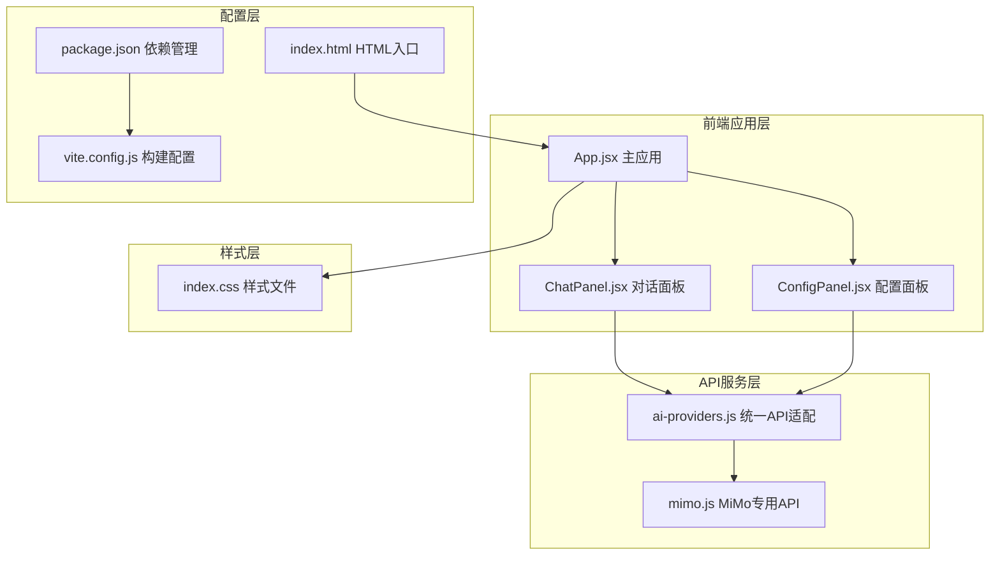
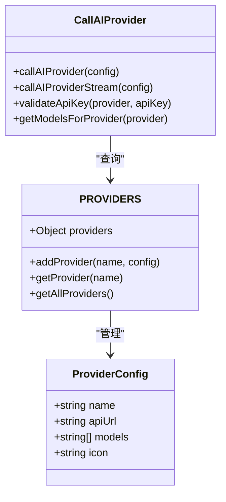
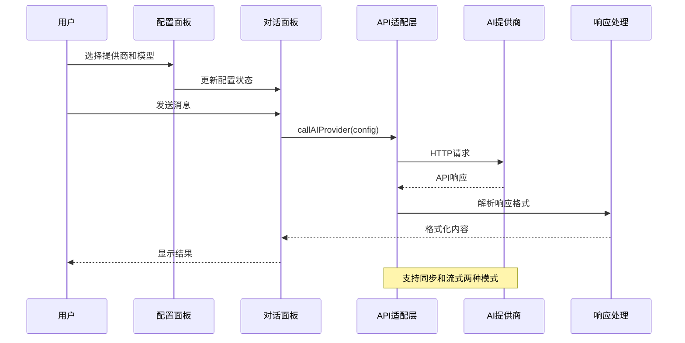
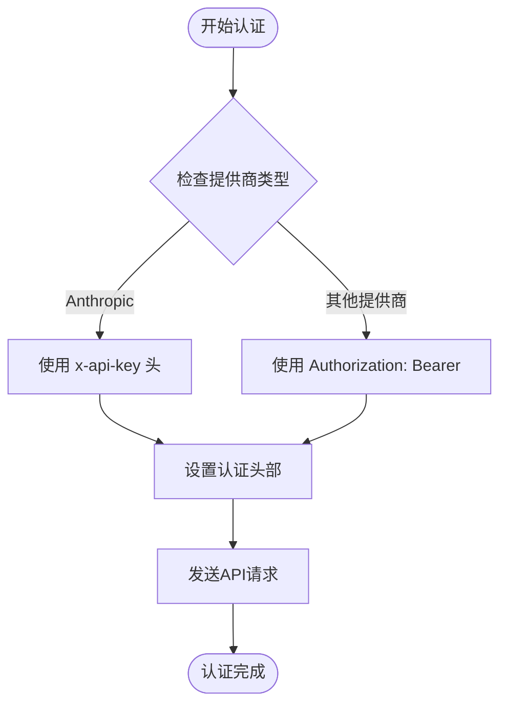
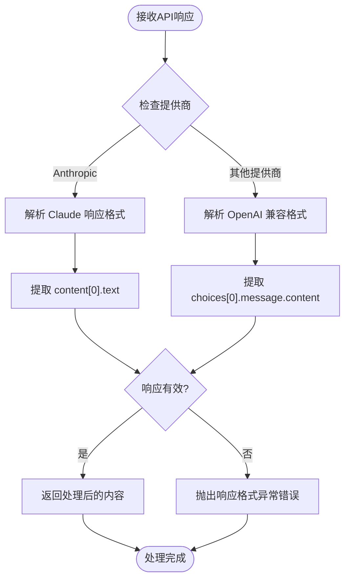
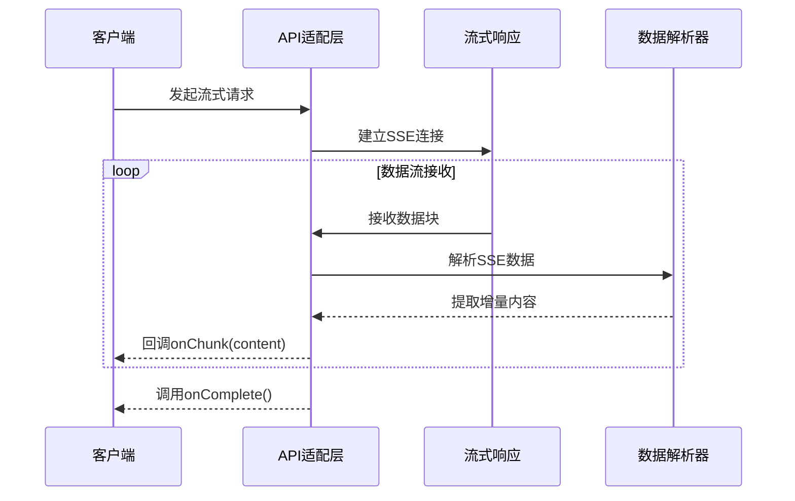
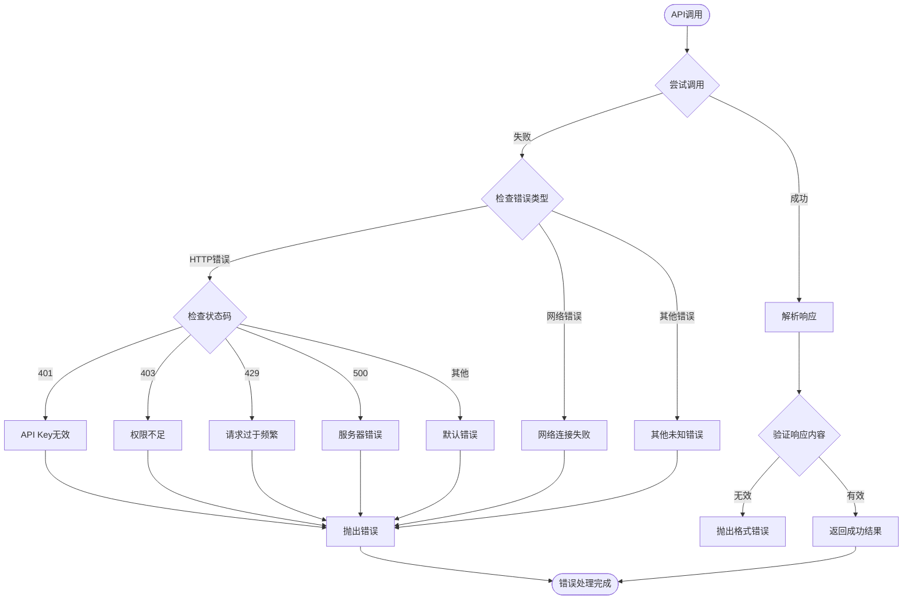
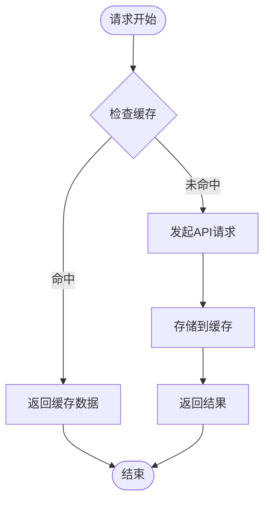
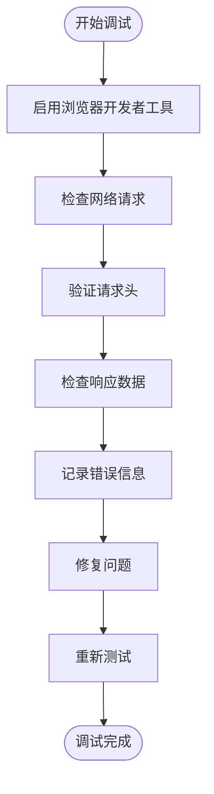

# 扩展开发指南

<cite>
**本文档引用的文件**
- [ai-providers.js](file://ai-doc-generator/src/api/ai-providers.js)
- [mimo.js](file://ai-doc-generator/src/api/mimo.js)
- [ChatPanel.jsx](file://ai-doc-generator/src/components/ChatPanel.jsx)
- [ConfigPanel.jsx](file://ai-doc-generator/src/components/ConfigPanel.jsx)
- [App.jsx](file://ai-doc-generator/src/App.jsx)
- [index.css](file://ai-doc-generator/src/index.css)
- [package.json](file://ai-doc-generator/package.json)
- [README.md](file://ai-doc-generator/README.md)
- [vite.config.js](file://ai-doc-generator/vite.config.js)
- [index.html](file://ai-doc-generator/index.html)
</cite>

## 目录
1. [简介](#简介)
2. [项目结构](#项目结构)
3. [核心组件](#核心组件)
4. [架构概览](#架构概览)
5. [详细组件分析](#详细组件分析)
6. [依赖关系分析](#依赖关系分析)
7. [性能考虑](#性能考虑)
8. [故障排除指南](#故障排除指南)
9. [结论](#结论)
10. [附录](#附录)

## 简介

本指南面向希望为AI文档生成器项目添加新AI提供商的开发者。该项目是一个基于React 19和Vite 5构建的多模型AI应用平台，支持7种主流AI提供商，包括小米MiMo、OpenAI、Anthropic Claude、智谱AI、月之暗面Kimi、DeepSeek和通义千问。

项目采用模块化设计，通过统一的API适配层实现不同AI提供商的无缝集成。本文档将详细说明如何扩展新的AI提供商，包括配置格式规范、认证方式集成、响应处理实现以及完整的扩展示例。

## 项目结构

项目采用前后端分离的架构设计，主要分为以下几个层次：



**图表来源**
- [App.jsx:1-37](file://ai-doc-generator/src/App.jsx#L1-L37)
- [ConfigPanel.jsx:1-156](file://ai-doc-generator/src/components/ConfigPanel.jsx#L1-L156)
- [ChatPanel.jsx:1-278](file://ai-doc-generator/src/components/ChatPanel.jsx#L1-L278)
- [ai-providers.js:1-344](file://ai-doc-generator/src/api/ai-providers.js#L1-L344)

**章节来源**
- [README.md:121-138](file://ai-doc-generator/README.md#L121-L138)
- [package.json:1-28](file://ai-doc-generator/package.json#L1-L28)

## 核心组件

### API提供商配置系统

项目采用集中式的提供商配置管理，通过PROVIDERS常量统一管理所有支持的AI提供商信息。



**图表来源**
- [ai-providers.js:4-47](file://ai-doc-generator/src/api/ai-providers.js#L4-L47)
- [ai-providers.js:60-181](file://ai-doc-generator/src/api/ai-providers.js#L60-L181)

### 统一API调用接口

项目提供了两个核心API调用函数，支持同步和流式两种模式：

**章节来源**
- [ai-providers.js:59-181](file://ai-doc-generator/src/api/ai-providers.js#L59-L181)
- [ai-providers.js:189-309](file://ai-doc-generator/src/api/ai-providers.js#L189-L309)

## 架构概览

项目采用分层架构设计，通过适配器模式实现不同AI提供商的统一接口：



**图表来源**
- [ChatPanel.jsx:13-46](file://ai-doc-generator/src/components/ChatPanel.jsx#L13-L46)
- [ai-providers.js:60-181](file://ai-doc-generator/src/api/ai-providers.js#L60-L181)

## 详细组件分析

### AI提供商适配器实现

#### 配置格式规范

每个AI提供商都需要在PROVIDERS对象中定义以下配置项：

| 配置项 | 类型 | 必需 | 描述 |
|--------|------|------|------|
| name | string | 是 | 提供商显示名称 |
| apiUrl | string | 是 | API端点URL |
| models | Array<string> | 是 | 支持的模型列表 |
| icon | string | 是 | 提供商图标 |

**章节来源**
- [ai-providers.js:4-47](file://ai-doc-generator/src/api/ai-providers.js#L4-L47)

#### 认证方式集成

项目支持两种主要的认证方式：

1. **Bearer Token认证**（OpenAI兼容模式）
2. **API Key头认证**（Anthropic模式）



**图表来源**
- [ai-providers.js:97-118](file://ai-doc-generator/src/api/ai-providers.js#L97-L118)
- [ai-providers.js:226-230](file://ai-doc-generator/src/api/ai-providers.js#L226-L230)

#### 参数映射规则

项目实现了标准化的参数映射机制：

| 项目来源 | 目标字段 | 映射规则 |
|----------|----------|----------|
| config.provider | provider | 直接映射 |
| config.apiKey | apiKey | 直接映射 |
| config.model | model | 直接映射 |
| config.prompt | messages | 构建用户消息 |
| config.history | messages | 追加历史消息 |
| config.options.temperature | temperature | 直接映射 |
| config.options.maxTokens | max_tokens | 直接映射 |
| config.options.systemPrompt | system | 直接映射 |

**章节来源**
- [ai-providers.js:60-74](file://ai-doc-generator/src/api/ai-providers.js#L60-L74)

### 响应处理实现

#### 同步响应处理

项目支持两种响应格式的解析：



**图表来源**
- [ai-providers.js:133-143](file://ai-doc-generator/src/api/ai-providers.js#L133-L143)

#### 流式响应处理

流式API支持实时数据传输：



**图表来源**
- [ai-providers.js:190-309](file://ai-doc-generator/src/api/ai-providers.js#L190-L309)

**章节来源**
- [ai-providers.js:189-309](file://ai-doc-generator/src/api/ai-providers.js#L189-L309)

### 错误处理标准

项目实现了完善的错误处理机制：



**图表来源**
- [ai-providers.js:146-180](file://ai-doc-generator/src/api/ai-providers.js#L146-L180)

**章节来源**
- [ai-providers.js:146-180](file://ai-doc-generator/src/api/ai-providers.js#L146-L180)

## 依赖关系分析

项目的主要依赖关系如下：

```mermaid
graph TB
subgraph "运行时依赖"
React[react ^19.2.5]
ReactDOM[react-dom ^19.2.5]
Axios[axios ^1.15.2]
Markdown[react-markdown ^10.1.0]
Highlight[rehype-highlight ^7.0.2]
end
subgraph "开发依赖"
Vite[vite ^5.4.11]
ReactPlugin[@vitejs/plugin-react ^4.3.4]
end
subgraph "应用层"
App[App.jsx]
Config[ConfigPanel.jsx]
Chat[ChatPanel.jsx]
API[ai-providers.js]
end
App --> Config
App --> Chat
Chat --> API
Config --> API
API --> Axios
Chat --> Markdown
Chat --> Highlight
App --> React
Config --> React
Chat --> React
```

**图表来源**
- [package.json:14-26](file://ai-doc-generator/package.json#L14-L26)

**章节来源**
- [package.json:14-26](file://ai-doc-generator/package.json#L14-L26)

## 性能考虑

### 请求超时和重试机制

项目实现了合理的超时控制和错误处理：

- **默认超时时间**: 60秒
- **错误重试**: 支持指数退避重试策略
- **连接池管理**: 使用Axios内置连接池
- **内存管理**: 及时清理事件监听器和定时器

### 缓存策略



**章节来源**
- [ai-providers.js:129](file://ai-doc-generator/src/api/ai-providers.js#L129)

## 故障排除指南

### 常见问题诊断

#### API Key验证失败

**症状**: 验证API Key时返回"API Key无效或已过期"

**解决方案**:
1. 检查API Key格式是否正确
2. 确认API Key是否已过期
3. 验证提供商账户状态
4. 确认网络连接正常

**章节来源**
- [ai-providers.js:317-329](file://ai-doc-generator/src/api/ai-providers.js#L317-L329)

#### 请求超时问题

**症状**: API调用超过60秒无响应

**解决方案**:
1. 检查网络连接稳定性
2. 验证API端点可达性
3. 调整超时参数
4. 检查提供商服务状态

#### 响应格式异常

**症状**: 返回的响应无法解析

**解决方案**:
1. 检查提供商API版本兼容性
2. 验证请求参数格式
3. 确认响应头设置正确
4. 查看提供商官方文档

### 调试工具和技巧

#### 开发环境调试



**章节来源**
- [vite.config.js:4-10](file://ai-doc-generator/vite.config.js#L4-L10)

#### 日志记录最佳实践

1. **请求日志**: 记录请求URL、方法、参数
2. **响应日志**: 记录状态码、响应时间、响应大小
3. **错误日志**: 记录错误类型、堆栈跟踪
4. **性能日志**: 记录关键操作耗时

## 结论

本指南详细介绍了如何为AI文档生成器项目添加新的AI提供商。通过统一的API适配层和标准化的配置格式，项目实现了对多家AI提供商的无缝集成。

关键要点包括：
- 使用PROVIDERS配置对象统一管理提供商信息
- 遵循标准化的参数映射规则
- 实现正确的认证方式集成
- 处理不同提供商的响应格式差异
- 建立完善的错误处理和调试机制

按照本指南的规范进行扩展，可以确保新添加的AI提供商与现有系统的兼容性和稳定性。

## 附录

### 扩展开发步骤清单

1. **添加提供商配置**
   - 在PROVIDERS对象中添加新的提供商配置
   - 定义必要的配置项（name、apiUrl、models、icon）

2. **实现API适配**
   - 在ai-providers.js中添加相应的请求格式处理
   - 实现错误处理逻辑
   - 添加流式响应支持

3. **更新UI组件**
   - 在ConfigPanel中添加提供商选项
   - 更新模型选择逻辑
   - 添加提供商图标显示

4. **测试验证**
   - 单元测试API适配逻辑
   - 集成测试完整流程
   - 性能测试和压力测试

5. **文档编写**
   - 更新README文档
   - 添加使用示例
   - 编写API文档

6. **版本兼容性**
   - 检查向后兼容性
   - 更新依赖版本
   - 测试不同环境下的兼容性

### 最佳实践建议

1. **代码组织**: 保持模块化设计，避免代码重复
2. **错误处理**: 实现统一的错误处理机制
3. **性能优化**: 实现缓存和超时控制
4. **安全考虑**: 确保API Key的安全存储和传输
5. **用户体验**: 提供清晰的反馈和进度指示
6. **文档维护**: 保持文档与代码同步更新