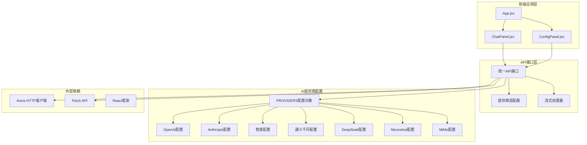
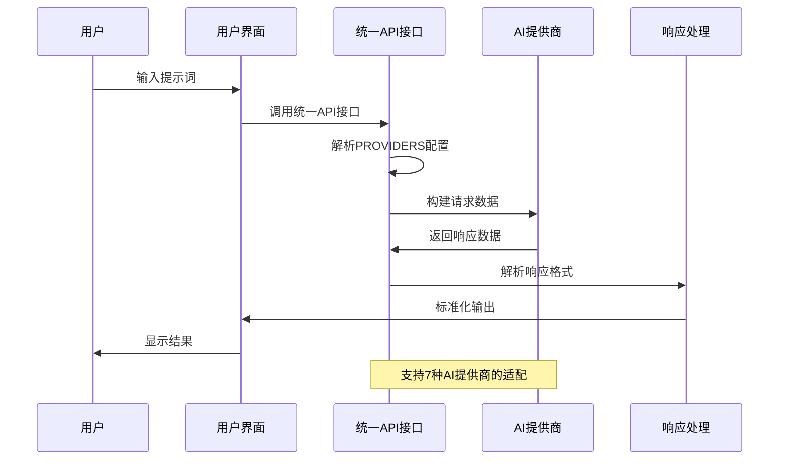
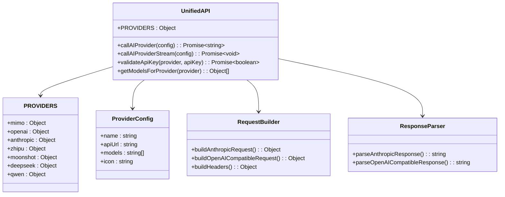
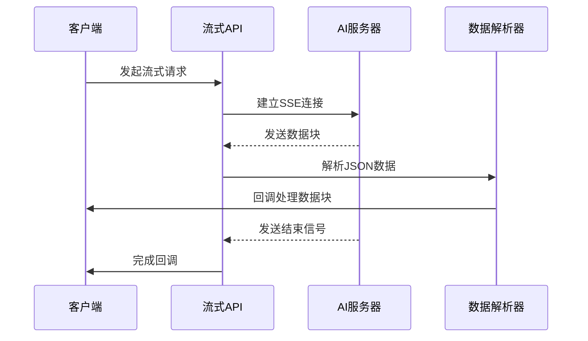
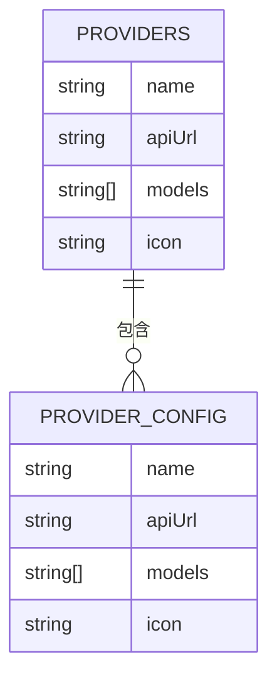
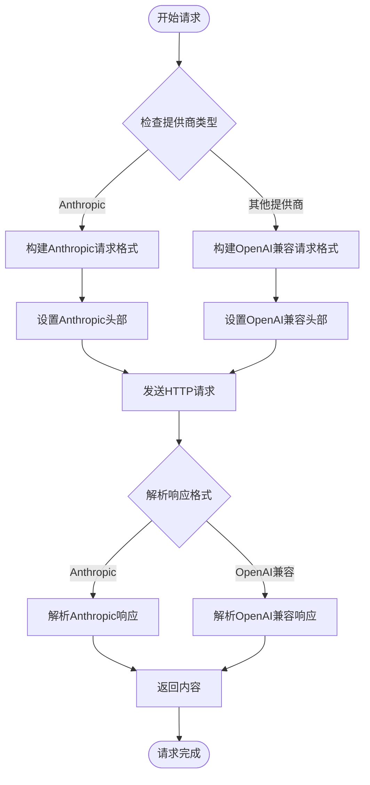
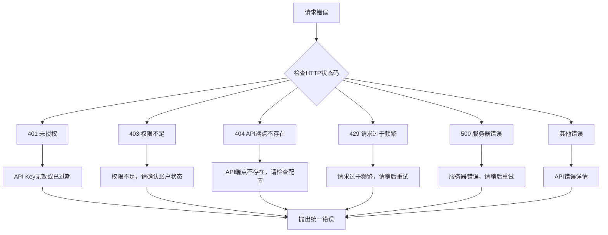
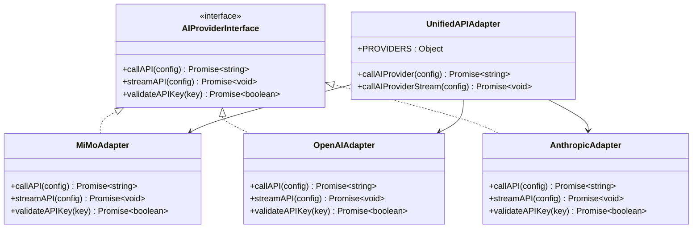

# 统一API接口设计

<cite>
**本文档引用的文件**
- [ai-providers.js](file://ai-doc-generator/src/api/ai-providers.js)
- [mimo.js](file://ai-doc-generator/src/api/mimo.js)
- [ChatPanel.jsx](file://ai-doc-generator/src/components/ChatPanel.jsx)
- [ConfigPanel.jsx](file://ai-doc-generator/src/components/ConfigPanel.jsx)
- [App.jsx](file://ai-doc-generator/src/App.jsx)
- [package.json](file://ai-doc-generator/package.json)
- [README.md](file://ai-doc-generator/README.md)
</cite>

## 目录
1. [简介](#简介)
2. [项目结构](#项目结构)
3. [核心组件](#核心组件)
4. [架构概览](#架构概览)
5. [详细组件分析](#详细组件分析)
6. [统一API接口设计](#统一api接口设计)
7. [PROVIDERS配置对象](#providers配置对象)
8. [请求构建与响应解析](#请求构建与响应解析)
9. [错误处理机制](#错误处理机制)
10. [适配器模式实现](#适配器模式实现)
11. [最佳实践与性能优化](#最佳实践与性能优化)
12. [故障排除指南](#故障排除指南)
13. [结论](#结论)

## 简介

本项目是一个基于React的AI文档生成器，实现了统一的API接口设计，支持7个主流AI提供商的标准化访问。通过PROVIDERS配置对象和适配器模式，项目将不同AI提供商的API差异抽象化，提供了统一的函数签名和参数格式，使得开发者可以无缝切换不同的AI服务提供商。

## 项目结构

项目采用模块化的架构设计，主要分为以下几个核心部分：



**图表来源**
- [App.jsx:1-37](file://ai-doc-generator/src/App.jsx#L1-L37)
- [ChatPanel.jsx:1-278](file://ai-doc-generator/src/components/ChatPanel.jsx#L1-L278)
- [ConfigPanel.jsx:1-156](file://ai-doc-generator/src/components/ConfigPanel.jsx#L1-L156)
- [ai-providers.js:1-344](file://ai-doc-generator/src/api/ai-providers.js#L1-L344)

**章节来源**
- [App.jsx:1-37](file://ai-doc-generator/src/App.jsx#L1-L37)
- [package.json:1-28](file://ai-doc-generator/package.json#L1-L28)

## 核心组件

### 应用主组件
应用的入口组件负责管理全局状态，包括API Key、提供商选择、模型选择和模板配置。它将这些状态传递给子组件，实现了组件间的解耦。

### 对话面板组件
对话面板负责处理用户的输入和显示AI的响应，实现了多轮对话的上下文管理和Markdown渲染功能。

### 配置面板组件
配置面板提供了用户友好的界面来选择AI提供商、模型和模板，支持预设的专业模板和自定义提示词。

**章节来源**
- [App.jsx:6-34](file://ai-doc-generator/src/App.jsx#L6-L34)
- [ChatPanel.jsx:7-46](file://ai-doc-generator/src/components/ChatPanel.jsx#L7-L46)
- [ConfigPanel.jsx:13-33](file://ai-doc-generator/src/components/ConfigPanel.jsx#L13-L33)

## 架构概览

项目采用了分层架构设计，通过统一的API接口层抽象了不同AI提供商的差异：



**图表来源**
- [ai-providers.js:60-181](file://ai-doc-generator/src/api/ai-providers.js#L60-L181)
- [ChatPanel.jsx:32-45](file://ai-doc-generator/src/components/ChatPanel.jsx#L32-L45)

## 详细组件分析

### 统一API接口实现

统一API接口是整个系统的核心，它实现了所有AI提供商的标准化访问：



**图表来源**
- [ai-providers.js:4-47](file://ai-doc-generator/src/api/ai-providers.js#L4-L47)
- [ai-providers.js:60-181](file://ai-doc-generator/src/api/ai-providers.js#L60-L181)

### 流式API接口实现

流式API接口支持实时的数据流传输，提供了更好的用户体验：



**图表来源**
- [ai-providers.js:190-309](file://ai-doc-generator/src/api/ai-providers.js#L190-L309)

**章节来源**
- [ai-providers.js:49-181](file://ai-doc-generator/src/api/ai-providers.js#L49-L181)
- [ai-providers.js:183-309](file://ai-doc-generator/src/api/ai-providers.js#L183-L309)

## 统一API接口设计

### 函数签名规范

统一API接口提供了两个核心函数，具有明确的函数签名和参数规范：

#### 同步调用函数
```javascript
async function callAIProvider(config) {
  // 参数验证和默认值设置
  const {
    provider = 'mimo',
    apiKey,
    model,
    prompt,
    history = [],
    options = {}
  } = config
  
  // 选项参数
  const {
    temperature = 0.7,
    maxTokens = 4000,
    systemPrompt = '你是一个专业的AI助手...'
  } = options
  
  // 返回AI生成的内容
  return Promise<string>
}
```

#### 流式调用函数
```javascript
async function callAIProviderStream(config) {
  const {
    provider = 'mimo',
    apiKey,
    model,
    prompt,
    history = [],
    options = {},
    onChunk,
    onComplete,
    onError
  } = config
  
  // 流式处理回调
  return Promise<void>
}
```

### 参数格式规范

统一API接口的参数格式经过精心设计，确保了跨提供商的一致性：

| 参数名 | 类型 | 必需 | 默认值 | 描述 |
|--------|------|------|--------|------|
| provider | string | 是 | 'mimo' | AI提供商标识符 |
| apiKey | string | 是 | - | API密钥 |
| model | string | 否 | 提供商默认模型 | AI模型名称 |
| prompt | string | 是 | - | 用户输入的提示词 |
| history | Array | 否 | [] | 对话历史记录 |
| options | Object | 否 | {} | 配置选项 |
| options.temperature | number | 否 | 0.7 | 采样温度 |
| options.maxTokens | number | 否 | 4000 | 最大生成tokens |
| options.systemPrompt | string | 否 | 标准系统提示 | 系统指令 |

### 返回值规范

统一API接口确保了所有提供商返回值的一致性：

- **同步调用**: 返回Promise<string>，包含完整的AI生成内容
- **流式调用**: 返回Promise<void>，通过回调函数实时传递数据块
- **错误处理**: 统一的错误类型和错误消息格式

**章节来源**
- [ai-providers.js:50-75](file://ai-doc-generator/src/api/ai-providers.js#L50-L75)
- [ai-providers.js:183-201](file://ai-doc-generator/src/api/ai-providers.js#L183-L201)

## PROVIDERS配置对象

### 结构设计

PROVIDERS配置对象是统一API设计的核心，它定义了所有支持的AI提供商及其配置信息：



**图表来源**
- [ai-providers.js:4-47](file://ai-providers.js#L4-L47)

### 各AI提供商配置

#### 小米MiMo配置
- **名称**: 小米 MiMo
- **API端点**: `https://api.mimo.xiaomimimo.com/v1/chat/completions`
- **支持模型**: mimo-v2.5, mimo-v2.5-lite, mimo-vision
- **图标**: 🤖

#### OpenAI配置
- **名称**: OpenAI
- **API端点**: `https://api.openai.com/v1/chat/completions`
- **支持模型**: gpt-4o, gpt-4o-mini, gpt-4-turbo, gpt-3.5-turbo
- **图标**: 🧠

#### Anthropic Claude配置
- **名称**: Anthropic Claude
- **API端点**: `https://api.anthropic.com/v1/messages`
- **支持模型**: claude-3-opus, claude-3-sonnet, claude-3-haiku
- **图标**: 🎯

#### 智谱AI配置
- **名称**: 智谱 AI
- **API端点**: `https://open.bigmodel.cn/api/paas/v4/chat/completions`
- **支持模型**: glm-4, glm-4-plus, glm-4-flash, glm-3-turbo
- **图标**: 🚀

#### 月之暗面Kimi配置
- **名称**: 月之暗面 Kimi
- **API端点**: `https://api.moonshot.cn/v1/chat/completions`
- **支持模型**: moonshot-v1-8k, moonshot-v1-32k, moonshot-v1-128k
- **图标**: 🌙

#### DeepSeek配置
- **名称**: DeepSeek
- **API端点**: `https://api.deepseek.com/chat/completions`
- **支持模型**: deepseek-chat, deepseek-coder, deepseek-reasoner
- **图标**: 🔍

#### 通义千问配置
- **名称**: 阿里云 通义千问
- **API端点**: `https://dashscope.aliyuncs.com/compatible-mode/v1/chat/completions`
- **支持模型**: qwen-max, qwen-plus, qwen-turbo, qwen-coder
- **图标**: 💎

### 配置对象的设计原则

1. **一致性**: 所有提供商配置遵循相同的结构模式
2. **可扩展性**: 新增提供商只需添加新的配置项
3. **向后兼容**: 现有的API调用不受新增提供商影响
4. **国际化**: 支持多语言提供商名称

**章节来源**
- [ai-providers.js:4-47](file://ai-doc-generator/src/api/ai-providers.js#L4-L47)

## 请求构建与响应解析

### 请求构建策略

统一API接口根据不同的AI提供商实现了差异化的请求构建策略：



**图表来源**
- [ai-providers.js:82-125](file://ai-doc-generator/src/api/ai-providers.js#L82-L125)
- [ai-providers.js:132-145](file://ai-doc-generator/src/api/ai-providers.js#L132-L145)

### 响应解析机制

响应解析机制确保了不同提供商返回格式的统一化：

#### Anthropic响应解析
- **响应字段**: `response.data.content[0].text`
- **特殊处理**: Claude使用不同的响应结构

#### OpenAI兼容响应解析
- **响应字段**: `response.data.choices[0].message.content`
- **标准格式**: 适用于大多数OpenAI兼容的提供商

### 特殊处理逻辑

某些AI提供商需要特殊的处理逻辑：

#### 通义千问特殊处理
- **额外头部**: `X-DashScope-SSE: disable`
- **兼容模式**: 使用兼容模式端点

#### 请求超时控制
- **超时时间**: 60秒
- **网络错误处理**: 统一的错误捕获机制

**章节来源**
- [ai-providers.js:82-181](file://ai-doc-generator/src/api/ai-providers.js#L82-L181)

## 错误处理机制

### 错误分类体系

统一API接口实现了完善的错误分类和处理机制：



**图表来源**
- [ai-providers.js:146-180](file://ai-doc-generator/src/api/ai-providers.js#L146-L180)

### 错误消息定制

针对不同提供商的错误消息进行了定制化处理：

| 状态码 | 错误类型 | MiMo消息 | OpenAI消息 | Claude消息 |
|--------|----------|----------|------------|------------|
| 401 | 未授权 | API Key无效或已过期 | API Key无效或已过期 | API Key无效或已过期 |
| 403 | 权限不足 | 权限不足，请确认账户状态 | 权限不足，请确认账户状态 | 权限不足，请确认账户状态 |
| 429 | 频率限制 | 请求过于频繁，请稍后重试 | 请求过于频繁，请稍后重试 | 请求过于频繁，请稍后重试 |
| 500 | 服务器错误 | 服务器错误，请稍后重试 | 服务器错误，请稍后重试 | 服务器错误，请稍后重试 |

### 错误恢复策略

- **网络错误**: 提示检查网络连接
- **API错误**: 提供具体的错误原因
- **超时错误**: 建议稍后重试
- **配置错误**: 指导检查API Key和配置

**章节来源**
- [ai-providers.js:146-180](file://ai-doc-generator/src/api/ai-providers.js#L146-L180)

## 适配器模式实现

### 设计模式应用

项目采用了适配器模式来处理不同AI提供商的API差异：



**图表来源**
- [ai-providers.js:49-181](file://ai-doc-generator/src/api/ai-providers.js#L49-L181)

### 适配器实现策略

#### 请求适配器
- **统一请求格式**: 将不同提供商的请求格式转换为统一格式
- **头部适配**: 处理不同提供商的认证头部
- **参数映射**: 将统一参数映射到特定提供商的参数

#### 响应适配器
- **统一响应格式**: 将不同提供商的响应格式标准化
- **内容提取**: 从响应中提取统一的文本内容
- **错误映射**: 将提供商特定的错误映射到统一错误格式

### 扩展性设计

适配器模式确保了系统的高度可扩展性：

- **新增提供商**: 只需实现统一接口即可
- **配置驱动**: 通过PROVIDERS配置对象管理提供商
- **向后兼容**: 现有功能不受新增提供商影响

**章节来源**
- [ai-providers.js:49-181](file://ai-doc-generator/src/api/ai-providers.js#L49-L181)

## 最佳实践与性能优化

### API调用最佳实践

#### 参数验证
```javascript
// 建议的参数验证模式
function validateCallConfig(config) {
  const errors = []
  
  if (!config.provider) errors.push('缺少提供商参数')
  if (!config.apiKey) errors.push('缺少API Key')
  if (!config.prompt) errors.push('缺少提示词')
  
  if (errors.length > 0) {
    throw new Error(`参数验证失败: ${errors.join(', ')}`)
  }
}
```

#### 错误处理策略
- **渐进式错误处理**: 从网络错误到API错误再到业务错误
- **用户友好提示**: 提供清晰的错误信息和解决方案
- **重试机制**: 对于临时性错误提供重试建议

### 性能优化建议

#### 请求优化
- **连接复用**: 使用HTTP连接池减少连接建立开销
- **缓存策略**: 缓存常用的模型配置和API Key
- **批量处理**: 对于大量请求考虑批量处理策略

#### 响应优化
- **流式处理**: 对于长文本生成使用流式处理
- **内容压缩**: 启用GZIP压缩减少传输数据量
- **超时控制**: 合理设置超时时间避免资源浪费

#### 内存管理
- **及时清理**: 及时清理不再使用的响应数据
- **分页加载**: 对于大量历史记录采用分页加载
- **垃圾回收**: 定期触发垃圾回收机制

### 安全最佳实践

#### API Key管理
- **本地存储**: API Key仅在本地存储，不在服务器端保存
- **加密传输**: 使用HTTPS确保API Key的安全传输
- **权限控制**: 限制API Key的使用范围和权限

#### 数据保护
- **敏感信息过滤**: 过滤对话中的敏感信息
- **访问日志**: 记录必要的访问日志但不包含敏感数据
- **审计跟踪**: 建立完整的操作审计机制

## 故障排除指南

### 常见问题诊断

#### API Key相关问题
1. **问题**: API Key无效或已过期
   - **症状**: 401未授权错误
   - **解决**: 检查API Key是否正确，确认账户状态正常

2. **问题**: 权限不足
   - **症状**: 403权限不足错误
   - **解决**: 确认账户有足够的权限使用指定模型

#### 网络连接问题
1. **问题**: 网络连接失败
   - **症状**: 网络错误提示
   - **解决**: 检查网络连接，确认防火墙设置

2. **问题**: 请求超时
   - **症状**: 超时错误
   - **解决**: 检查网络延迟，适当增加超时时间

#### 配置问题
1. **问题**: 不支持的提供商
   - **症状**: "不支持的提供商"错误
   - **解决**: 检查PROVIDERS配置是否正确

2. **问题**: 模型不可用
   - **症状**: 模型选择错误
   - **解决**: 确认所选模型在该提供商处可用

### 调试技巧

#### 日志记录
```javascript
// 建议的日志记录模式
function logAPICall(config, response) {
  console.log('API调用详情:', {
    provider: config.provider,
    model: config.model,
    timestamp: new Date(),
    responseTime: response.duration,
    status: response.status
  })
}
```

#### 性能监控
- **响应时间**: 监控各提供商的响应时间
- **成功率**: 统计API调用的成功率
- **错误分布**: 分析不同类型错误的发生频率

### 支持资源

#### 官方文档
- [MiMo API文档](https://mimo-api.xiaomimimo.com)
- [OpenAI API文档](https://platform.openai.com/docs)
- [Anthropic API文档](https://docs.anthropic.com)

#### 社区支持
- GitHub Issues页面
- 相关技术论坛
- 社区问答平台

**章节来源**
- [ai-providers.js:146-180](file://ai-doc-generator/src/api/ai-providers.js#L146-L180)

## 结论

本项目成功实现了统一的AI API接口设计，通过PROVIDERS配置对象和适配器模式，将7个不同AI提供商的API差异抽象化，提供了标准化的函数签名和参数格式。这种设计不仅提高了代码的可维护性和可扩展性，还为用户提供了无缝切换不同AI提供商的能力。

### 主要成就

1. **标准化接口**: 实现了统一的API调用接口，简化了多提供商集成
2. **配置驱动**: 通过PROVIDERS配置对象实现了灵活的提供商管理
3. **错误处理**: 建立了完善的错误分类和处理机制
4. **性能优化**: 采用了流式处理和超时控制等性能优化策略
5. **安全设计**: 确保了API Key的安全存储和传输

### 未来发展方向

1. **更多提供商支持**: 可以轻松添加新的AI提供商
2. **高级功能扩展**: 支持图像识别、语音合成等多模态功能
3. **智能路由**: 根据负载和性能自动选择最优提供商
4. **成本优化**: 提供成本分析和优化建议
5. **企业级功能**: 支持企业级的权限管理和审计功能

通过这种统一的API接口设计，开发者可以专注于业务逻辑的实现，而无需关心底层AI提供商的具体差异，大大提高了开发效率和系统的稳定性。