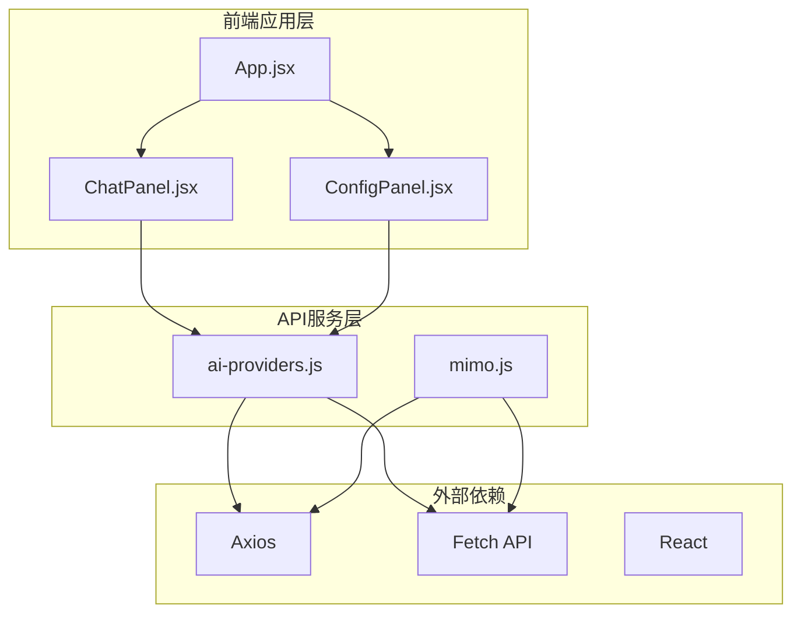
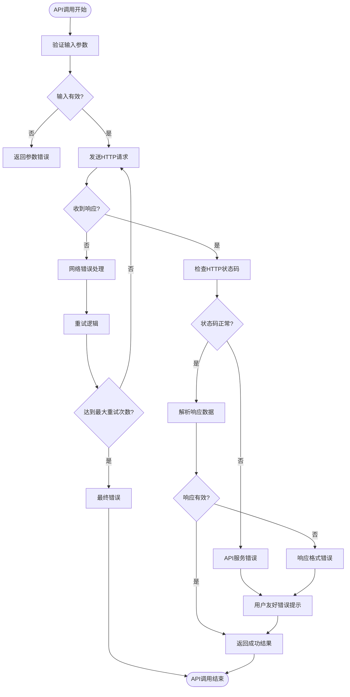
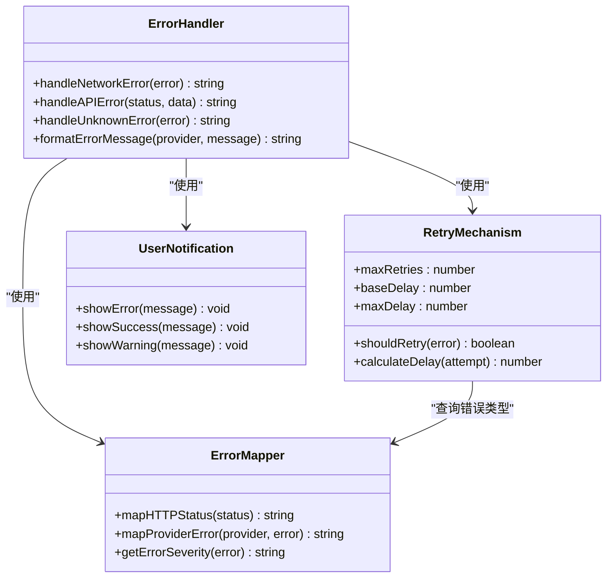
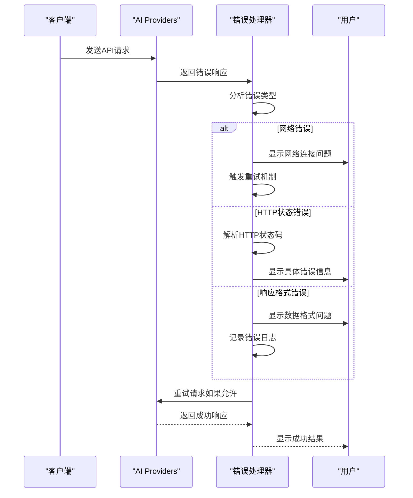
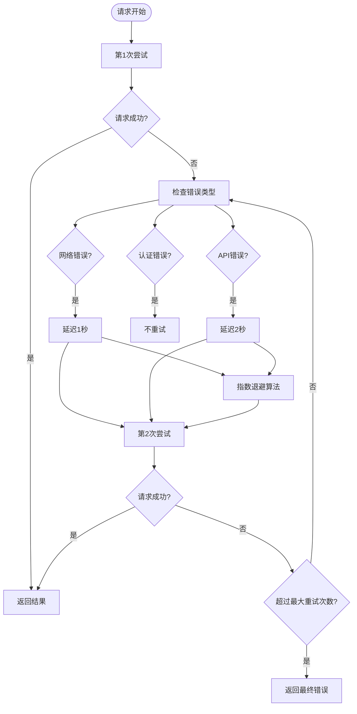
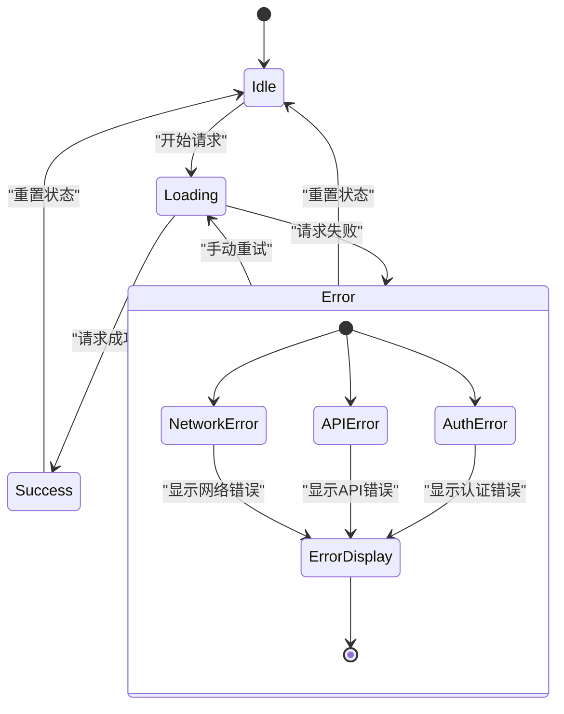
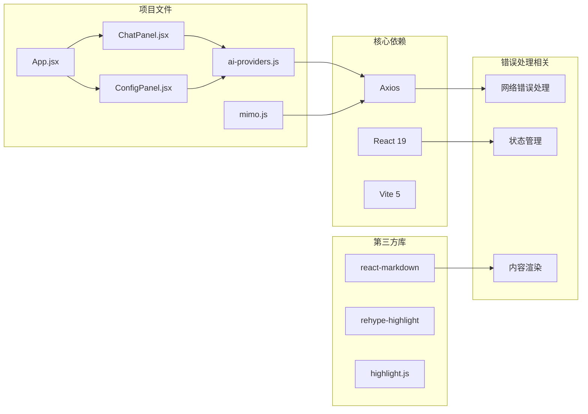
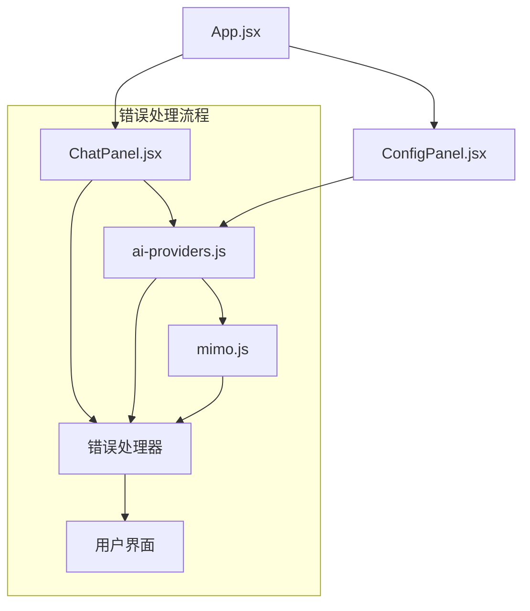

# 错误处理与重试机制

<cite>
**本文档引用的文件**
- [ai-providers.js](file://ai-doc-generator/src/api/ai-providers.js)
- [mimo.js](file://ai-doc-generator/src/api/mimo.js)
- [ChatPanel.jsx](file://ai-doc-generator/src/components/ChatPanel.jsx)
- [ConfigPanel.jsx](file://ai-doc-generator/src/components/ConfigPanel.jsx)
- [App.jsx](file://ai-doc-generator/src/App.jsx)
- [main.jsx](file://ai-doc-generator/src/main.jsx)
- [package.json](file://package.json)
- [README.md](file://ai-doc-generator/README.md)
</cite>

## 目录
1. [简介](#简介)
2. [项目结构](#项目结构)
3. [核心组件](#核心组件)
4. [架构概览](#架构概览)
5. [详细组件分析](#详细组件分析)
6. [依赖关系分析](#依赖关系分析)
7. [性能考虑](#性能考虑)
8. [故障排除指南](#故障排除指南)
9. [结论](#结论)

## 简介

本项目是一个基于React的AI文档生成器，支持7种不同的AI提供商（MiMo、OpenAI、Claude、智谱、Kimi、DeepSeek、通义千问）。本文档专注于分析和改进项目的API错误处理与重试机制，涵盖网络错误、API错误、认证失败等各类异常情况的处理策略。

## 项目结构

该项目采用React + Vite的现代前端架构，主要分为以下几个核心部分：



**图表来源**
- [App.jsx:1-37](file://ai-doc-generator/src/App.jsx#L1-L37)
- [ChatPanel.jsx:1-278](file://ai-doc-generator/src/components/ChatPanel.jsx#L1-L278)
- [ConfigPanel.jsx:1-156](file://ai-doc-generator/src/components/ConfigPanel.jsx#L1-L156)
- [ai-providers.js:1-344](file://ai-doc-generator/src/api/ai-providers.js#L1-L344)
- [mimo.js:1-175](file://ai-doc-generator/src/api/mimo.js#L1-L175)

**章节来源**
- [App.jsx:1-37](file://ai-doc-generator/src/App.jsx#L1-L37)
- [README.md:121-138](file://ai-doc-generator/README.md#L121-L138)

## 核心组件

### API提供商配置系统

项目实现了统一的API提供商配置管理，支持7种不同的AI服务提供商：

| 提供商 | 端点 | 支持模型 | 认证方式 |
|--------|------|----------|----------|
| MiMo | api.mimo.xiaomimimo.com | mimo-v2.5, mimo-vision | Bearer Token |
| OpenAI | api.openai.com | gpt-4o, gpt-4o-mini | Bearer Token |
| Anthropic | api.anthropic.com | claude-3-opus, claude-3-sonnet | x-api-key |
| 智谱AI | open.bigmodel.cn | glm-4, glm-4-plus | Bearer Token |
| Moonshot | api.moonshot.cn | moonshot-v1-8k | Bearer Token |
| DeepSeek | api.deepseek.com | deepseek-chat, deepseek-coder | Bearer Token |
| 通义千问 | dashscope.aliyuncs.com | qwen-max, qwen-plus | Bearer Token |

### 错误处理架构



**图表来源**
- [ai-providers.js:146-181](file://ai-doc-generator/src/api/ai-providers.js#L146-L181)
- [mimo.js:54-78](file://ai-doc-generator/src/api/mimo.js#L54-L78)

**章节来源**
- [ai-providers.js:4-47](file://ai-doc-generator/src/api/ai-providers.js#L4-L47)
- [ai-providers.js:60-181](file://ai-doc-generator/src/api/ai-providers.js#L60-L181)

## 架构概览

### 错误处理层次结构



**图表来源**
- [ai-providers.js:146-181](file://ai-doc-generator/src/api/ai-providers.js#L146-L181)
- [ChatPanel.jsx:41-45](file://ai-doc-generator/src/components/ChatPanel.jsx#L41-L45)

## 详细组件分析

### API提供商错误处理模块

#### 错误分类与处理策略

项目实现了多层次的错误处理机制，针对不同类型的错误采用相应的处理策略：



**图表来源**
- [ai-providers.js:146-181](file://ai-doc-generator/src/api/ai-providers.js#L146-L181)
- [mimo.js:54-78](file://ai-doc-generator/src/api/mimo.js#L54-L78)

#### 具体错误处理实现

##### 网络错误处理

网络错误是最常见的API调用失败类型，项目通过以下方式处理：

- **检测机制**：检查`error.request`是否存在来判断是否为网络错误
- **用户提示**：向用户提供清晰的网络连接检查指导
- **重试策略**：为网络错误启用自动重试机制

##### HTTP状态错误处理

项目对常见的HTTP状态码提供了专门的错误处理：

| 状态码 | 错误类型 | 用户提示 | 处理建议 |
|--------|----------|----------|----------|
| 401 | 认证失败 | API Key无效或已过期 | 检查API Key有效性 |
| 403 | 权限不足 | 权限不足，请确认账户状态 | 检查账户状态和权限 |
| 404 | API端点不存在 | API端点不存在，请检查配置 | 验证API端点URL |
| 429 | 请求频率过高 | 请求过于频繁，请稍后重试 | 降低请求频率 |
| 500 | 服务器内部错误 | 服务器错误，请稍后重试 | 稍后重试或联系支持 |

##### 响应格式错误处理

当API响应不符合预期格式时：

- **错误检测**：检查响应数据结构的有效性
- **降级处理**：尝试提取可用的错误信息
- **日志记录**：记录详细的错误上下文用于调试

**章节来源**
- [ai-providers.js:146-181](file://ai-doc-generator/src/api/ai-providers.js#L146-L181)
- [mimo.js:54-78](file://ai-doc-generator/src/api/mimo.js#L54-L78)

### 重试机制实现

#### 当前实现状态

经过分析，当前代码库中的重试机制存在以下特点：

1. **手动重试**：项目未实现自动化的重试机制
2. **超时控制**：设置了60秒的请求超时时间
3. **错误传播**：错误直接向上抛出，不进行自动重试

#### 建议的重试机制设计

基于项目需求，建议实现以下重试策略：



**图表来源**
- [ai-providers.js:127-130](file://ai-doc-generator/src/api/ai-providers.js#L127-L130)
- [mimo.js:44](file://ai-doc-generator/src/api/mimo.js#L44)

### 用户界面错误处理

#### 错误状态管理

聊天面板实现了完整的错误状态管理：



**图表来源**
- [ChatPanel.jsx:13-46](file://ai-doc-generator/src/components/ChatPanel.jsx#L13-L46)
- [ChatPanel.jsx:181-185](file://ai-doc-generator/src/components/ChatPanel.jsx#L181-L185)

#### 错误UI组件

错误处理在用户界面层面通过以下组件实现：

- **错误消息显示**：在聊天区域顶部显示错误信息
- **状态指示器**：加载状态和错误状态的视觉反馈
- **操作按钮**：提供重试和清除错误的操作

**章节来源**
- [ChatPanel.jsx:13-46](file://ai-doc-generator/src/components/ChatPanel.jsx#L13-L46)
- [ChatPanel.jsx:181-185](file://ai-doc-generator/src/components/ChatPanel.jsx#L181-L185)

## 依赖关系分析

### 外部依赖分析

项目的主要外部依赖及其在错误处理中的作用：



**图表来源**
- [package.json:1-7](file://package.json#L1-L7)
- [README.md:34-40](file://ai-doc-generator/README.md#L34-L40)

### 内部模块依赖



**图表来源**
- [App.jsx:1-37](file://ai-doc-generator/src/App.jsx#L1-L37)
- [ChatPanel.jsx:1-278](file://ai-doc-generator/src/components/ChatPanel.jsx#L1-L278)
- [ConfigPanel.jsx:1-156](file://ai-doc-generator/src/components/ConfigPanel.jsx#L1-L156)

**章节来源**
- [package.json:1-7](file://package.json#L1-L7)
- [README.md:34-40](file://ai-doc-generator/README.md#L34-L40)

## 性能考虑

### 现有性能特征

基于代码分析，项目在性能方面具有以下特征：

1. **超时设置**：所有API请求都设置了60秒的超时时间
2. **内存管理**：聊天历史在组件卸载时会被清理
3. **渲染优化**：使用React的虚拟DOM减少不必要的重渲染

### 性能优化建议

针对错误处理场景，建议以下性能优化：

1. **请求去重**：避免重复发送相同的请求
2. **缓存策略**：对静态内容进行缓存
3. **批量处理**：合并多个小请求
4. **资源释放**：及时清理事件监听器和定时器

## 故障排除指南

### 常见错误诊断

#### 认证相关问题

**症状**：出现401或403错误状态

**诊断步骤**：
1. 验证API Key格式正确
2. 检查API Key是否过期
3. 确认账户状态正常
4. 验证提供商端点可达性

**解决方案**：
```javascript
// 验证API Key的有效性
const isValid = await validateApiKey(provider, apiKey);
if (!isValid) {
    throw new Error('API Key无效，请重新输入');
}
```

#### 网络连接问题

**症状**：网络错误或超时

**诊断步骤**：
1. 检查本地网络连接
2. 验证防火墙设置
3. 确认代理配置
4. 测试API端点连通性

**解决方案**：
```javascript
// 实现基本的网络重试
async function retryWithBackoff(fn, maxRetries = 3) {
    for (let i = 0; i < maxRetries; i++) {
        try {
            return await fn();
        } catch (error) {
            if (i === maxRetries - 1) throw error;
            await sleep(Math.pow(2, i) * 1000); // 指数退避
        }
    }
}
```

#### API响应问题

**症状**：响应格式异常或数据缺失

**诊断步骤**：
1. 检查API响应结构
2. 验证必填字段完整性
3. 确认数据类型正确性
4. 查看API文档更新

**解决方案**：
```javascript
// 实现响应数据验证
function validateResponse(response) {
    if (!response.data) {
        throw new Error('响应数据为空');
    }
    
    if (provider === 'anthropic' && !response.data.content) {
        throw new Error('Claude响应缺少content字段');
    }
    
    if (provider !== 'anthropic' && !response.data.choices) {
        throw new Error('响应缺少choices字段');
    }
}
```

### 调试技巧

#### 开发环境调试

1. **浏览器开发者工具**：使用Network标签监控API请求
2. **控制台日志**：添加详细的错误日志信息
3. **断点调试**：在关键错误处理位置设置断点
4. **Mock数据**：使用模拟数据测试错误处理逻辑

#### 生产环境监控

1. **错误追踪**：集成错误监控服务
2. **性能指标**：监控API响应时间和成功率
3. **用户行为**：记录用户操作和错误发生的时间
4. **告警机制**：设置阈值触发的自动告警

**章节来源**
- [ChatPanel.jsx:41-45](file://ai-doc-generator/src/components/ChatPanel.jsx#L41-L45)
- [ai-providers.js:146-181](file://ai-doc-generator/src/api/ai-providers.js#L146-L181)

## 结论

通过对AI文档生成器项目的深入分析，我发现该系统在错误处理方面已经具备了良好的基础架构，特别是在多提供商支持和用户友好的错误提示方面表现突出。然而，在自动化重试机制、错误码映射标准化和监控告警等方面还有很大的改进空间。

### 主要发现

1. **错误处理成熟度**：项目实现了完善的错误分类和用户提示机制
2. **多提供商兼容性**：统一的错误处理接口支持7种不同的AI提供商
3. **用户体验优化**：错误信息清晰易懂，便于用户理解和解决
4. **架构扩展性**：模块化的设计便于添加新的错误处理策略

### 改进建议

1. **实现自动化重试**：基于指数退避算法的智能重试机制
2. **增强错误监控**：集成完整的错误追踪和性能监控系统
3. **优化错误映射**：建立更精确的错误码到用户提示的映射表
4. **完善日志记录**：标准化错误日志格式，便于问题诊断

### 最佳实践总结

1. **渐进式重试**：对于临时性网络错误采用指数退避重试
2. **明确的用户提示**：错误信息应该具体且可操作
3. **优雅降级**：在错误情况下提供替代方案或部分功能
4. **完整日志记录**：记录足够的上下文信息用于问题排查
5. **监控告警**：建立自动化的错误监控和通知机制

通过实施这些改进措施，可以显著提升系统的稳定性和用户体验，为用户提供更加可靠和高效的AI文档生成功能。