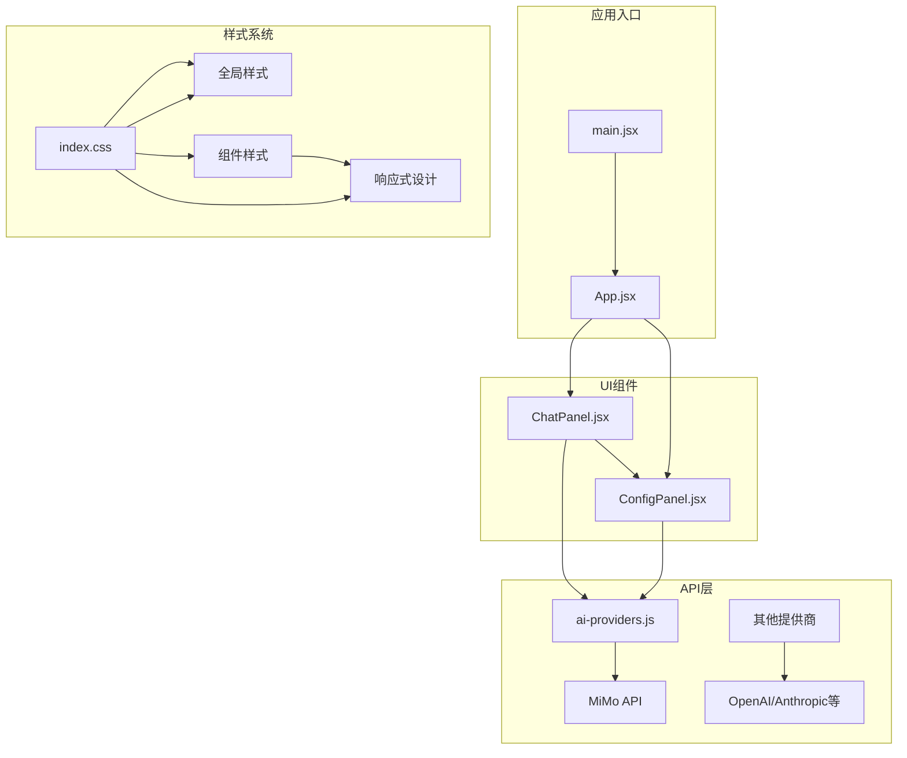
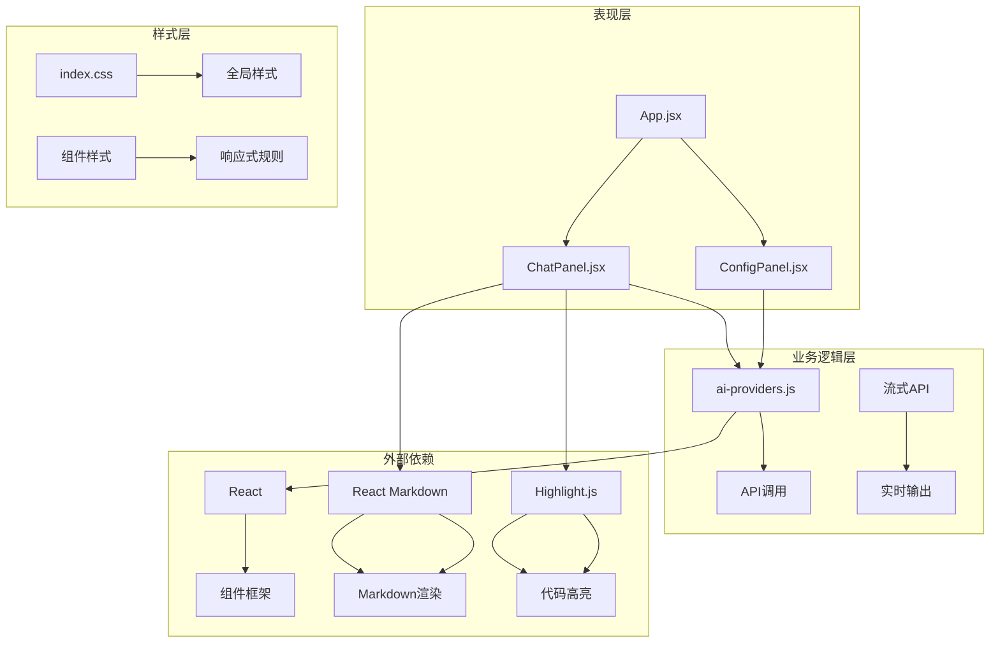
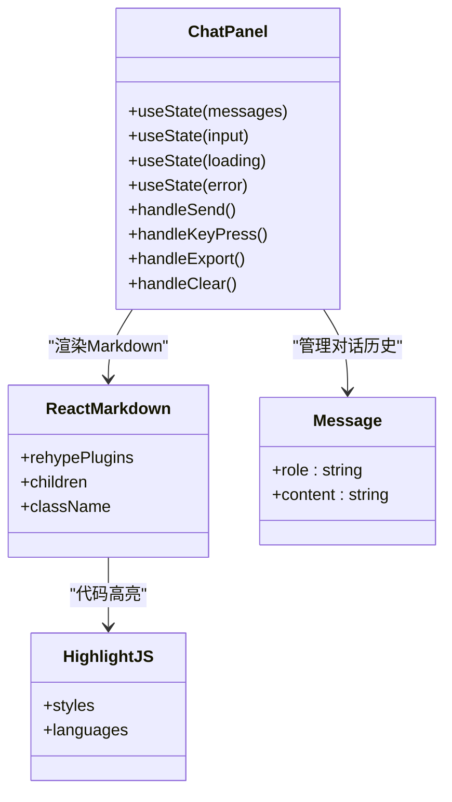
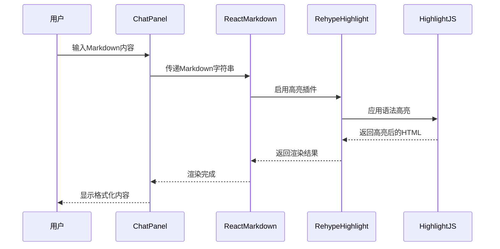
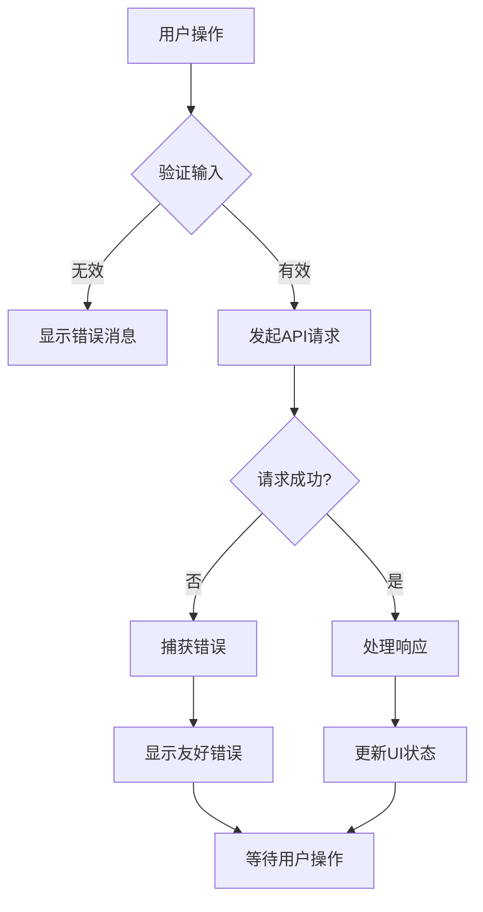

# UI/UX设计与样式系统

<cite>
**本文档引用的文件**
- [index.css](file://ai-doc-generator/src/index.css)
- [main.jsx](file://ai-doc-generator/src/main.jsx)
- [App.jsx](file://ai-doc-generator/src/App.jsx)
- [ChatPanel.jsx](file://ai-doc-generator/src/components/ChatPanel.jsx)
- [ConfigPanel.jsx](file://ai-doc-generator/src/components/ConfigPanel.jsx)
- [ai-providers.js](file://ai-doc-generator/src/api/ai-providers.js)
- [mimo.js](file://ai-doc-generator/src/api/mimo.js)
- [package.json](file://ai-doc-generator/package.json)
- [vite.config.js](file://ai-doc-generator/vite.config.js)
</cite>

## 目录
1. [简介](#简介)
2. [项目结构](#项目结构)
3. [核心组件](#核心组件)
4. [架构概览](#架构概览)
5. [详细组件分析](#详细组件分析)
6. [依赖关系分析](#依赖关系分析)
7. [性能考虑](#性能考虑)
8. [故障排除指南](#故障排除指南)
9. [结论](#结论)

## 简介

AI文档生成器是一个基于React的现代化Web应用程序，专注于提供优秀的用户体验和沉浸式的界面设计。该应用采用深色主题的赛博朋克风格，结合渐变色彩系统和响应式布局，为用户提供流畅的AI文档生成体验。

本项目的核心设计理念是通过精心设计的视觉层次和交互反馈，让用户能够专注于内容创作，同时获得专业级的界面体验。系统集成了多种AI提供商，支持Markdown渲染和代码高亮，提供了完整的文档生成工作流程。

## 项目结构

项目采用模块化的React架构，主要分为以下几个核心部分：



**图表来源**
- [main.jsx:1-11](file://ai-doc-generator/src/main.jsx#L1-L11)
- [App.jsx:1-37](file://ai-doc-generator/src/App.jsx#L1-L37)
- [index.css:1-531](file://ai-doc-generator/src/index.css#L1-L531)

**章节来源**
- [main.jsx:1-11](file://ai-doc-generator/src/main.jsx#L1-L11)
- [App.jsx:1-37](file://ai-doc-generator/src/App.jsx#L1-L37)
- [package.json:1-28](file://ai-doc-generator/package.json#L1-L28)

## 核心组件

### 渐变色彩设计系统

应用采用了精心设计的渐变色彩系统，基于深色主题的赛博朋克美学：

#### 主题色彩变量
- **背景层次**: `--bg-primary`(深蓝紫) → `--bg-secondary`(更深蓝紫) → `--bg-tertiary`(最深蓝紫)
- **强调色彩**: `--accent-cyan`(青色) → `--accent-magenta`(洋红色) → `--accent-orange`(橙色) → `--accent-green`(绿色)
- **文本层次**: `--text-primary`(浅灰白) → `--text-secondary`(中灰) → `--text-muted`(深灰)

#### 视觉层次设计
- **主标题**: 使用青色到洋红色的渐变，营造科技感
- **辅助标题**: 洋红色强调，突出重要信息
- **边框装饰**: 三色渐变边框，增加立体感
- **阴影效果**: 不同色彩的发光阴影，创造深度感

### 响应式布局策略

应用实现了多层次的响应式设计：

#### 大屏幕布局 (≥1200px)
- 两列布局：配置面板(400px) + 输出面板(1fr)
- 固定定位的配置面板，支持悬停动画效果

#### 中等屏幕布局 (768px - 1199px)
- 减少内边距，调整字体大小
- 保持两列布局但缩小配置面板宽度

#### 小屏幕布局 (≤768px)
- 单列布局：输出面板在上，配置面板在下
- 配置面板改为静态定位
- 优化触摸交互尺寸

### 组件样式组织结构

采用BEM风格的CSS类命名规范：

#### 基础容器类
- `.app-container`: 应用主容器，最大宽度1600px
- `.main-content`: 主要内容网格布局
- `.output-panel`: 输出面板容器

#### 组件特定类
- `.config-panel`: 配置面板样式
- `.template-btn`: 模板按钮样式
- `.btn`: 按钮基础样式
- `.btn-primary`: 主要操作按钮

#### 状态类
- `.active`: 激活状态样式
- `.hover`: 悬停状态样式
- `.loading`: 加载状态样式

**章节来源**
- [index.css:1-531](file://ai-doc-generator/src/index.css#L1-L531)
- [ChatPanel.jsx:1-278](file://ai-doc-generator/src/components/ChatPanel.jsx#L1-L278)
- [ConfigPanel.jsx:1-156](file://ai-doc-generator/src/components/ConfigPanel.jsx#L1-L156)

## 架构概览

应用采用分层架构设计，清晰分离关注点：



**图表来源**
- [App.jsx:1-37](file://ai-doc-generator/src/App.jsx#L1-L37)
- [ChatPanel.jsx:1-278](file://ai-doc-generator/src/components/ChatPanel.jsx#L1-L278)
- [ai-providers.js:1-344](file://ai-doc-generator/src/api/ai-providers.js#L1-L344)
- [package.json:14-22](file://ai-doc-generator/package.json#L14-L22)

## 详细组件分析

### ChatPanel 组件分析

ChatPanel负责处理AI对话和输出显示，是应用的核心交互组件。

#### 组件架构图



**图表来源**
- [ChatPanel.jsx:1-278](file://ai-doc-generator/src/components/ChatPanel.jsx#L1-L278)
- [ChatPanel.jsx:2-5](file://ai-doc-generator/src/components/ChatPanel.jsx#L2-L5)

#### Markdown渲染流程



**图表来源**
- [ChatPanel.jsx:165-169](file://ai-doc-generator/src/components/ChatPanel.jsx#L165-L169)

#### 代码高亮实现原理

应用使用React Markdown和Rehype Highlight.js的组合实现代码高亮：

1. **依赖集成**: 通过npm安装react-markdown和rehype-highlight
2. **样式加载**: 引入atom-one-dark.css提供深色主题代码高亮
3. **插件配置**: 在ReactMarkdown组件中启用rehypeHighlight插件
4. **语言支持**: Highlight.js自动检测和高亮多种编程语言

**章节来源**
- [ChatPanel.jsx:1-278](file://ai-doc-generator/src/components/ChatPanel.jsx#L1-L278)
- [package.json:20-21](file://ai-doc-generator/package.json#L20-L21)

### ConfigPanel 组件分析

ConfigPanel提供AI提供商配置和模板选择功能。

#### 模板系统设计

```mermaid
flowchart TD
A[用户选择模板] --> B{模板类型}
B --> |技术文档| C[生成技术文档模板]
B --> |代码生成| D[生成代码实现模板]
B --> |API文档| E[生成API文档模板]
B --> |教程指南| F[生成教程内容模板]
B --> |代码审查| G[生成审查建议模板]
B --> |自定义| H[用户自定义提示词]
C --> I[替换{topic}占位符]
D --> I
E --> I
F --> I
G --> I
H --> J[直接使用自定义内容]
I --> K[生成最终提示词]
J --> K
K --> L[提交给AI模型]
```

**图表来源**
- [ConfigPanel.jsx:4-11](file://ai-doc-generator/src/components/ConfigPanel.jsx#L4-L11)
- [ConfigPanel.jsx:28-33](file://ai-doc-generator/src/components/ConfigPanel.jsx#L28-L33)

#### AI提供商集成

应用支持7个主流AI提供商，每个都经过专门的配置：

| 提供商 | 模型数量 | 特殊功能 | API端点 |
|--------|----------|----------|---------|
| Xiaomi MiMo | 3个 | 最新模型 | mimo-v2.5, lite, vision |
| OpenAI | 4个 | 兼容性强 | gpt-4o, turbo, 3.5-turbo |
| Anthropic Claude | 3个 | 安全性高 | opus, sonnet, haiku |
| Zhipu AI | 4个 | 中文优化 | glm-4, flash, 3-turbo |
| Moonshot Kimi | 3个 | 长上下文 | 8k, 32k, 128k |
| DeepSeek | 3个 | 编码专长 | chat, coder, reasoner |
| Alibaba Qwen | 4个 | 多模态 | max, plus, turbo, coder |

**章节来源**
- [ConfigPanel.jsx:1-156](file://ai-doc-generator/src/components/ConfigPanel.jsx#L1-L156)
- [ai-providers.js:4-47](file://ai-doc-generator/src/api/ai-providers.js#L4-L47)

### 样式系统组织结构

#### CSS变量系统

应用使用CSS自定义属性实现统一的主题管理：

```css
:root {
  /* 背景层次 */
  --bg-primary: #0a0e27;
  --bg-secondary: #151b3d;
  --bg-tertiary: #1e2746;
  
  /* 强调色彩 */
  --accent-cyan: #00f5ff;
  --accent-magenta: #ff00ff;
  --accent-orange: #ff6b35;
  --accent-green: #00ff88;
  
  /* 文本色彩 */
  --text-primary: #e0e6ff;
  --text-secondary: #8b92c5;
  --text-muted: #4a5189;
  
  /* 视觉效果 */
  --border-glow: rgba(0, 245, 255, 0.3);
  --shadow-cyan: 0 0 20px rgba(0, 245, 255, 0.4);
  --shadow-magenta: 0 0 20px rgba(255, 0, 255, 0.4);
}
```

#### 动画和过渡效果

应用实现了丰富的动画效果来增强用户体验：

- **扫描线动画**: 标题下方的渐变扫描效果
- **呼吸动画**: 头部区域的脉冲发光效果
- **边框旋转**: 渐变边框的连续旋转动画
- **网格背景**: 透明网格的动态移动效果
- **元素过渡**: 所有交互元素的平滑过渡动画

**章节来源**
- [index.css:3-17](file://ai-doc-generator/src/index.css#L3-L17)
- [index.css:94-117](file://ai-doc-generator/src/index.css#L94-L117)
- [index.css:40-67](file://ai-doc-generator/src/index.css#L40-L67)

## 依赖关系分析

### 外部依赖架构

```mermaid
graph TB
subgraph "运行时依赖"
A[react] --> B[19.2.5]
C[react-dom] --> D[19.2.5]
E[axios] --> F[1.15.2]
G[highlight.js] --> H[11.11.1]
I[react-markdown] --> J[10.1.0]
K[rehype-highlight] --> L[7.0.2]
end
subgraph "开发依赖"
M[@vitejs/plugin-react] --> N[4.3.4]
O[vite] --> P[5.4.11]
end
subgraph "UI图标库"
Q[lucide-react] --> R[1.14.0]
end
```

**图表来源**
- [package.json:14-26](file://ai-doc-generator/package.json#L14-L26)

### Vite构建配置

应用使用Vite作为构建工具，提供快速的开发体验：

- **开发服务器**: 自动打开浏览器，端口3000
- **React插件**: 支持JSX和现代React特性
- **热重载**: 实时更新开发体验
- **生产构建**: 优化的打包和压缩

**章节来源**
- [vite.config.js:1-11](file://ai-doc-generator/vite.config.js#L1-L11)
- [package.json:6-10](file://ai-doc-generator/package.json#L6-L10)

## 性能考虑

### 渲染优化策略

1. **虚拟滚动**: 对于大量消息的场景，可以考虑实现虚拟滚动
2. **懒加载**: 图片和代码块的懒加载
3. **防抖处理**: 输入框的防抖处理减少API调用
4. **内存管理**: 及时清理不再使用的DOM节点

### 网络优化

1. **连接复用**: 复用HTTP连接减少延迟
2. **缓存策略**: 合理的缓存机制避免重复请求
3. **超时控制**: 设置合理的请求超时时间
4. **错误重试**: 实现智能的错误重试机制

### 样式性能

1. **CSS变量**: 使用CSS变量减少样式计算开销
2. **硬件加速**: 利用transform和opacity触发GPU加速
3. **动画优化**: 使用will-change属性优化动画性能
4. **样式合并**: 合并相似的样式规则

## 故障排除指南

### 常见问题诊断

#### API连接问题
- **症状**: "请先输入 API Key"
- **解决方案**: 检查API Key格式和提供商选择

#### 渲染问题
- **症状**: Markdown不正确显示
- **解决方案**: 确认react-markdown和highlight.js版本兼容性

#### 响应式问题
- **症状**: 移动端布局错乱
- **解决方案**: 检查媒体查询断点设置

### 错误处理机制

应用实现了完善的错误处理：



**图表来源**
- [ChatPanel.jsx:13-46](file://ai-doc-generator/src/components/ChatPanel.jsx#L13-L46)
- [ChatPanel.jsx:41-45](file://ai-doc-generator/src/components/ChatPanel.jsx#L41-L45)

**章节来源**
- [ChatPanel.jsx:13-80](file://ai-doc-generator/src/components/ChatPanel.jsx#L13-L80)
- [ai-providers.js:146-180](file://ai-doc-generator/src/api/ai-providers.js#L146-L180)

## 结论

AI文档生成器的UI/UX设计系统展现了现代Web应用的设计理念，通过精心构建的渐变色彩系统、响应式布局和组件化样式架构，为用户提供了专业而优雅的使用体验。

### 设计亮点

1. **视觉一致性**: 统一的色彩系统和设计语言
2. **响应式体验**: 适配各种设备和屏幕尺寸
3. **交互反馈**: 丰富的动画和过渡效果
4. **可扩展性**: 模块化的组件架构便于维护和扩展

### 技术优势

1. **性能优化**: 合理的资源管理和渲染策略
2. **错误处理**: 完善的异常处理和用户反馈机制
3. **依赖管理**: 清晰的依赖关系和版本控制
4. **构建优化**: 基于Vite的现代化开发体验

该系统为AI应用的UI设计提供了优秀的参考范例，展示了如何在保持功能完整性的同时，创造出既美观又实用的用户界面。