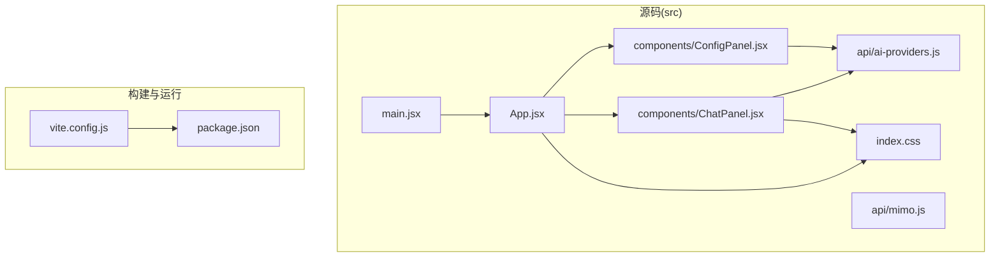
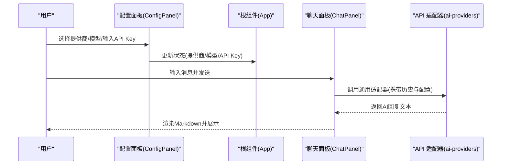
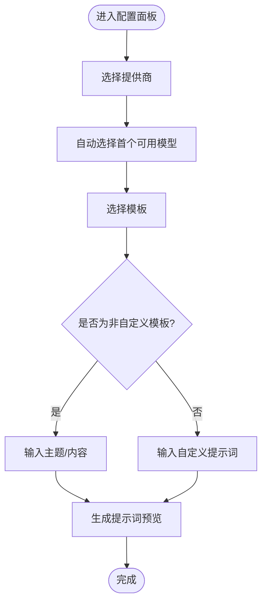
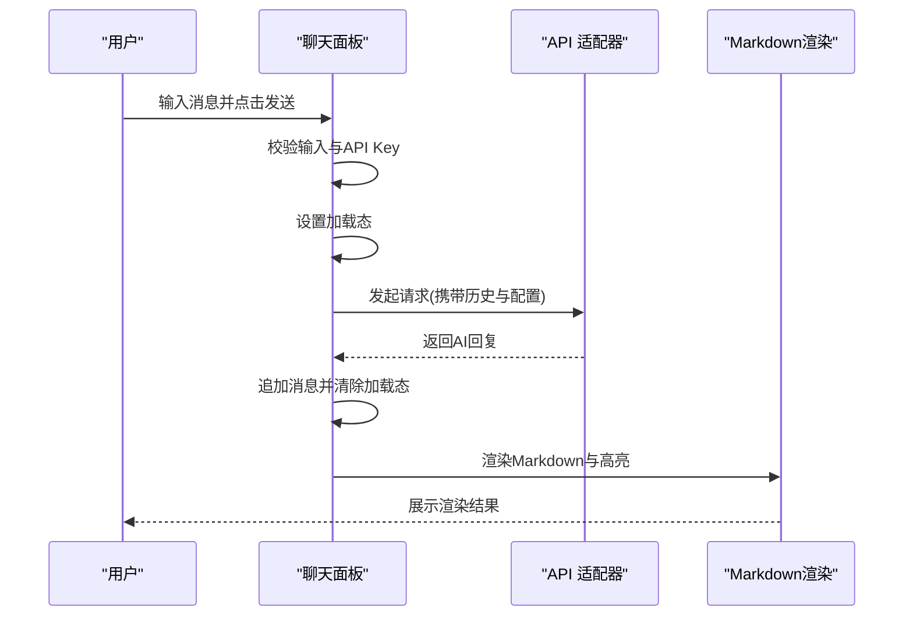
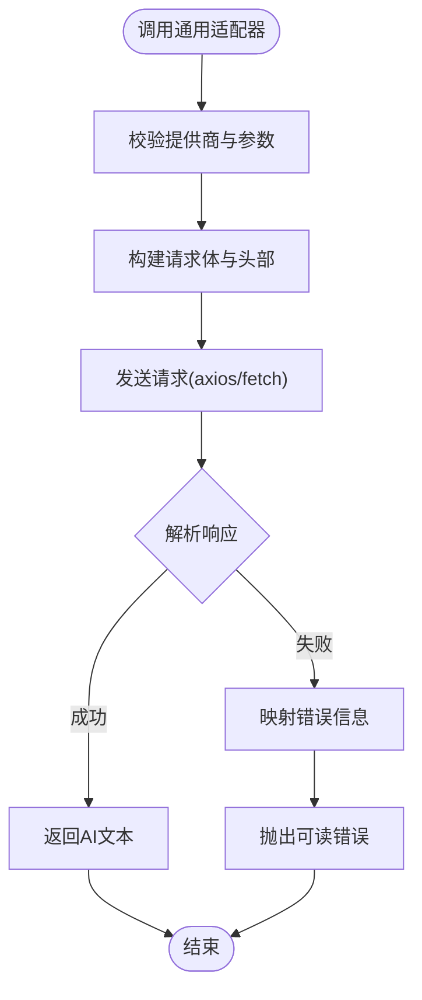
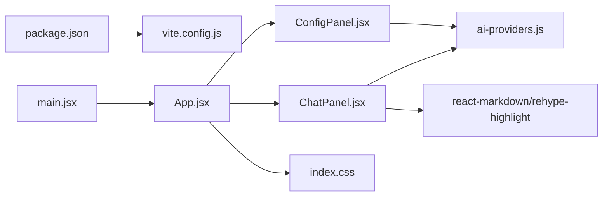

# 代码结构与规范

<cite>
**本文引用的文件**
- [package.json](file://ai-doc-generator/package.json)
- [vite.config.js](file://ai-doc-generator/vite.config.js)
- [main.jsx](file://ai-doc-generator/src/main.jsx)
- [App.jsx](file://ai-doc-generator/src/App.jsx)
- [index.css](file://ai-doc-generator/src/index.css)
- [ai-providers.js](file://ai-doc-generator/src/api/ai-providers.js)
- [mimo.js](file://ai-doc-generator/src/api/mimo.js)
- [ChatPanel.jsx](file://ai-doc-generator/src/components/ChatPanel.jsx)
- [ConfigPanel.jsx](file://ai-doc-generator/src/components/ConfigPanel.jsx)
- [README.md](file://ai-doc-generator/README.md)
</cite>

## 目录
1. [简介](#简介)
2. [项目结构](#项目结构)
3. [核心组件](#核心组件)
4. [架构总览](#架构总览)
5. [详细组件分析](#详细组件分析)
6. [依赖关系分析](#依赖关系分析)
7. [性能考虑](#性能考虑)
8. [故障排查指南](#故障排查指南)
9. [结论](#结论)
10. [附录](#附录)

## 简介
本项目是一个基于 React 19 的 AI 文档生成器，支持多模型提供商（MiMo、OpenAI、Claude、智谱、Kimi、DeepSeek、通义千问），提供模板化的文档生成、多轮对话、Markdown 渲染与导出等功能。本文档聚焦于代码结构与开发规范，涵盖目录组织原则、文件命名约定、React 组件设计模式与最佳实践、API 调用层设计规范、组件间通信与数据流、代码风格指南以及注释与文档编写标准。

## 项目结构
项目采用“按职责分层 + 功能模块化”的组织方式：
- 根目录包含构建配置与包管理文件
- 源码位于 src 目录，按功能域划分：
  - api：封装各 AI 提供商的调用逻辑与通用适配器
  - components：UI 组件（配置面板、聊天面板）
  - 根入口与全局样式：main.jsx、App.jsx、index.css
- README.md 提供项目说明与开发指南

图表来源
- [main.jsx:1-11](file://ai-doc-generator/src/main.jsx#L1-L11)
- [App.jsx:1-37](file://ai-doc-generator/src/App.jsx#L1-L37)
- [ConfigPanel.jsx:1-156](file://ai-doc-generator/src/components/ConfigPanel.jsx#L1-L156)
- [ChatPanel.jsx:1-278](file://ai-doc-generator/src/components/ChatPanel.jsx#L1-L278)
- [ai-providers.js:1-344](file://ai-doc-generator/src/api/ai-providers.js#L1-L344)
- [mimo.js:1-175](file://ai-doc-generator/src/api/mimo.js#L1-L175)
- [index.css:1-531](file://ai-doc-generator/src/index.css#L1-L531)
- [vite.config.js:1-11](file://ai-doc-generator/vite.config.js#L1-L11)
- [package.json:1-28](file://ai-doc-generator/package.json#L1-L28)

章节来源
- [README.md:121-138](file://ai-doc-generator/README.md#L121-L138)
- [package.json:1-28](file://ai-doc-generator/package.json#L1-L28)
- [vite.config.js:1-11](file://ai-doc-generator/vite.config.js#L1-L11)

## 核心组件
- 应用入口与根组件
  - 入口文件负责挂载根组件并引入全局样式
  - 根组件负责状态管理与布局，向下传递配置与状态给子组件
- 配置面板组件
  - 负责提供商选择、模型选择、API Key 输入、模板选择与提示词预览
- 聊天面板组件
  - 负责消息展示、输入处理、发送与导出、错误与加载状态管理
- API 层
  - 通用适配器统一处理多提供商请求、响应解析与错误映射
  - 单一提供商适配器用于特定场景（如 MiMo）

章节来源
- [main.jsx:1-11](file://ai-doc-generator/src/main.jsx#L1-L11)
- [App.jsx:1-37](file://ai-doc-generator/src/App.jsx#L1-L37)
- [ConfigPanel.jsx:1-156](file://ai-doc-generator/src/components/ConfigPanel.jsx#L1-L156)
- [ChatPanel.jsx:1-278](file://ai-doc-generator/src/components/ChatPanel.jsx#L1-L278)
- [ai-providers.js:1-344](file://ai-doc-generator/src/api/ai-providers.js#L1-L344)
- [mimo.js:1-175](file://ai-doc-generator/src/api/mimo.js#L1-L175)

## 架构总览
系统采用“单向数据流 + 组件组合”的架构：
- 根组件持有全局状态（API Key、模板、提供商、模型）
- 配置面板负责更新这些状态
- 聊天面板根据当前状态发起 API 请求，渲染结果并维护本地消息历史
- API 层对不同提供商进行统一抽象，屏蔽差异

图表来源
- [App.jsx:1-37](file://ai-doc-generator/src/App.jsx#L1-L37)
- [ConfigPanel.jsx:1-156](file://ai-doc-generator/src/components/ConfigPanel.jsx#L1-L156)
- [ChatPanel.jsx:1-278](file://ai-doc-generator/src/components/ChatPanel.jsx#L1-L278)
- [ai-providers.js:1-344](file://ai-doc-generator/src/api/ai-providers.js#L1-L344)

## 详细组件分析

### 根组件 App 设计
- 设计模式
  - 函数组件 + Hooks：集中管理全局状态，通过 props 下传至子组件
  - 状态最小化：仅保留必要的配置项，避免过度拆分
- 数据流
  - 从配置面板接收 setter 并回写到根状态
  - 将状态以 props 形式传递给聊天面板
- 最佳实践
  - 将 UI 与业务逻辑分离，保持组件职责单一
  - 使用受控组件处理表单输入，确保状态一致

章节来源
- [App.jsx:1-37](file://ai-doc-generator/src/App.jsx#L1-L37)

### 配置面板 ConfigPanel 分析
- 设计模式
  - 表单组件：使用受控组件管理输入状态
  - 模板驱动：内置模板集合，支持自定义提示词
- 数据流
  - 提供商变更时自动同步模型列表
  - 根据模板与输入动态生成最终提示词
- 错误处理
  - 对模板选择与必填项进行校验，防止无效输入
- 性能
  - 仅在提供商变化时重新计算模型列表，避免不必要的重渲染

图表来源
- [ConfigPanel.jsx:1-156](file://ai-doc-generator/src/components/ConfigPanel.jsx#L1-L156)

章节来源
- [ConfigPanel.jsx:1-156](file://ai-doc-generator/src/components/ConfigPanel.jsx#L1-L156)

### 聊天面板 ChatPanel 分析
- 设计模式
  - 函数组件 + Hooks：管理消息历史、输入、加载与错误状态
  - 异步处理：封装发送流程，统一错误处理与加载态
- 数据流
  - 将本地消息历史转换为 API 历史格式
  - 接收 AI 回复后追加到消息列表
- 渲染与交互
  - 使用 Markdown 渲染与代码高亮增强可读性
  - 支持快捷键、清空与导出功能
- 错误处理
  - 对空输入、未设置 API Key、网络/服务端错误进行分类提示

图表来源
- [ChatPanel.jsx:1-278](file://ai-doc-generator/src/components/ChatPanel.jsx#L1-L278)
- [ai-providers.js:1-344](file://ai-doc-generator/src/api/ai-providers.js#L1-L344)

章节来源
- [ChatPanel.jsx:1-278](file://ai-doc-generator/src/components/ChatPanel.jsx#L1-L278)

### API 调用层设计规范
- 通用适配器
  - 统一请求构建：根据提供商类型构造不同请求体与头部
  - 统一响应解析：兼容不同提供商的响应结构
  - 统一错误映射：将 HTTP 状态码与提供商错误信息映射为用户可读提示
  - 支持流式与非流式两种调用方式
- 单一提供商适配器
  - 用于特定提供商的专用封装，便于扩展与维护
- 最佳实践
  - 明确的入参校验与默认值
  - 统一的超时控制与错误处理策略
  - 对敏感信息（API Key）进行本地处理，不在 UI 中明文显示

图表来源
- [ai-providers.js:1-344](file://ai-doc-generator/src/api/ai-providers.js#L1-L344)
- [mimo.js:1-175](file://ai-doc-generator/src/api/mimo.js#L1-L175)

章节来源
- [ai-providers.js:1-344](file://ai-doc-generator/src/api/ai-providers.js#L1-L344)
- [mimo.js:1-175](file://ai-doc-generator/src/api/mimo.js#L1-L175)

### 样式与主题设计
- 设计理念
  - 科技感主题：使用渐变、发光边框、网格背景等元素营造未来感
  - 响应式布局：针对不同屏幕尺寸调整布局与间距
  - 组件化样式：通过类名区分面板、按钮、输入框等组件
- 规范
  - 使用 CSS 变量统一主题色，便于维护与扩展
  - 为交互状态（hover、focus、loading）提供过渡动画

章节来源
- [index.css:1-531](file://ai-doc-generator/src/index.css#L1-L531)

## 依赖关系分析
- 构建与运行
  - Vite 作为构建工具，React 19 作为核心框架
  - Axios 用于 HTTP 请求，react-markdown + rehype-highlight 用于 Markdown 渲染与高亮
- 组件依赖
  - ChatPanel 依赖 API 适配器与 Markdown 渲染库
  - ConfigPanel 依赖 API 适配器提供的模型查询能力
  - App 作为父容器，协调两个子面板的状态

图表来源
- [package.json:1-28](file://ai-doc-generator/package.json#L1-L28)
- [vite.config.js:1-11](file://ai-doc-generator/vite.config.js#L1-L11)
- [main.jsx:1-11](file://ai-doc-generator/src/main.jsx#L1-L11)
- [App.jsx:1-37](file://ai-doc-generator/src/App.jsx#L1-L37)
- [ConfigPanel.jsx:1-156](file://ai-doc-generator/src/components/ConfigPanel.jsx#L1-L156)
- [ChatPanel.jsx:1-278](file://ai-doc-generator/src/components/ChatPanel.jsx#L1-L278)
- [ai-providers.js:1-344](file://ai-doc-generator/src/api/ai-providers.js#L1-L344)
- [index.css:1-531](file://ai-doc-generator/src/index.css#L1-L531)

章节来源
- [package.json:1-28](file://ai-doc-generator/package.json#L1-L28)
- [vite.config.js:1-11](file://ai-doc-generator/vite.config.js#L1-L11)

## 性能考虑
- 组件渲染优化
  - 使用受控组件减少不必要的重渲染
  - 将计算逻辑（如模型列表）放在变更时触发，避免每次渲染都重复计算
- 网络请求优化
  - 统一超时控制，避免长时间阻塞
  - 对错误进行快速反馈，减少用户等待时间
- 渲染性能
  - Markdown 渲染与代码高亮在必要时才启用，避免对简单文本造成开销

## 故障排查指南
- 常见问题与定位
  - API Key 无效：检查提供商与密钥是否匹配，查看错误映射提示
  - 网络连接失败：确认网络状态与代理设置
  - 请求过于频繁：遵循提供商速率限制，适当降低请求频率
  - 响应格式异常：检查请求体与头部是否符合提供商要求
- 日志与调试
  - 在 API 层捕获错误并输出详细信息，便于定位问题
  - 在组件中区分用户输入错误与系统错误，提供明确的提示

章节来源
- [ai-providers.js:146-180](file://ai-doc-generator/src/api/ai-providers.js#L146-L180)
- [ChatPanel.jsx:41-45](file://ai-doc-generator/src/components/ChatPanel.jsx#L41-L45)

## 结论
本项目通过清晰的目录组织、合理的组件拆分与统一的 API 抽象，实现了多提供商、多模板的 AI 文档生成能力。遵循本文档的开发规范与最佳实践，可在保证可维护性的前提下持续扩展功能与优化性能。

## 附录

### 目录组织原则与文件命名约定
- 目录组织
  - 按功能域划分：api、components、根入口与样式
  - 保持层级扁平，避免过深嵌套
- 文件命名
  - 组件文件使用帕斯卡命名法（如 ChatPanel.jsx）
  - API 文件使用语义化命名（如 ai-providers.js、mimo.js）
  - 样式文件使用小写短横线命名（如 index.css）
  - 入口文件使用 main.jsx、index.html 等约定名称

章节来源
- [README.md:121-138](file://ai-doc-generator/README.md#L121-L138)
- [package.json:1-28](file://ai-doc-generator/package.json#L1-L28)

### React 组件设计模式与最佳实践
- 函数组件 + Hooks
  - 使用 useState/useEffect 管理状态与副作用
  - 将复杂逻辑抽取为自定义 Hook，提升复用性
- Props 传递与状态提升
  - 将共享状态提升到最近公共父组件，避免跨层级通信
  - 使用回调函数实现子改父的数据回传
- 受控组件
  - 表单输入使用受控组件，确保状态一致性
- 渲染优化
  - 使用 memo 与 useMemo 缓存昂贵计算
  - 合理拆分组件，避免不必要的重渲染

### API 调用层设计规范
- 参数校验与默认值
  - 对必填参数进行校验，提供合理默认值
- 请求构建
  - 根据提供商类型构建请求体与头部，保持一致性
- 响应解析
  - 统一解析响应结构，提取文本内容
- 错误处理
  - 区分网络错误、HTTP 错误与业务错误，提供用户可读提示
- 超时与重试
  - 设置超时时间，必要时支持有限重试

章节来源
- [ai-providers.js:60-181](file://ai-doc-generator/src/api/ai-providers.js#L60-L181)
- [mimo.js:10-78](file://ai-doc-generator/src/api/mimo.js#L10-L78)

### 组件间通信与数据流
- 单向数据流
  - 根组件持有全局状态，通过 props 向子组件传递
  - 子组件通过回调更新父组件状态
- 状态管理
  - 将配置状态（提供商、模型、API Key、模板）集中在根组件
  - 聊天面板维护本地消息历史，避免污染全局状态

章节来源
- [App.jsx:1-37](file://ai-doc-generator/src/App.jsx#L1-L37)
- [ConfigPanel.jsx:1-156](file://ai-doc-generator/src/components/ConfigPanel.jsx#L1-L156)
- [ChatPanel.jsx:1-278](file://ai-doc-generator/src/components/ChatPanel.jsx#L1-L278)

### 代码风格指南（ESLint 与 Prettier）
- ESLint 规则建议
  - 使用推荐规则集（如 airbnb-base 或 standard），结合 React 插件
  - 关闭与项目风格冲突的规则，确保团队一致
- Prettier 规则建议
  - 统一缩进（2 空格）、引号（双引号）、尾逗号（按需）
  - 与 ESLint 配合，优先使用 Prettier 格式化，ESLint 检查语法与风格
- 提交前检查
  - 在 CI 中执行 lint 与格式化检查，确保代码质量

### 注释规范与文档编写标准
- 注释规范
  - 函数/方法：使用 JSDoc 注释说明参数、返回值与异常
  - 复杂逻辑：添加简要说明，解释为什么这样实现
  - API 层：对请求体、响应结构与错误码进行说明
- 文档编写
  - README 中包含功能特性、使用指南、项目结构与开发说明
  - 新增模板或 API 时同步更新文档

章节来源
- [ai-providers.js:49-181](file://ai-doc-generator/src/api/ai-providers.js#L49-L181)
- [README.md:1-179](file://ai-doc-generator/README.md#L1-L179)