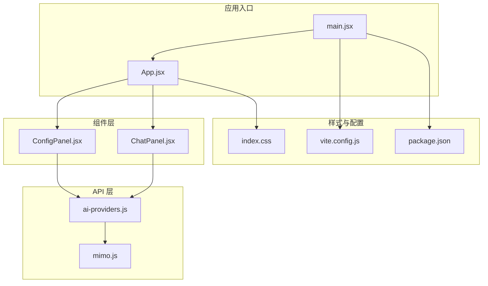
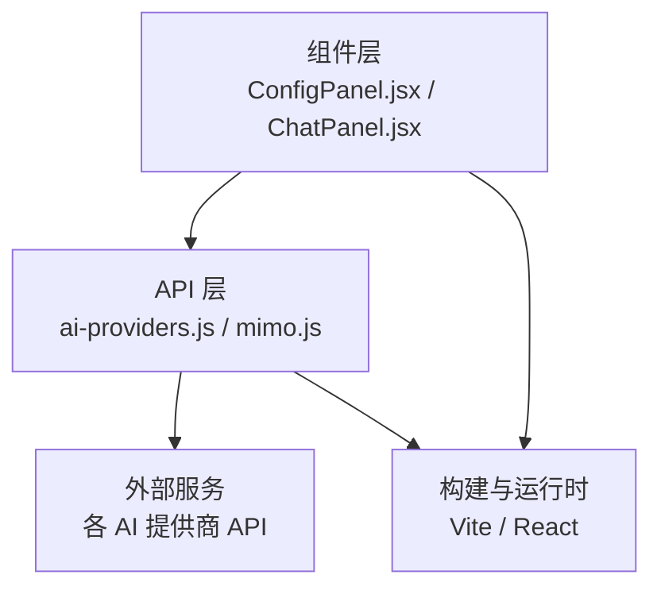
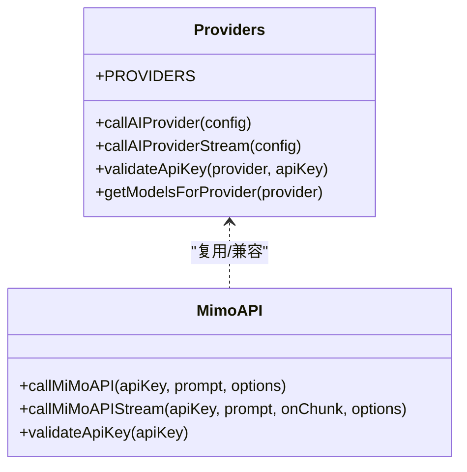
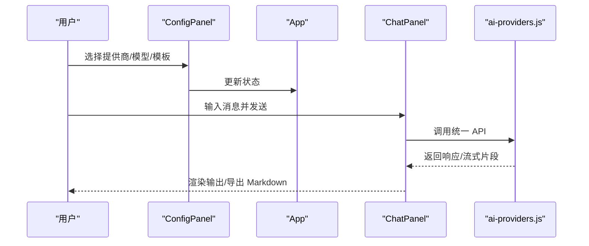
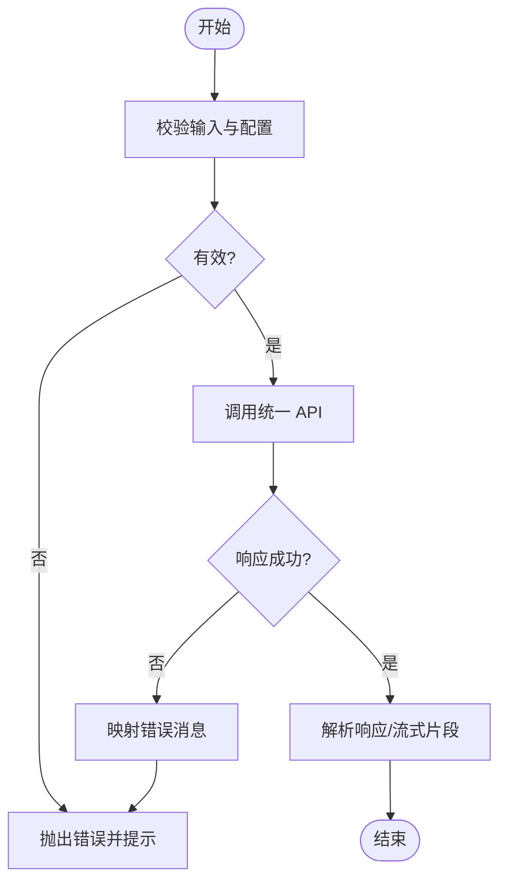
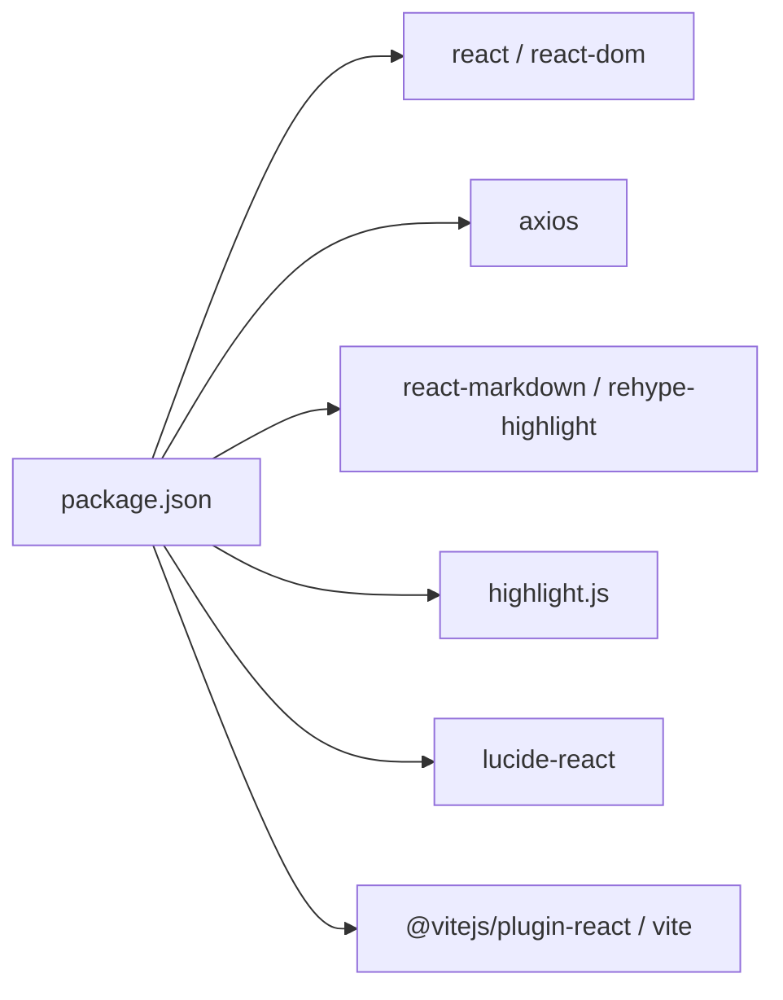

# 功能开发流程

<cite>
**本文引用的文件**
- [ai-providers.js](file://ai-doc-generator/src/api/ai-providers.js)
- [mimo.js](file://ai-doc-generator/src/api/mimo.js)
- [ChatPanel.jsx](file://ai-doc-generator/src/components/ChatPanel.jsx)
- [ConfigPanel.jsx](file://ai-doc-generator/src/components/ConfigPanel.jsx)
- [App.jsx](file://ai-doc-generator/src/App.jsx)
- [main.jsx](file://ai-doc-generator/src/main.jsx)
- [index.css](file://ai-doc-generator/src/index.css)
- [package.json](file://ai-doc-generator/package.json)
- [vite.config.js](file://ai-doc-generator/vite.config.js)
- [README.md](file://ai-doc-generator/README.md)
</cite>

## 目录
1. [引言](#引言)
2. [项目结构](#项目结构)
3. [核心组件](#核心组件)
4. [架构总览](#架构总览)
5. [详细组件分析](#详细组件分析)
6. [依赖关系分析](#依赖关系分析)
7. [性能考虑](#性能考虑)
8. [故障排查指南](#故障排查指南)
9. [结论](#结论)
10. [附录](#附录)

## 引言
本指南面向希望在现有 AI 文档生成器基础上进行功能扩展与开发的工程师，覆盖从需求分析、设计、API 集成、UI 组件开发、测试驱动开发（TDD）、版本控制与分支管理、代码审查与质量保证，到功能发布与部署的全流程。重点围绕 ai-providers.js 的扩展方法与组件开发规范展开，并提供可操作的实践建议与最佳实践。

## 项目结构
该项目采用 React + Vite 的前端单页应用结构，核心模块划分如下：
- API 层：统一的 AI 提供商适配层与专用提供商封装
- 组件层：配置面板与聊天输出面板
- 应用入口与样式：应用根组件、入口文件与全局样式
- 构建与脚本：Vite 配置与 npm scripts

图表来源
- [main.jsx:1-11](file://ai-doc-generator/src/main.jsx#L1-L11)
- [App.jsx:1-37](file://ai-doc-generator/src/App.jsx#L1-L37)
- [ConfigPanel.jsx:1-156](file://ai-doc-generator/src/components/ConfigPanel.jsx#L1-L156)
- [ChatPanel.jsx:1-278](file://ai-doc-generator/src/components/ChatPanel.jsx#L1-L278)
- [ai-providers.js:1-344](file://ai-doc-generator/src/api/ai-providers.js#L1-L344)
- [mimo.js:1-175](file://ai-doc-generator/src/api/mimo.js#L1-L175)
- [index.css:1-531](file://ai-doc-generator/src/index.css#L1-L531)
- [vite.config.js:1-11](file://ai-doc-generator/vite.config.js#L1-L11)
- [package.json:1-28](file://ai-doc-generator/package.json#L1-L28)

章节来源
- [main.jsx:1-11](file://ai-doc-generator/src/main.jsx#L1-L11)
- [App.jsx:1-37](file://ai-doc-generator/src/App.jsx#L1-L37)
- [package.json:1-28](file://ai-doc-generator/package.json#L1-L28)

## 核心组件
- 应用根组件负责状态持有与布局组织，将配置面板与聊天面板组合展示。
- 配置面板负责提供商选择、模型选择、API Key 输入、模板选择与提示词预览。
- 聊天面板负责消息渲染、发送请求、导出 Markdown、错误处理与加载态。
- API 层提供统一的提供商配置、请求封装、流式与非流式调用、错误映射与模型查询能力；同时保留专用提供商封装以兼容历史实现。

章节来源
- [App.jsx:1-37](file://ai-doc-generator/src/App.jsx#L1-L37)
- [ConfigPanel.jsx:1-156](file://ai-doc-generator/src/components/ConfigPanel.jsx#L1-L156)
- [ChatPanel.jsx:1-278](file://ai-doc-generator/src/components/ChatPanel.jsx#L1-L278)
- [ai-providers.js:1-344](file://ai-doc-generator/src/api/ai-providers.js#L1-L344)
- [mimo.js:1-175](file://ai-doc-generator/src/api/mimo.js#L1-L175)

## 架构总览
整体采用“组件-服务”分层架构：
- 组件层通过 props 与状态管理与服务层解耦
- API 层抽象统一的调用协议，屏蔽不同提供商差异
- 构建层通过 Vite 提供开发与生产环境支持

图表来源
- [ConfigPanel.jsx:1-156](file://ai-doc-generator/src/components/ConfigPanel.jsx#L1-L156)
- [ChatPanel.jsx:1-278](file://ai-doc-generator/src/components/ChatPanel.jsx#L1-L278)
- [ai-providers.js:1-344](file://ai-doc-generator/src/api/ai-providers.js#L1-L344)
- [mimo.js:1-175](file://ai-doc-generator/src/api/mimo.js#L1-L175)
- [vite.config.js:1-11](file://ai-doc-generator/vite.config.js#L1-L11)

## 详细组件分析

### API 集成与扩展：ai-providers.js
该文件是多提供商统一适配的核心，职责包括：
- 提供商配置常量与模型枚举
- 统一调用函数，支持 OpenAI 兼容格式与 Anthropic 格式
- 流式调用函数，支持增量输出
- API Key 校验与模型查询
- 错误映射与统一异常抛出

扩展方法（新增提供商）：
- 在 PROVIDERS 常量中新增条目，包含名称、API 地址、可用模型数组与图标
- 如需特殊请求格式或头信息，可在统一调用函数中增加条件分支
- 如需流式支持，确保目标提供商支持 SSE 或等效机制，并在流式函数中处理相应数据帧
- 新增模型时，无需修改调用逻辑，直接在 PROVIDERS 中维护即可

图表来源
- [ai-providers.js:1-344](file://ai-doc-generator/src/api/ai-providers.js#L1-L344)
- [mimo.js:1-175](file://ai-doc-generator/src/api/mimo.js#L1-L175)

章节来源
- [ai-providers.js:1-344](file://ai-doc-generator/src/api/ai-providers.js#L1-L344)
- [mimo.js:1-175](file://ai-doc-generator/src/api/mimo.js#L1-L175)

### 组件开发规范：ConfigPanel 与 ChatPanel
- 状态管理：在父组件中集中管理 API Key、提供商、模型、模板等状态，子组件通过 props 传入与回调更新
- 数据流：ConfigPanel 负责收集用户输入与模板选择，ChatPanel 负责发起请求与渲染结果
- 错误处理：统一在 ChatPanel 中捕获并展示，避免错误冒泡至全局
- UI 规范：使用 CSS 变量与媒体查询，保证响应式与主题一致性

图表来源
- [ConfigPanel.jsx:1-156](file://ai-doc-generator/src/components/ConfigPanel.jsx#L1-L156)
- [App.jsx:1-37](file://ai-doc-generator/src/App.jsx#L1-L37)
- [ChatPanel.jsx:1-278](file://ai-doc-generator/src/components/ChatPanel.jsx#L1-L278)
- [ai-providers.js:1-344](file://ai-doc-generator/src/api/ai-providers.js#L1-L344)

章节来源
- [ConfigPanel.jsx:1-156](file://ai-doc-generator/src/components/ConfigPanel.jsx#L1-L156)
- [ChatPanel.jsx:1-278](file://ai-doc-generator/src/components/ChatPanel.jsx#L1-L278)
- [App.jsx:1-37](file://ai-doc-generator/src/App.jsx#L1-L37)

### 错误处理与健壮性
- 统一错误映射：根据 HTTP 状态码与提供商返回体进行错误消息转换，便于用户理解
- 网络与超时：设置合理的超时时间与网络错误兜底
- 流式处理：对流式数据帧进行逐行解析与异常忽略，保证稳定性

图表来源
- [ai-providers.js:146-180](file://ai-doc-generator/src/api/ai-providers.js#L146-L180)
- [ChatPanel.jsx:41-46](file://ai-doc-generator/src/components/ChatPanel.jsx#L41-L46)

章节来源
- [ai-providers.js:146-180](file://ai-doc-generator/src/api/ai-providers.js#L146-L180)
- [ChatPanel.jsx:41-46](file://ai-doc-generator/src/components/ChatPanel.jsx#L41-L46)

## 依赖关系分析
- 运行时依赖：React、ReactDOM、Axios、react-markdown、rehype-highlight、lucide-react、highlight.js
- 开发依赖：@vitejs/plugin-react、vite
- 构建脚本：dev、build、preview

图表来源
- [package.json:1-28](file://ai-doc-generator/package.json#L1-L28)

章节来源
- [package.json:1-28](file://ai-doc-generator/package.json#L1-L28)

## 性能考虑
- 请求超时与重试：为第三方 API 设置合理超时，必要时在上层实现指数退避重试
- 流式渲染：优先使用流式接口以提升用户体验，避免长等待
- 样式与资源：使用 CSS 变量与媒体查询减少重复计算，避免不必要的重排重绘
- 构建优化：利用 Vite 的按需编译与热更新，生产构建开启压缩与 Tree Shaking

## 故障排查指南
常见问题与定位思路：
- API Key 无效：检查提供商与 Key 是否匹配，查看错误映射中的状态码提示
- 网络连接失败：确认网络可达性与代理设置，检查跨域与证书问题
- 响应格式异常：核对 PROVIDERS 中的请求字段与提供商文档是否一致
- 流式输出中断：检查 SSE/流式协议支持与浏览器兼容性

章节来源
- [ai-providers.js:146-180](file://ai-doc-generator/src/api/ai-providers.js#L146-L180)
- [ChatPanel.jsx:41-46](file://ai-doc-generator/src/components/ChatPanel.jsx#L41-L46)

## 结论
本指南提供了从需求到发布的完整流程参考，强调了 API 层的统一抽象、组件层的状态与数据流管理、以及错误处理与性能优化的关键点。按照本文的扩展方法与开发规范，可以高效地在现有系统上新增提供商、模板与功能模块，并保持代码质量与可维护性。

## 附录

### 功能开发流程清单
- 需求分析与设计
  - 明确功能目标与用户场景
  - 设计 UI 原型与交互流程
  - 制定 API 集成方案与错误处理策略
- 开发实施
  - 在 API 层扩展 ai-providers.js（如需）
  - 在组件层新增或修改 UI 组件
  - 编写单元测试与集成测试
- 测试驱动开发（TDD）
  - 单元测试：针对 API 调用、错误映射、模型查询等函数
  - 集成测试：模拟组件间交互与真实 API 调用
- 版本控制与分支管理
  - 使用功能分支开发，主干只合并稳定版本
  - 提交信息清晰描述变更内容与影响范围
- 代码审查与质量保证
  - 代码审查关注：可读性、健壮性、安全性、性能
  - 质量门禁：通过单元测试、集成测试与静态检查
- 发布与部署
  - 本地预览验证
  - 生产构建与产物校验
  - 部署与回滚预案

### 测试驱动开发最佳实践
- 单元测试
  - 使用最小化依赖与模拟对象
  - 覆盖正常路径与边界条件
  - 对错误映射与异常抛出进行断言
- 集成测试
  - 模拟真实网络请求与响应
  - 验证组件渲染与交互行为
  - 包含流式输出的端到端验证

### 版本控制与分支管理策略
- 分支命名：feature/功能名、fix/修复项、hotfix/紧急修复
- 提交规范：类型: 概述；正文: 影响范围与解决要点
- 合并与审核：小步快跑，每次合并前确保测试通过

### 代码审查流程与质量保证
- 审查清单：功能正确性、性能影响、安全风险、可维护性
- 质量工具：ESLint、Prettier、TypeScript（如启用）、SonarQube（可选）

### 发布与部署标准化流程
- 本地验证：npm run dev 与 npm run preview
- 构建产物：npm run build，检查 dist 目录与资源完整性
- 部署：将构建产物部署至静态托管或容器环境
- 回滚：保留上一版本构建产物，快速回滚