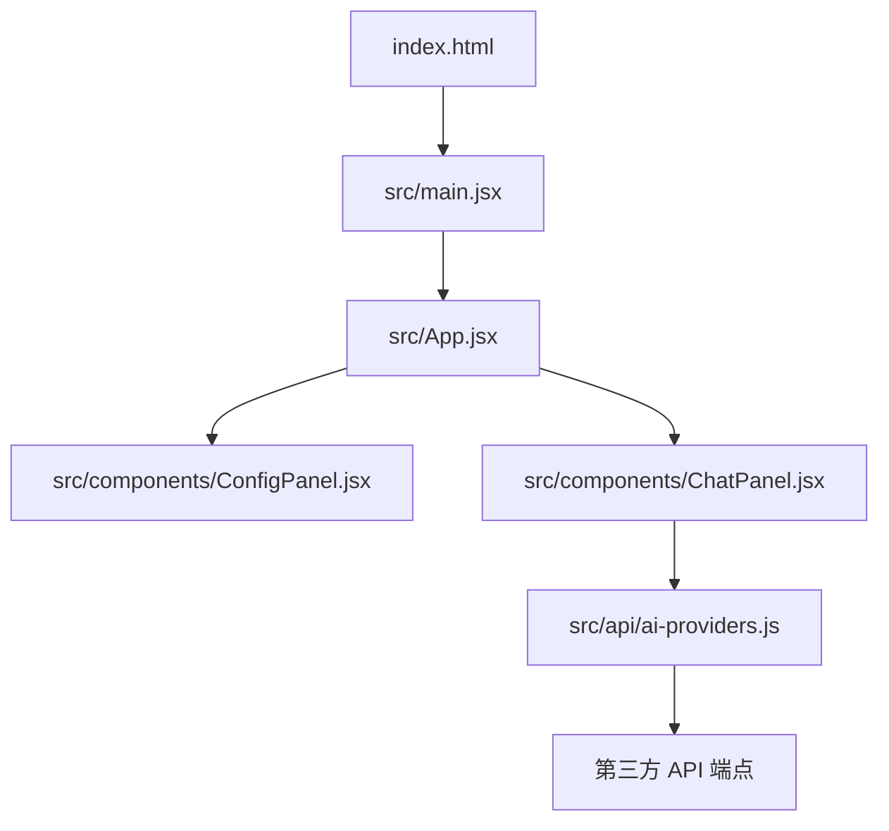
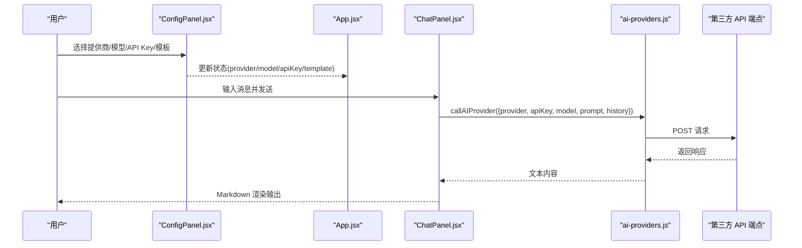
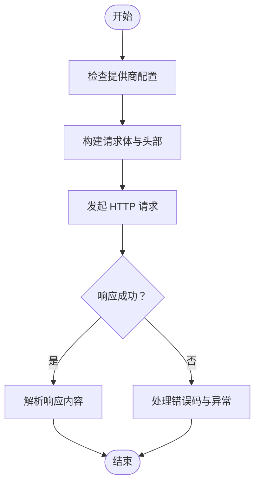
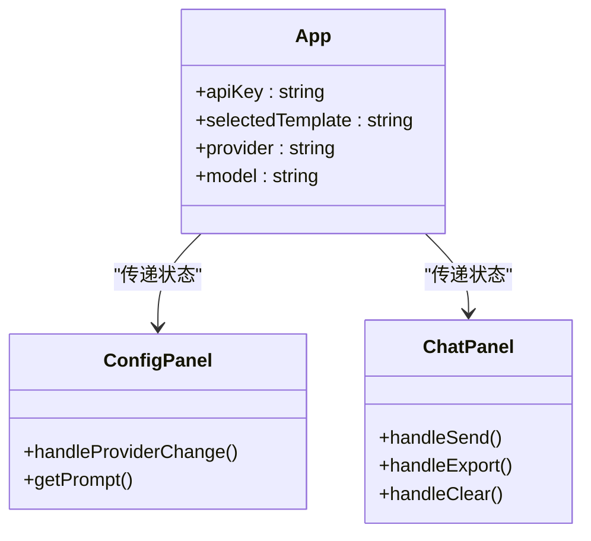
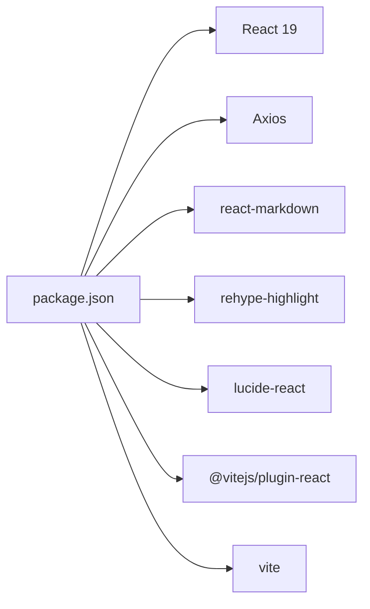

# 开发环境配置

<cite>
**本文引用的文件**
- [package.json](file://ai-doc-generator/package.json)
- [vite.config.js](file://ai-doc-generator/vite.config.js)
- [index.html](file://ai-doc-generator/index.html)
- [main.jsx](file://ai-doc-generator/src/main.jsx)
- [App.jsx](file://ai-doc-generator/src/App.jsx)
- [ConfigPanel.jsx](file://ai-doc-generator/src/components/ConfigPanel.jsx)
- [ChatPanel.jsx](file://ai-doc-generator/src/components/ChatPanel.jsx)
- [ai-providers.js](file://ai-doc-generator/src/api/ai-providers.js)
- [mimo.js](file://ai-doc-generator/src/api/mimo.js)
- [README.md](file://ai-doc-generator/README.md)
</cite>

## 目录
1. [简介](#简介)
2. [项目结构](#项目结构)
3. [核心组件](#核心组件)
4. [架构总览](#架构总览)
5. [详细组件分析](#详细组件分析)
6. [依赖关系分析](#依赖关系分析)
7. [性能考虑](#性能考虑)
8. [故障排除指南](#故障排除指南)
9. [结论](#结论)
10. [附录](#附录)

## 简介
本指南面向开发人员，提供该 React + Vite 项目的开发环境配置与使用说明，涵盖 Node.js 版本要求、包管理器安装、Vite 构建工具配置、开发服务器设置、代理与热重载机制、环境变量与 API 密钥管理、调试工具配置以及 IDE 推荐设置，并提供常见问题排查方案。

## 项目结构
该项目采用前端单页应用结构，核心目录与文件如下：
- 应用入口与页面模板
  - index.html：HTML 页面模板，挂载点为 #root，引入模块入口脚本
  - src/main.jsx：React 根节点渲染入口
  - src/App.jsx：主应用容器，协调配置面板与对话面板
- 组件层
  - src/components/ConfigPanel.jsx：配置面板，负责提供商、模型、API Key、模板与主题输入
  - src/components/ChatPanel.jsx：对话与输出面板，负责消息展示、发送、导出与错误处理
- API 层
  - src/api/ai-providers.js：统一的多提供商 API 调用封装，支持流式与非流式
  - src/api/mimo.js：MiMo 专属 API 调用封装（兼容通用封装）
- 构建与运行
  - vite.config.js：Vite 开发服务器与插件配置
  - package.json：脚本、依赖与开发依赖声明

图表来源
- [index.html:1-14](file://ai-doc-generator/index.html#L1-L14)
- [main.jsx:1-11](file://ai-doc-generator/src/main.jsx#L1-L11)
- [App.jsx:1-37](file://ai-doc-generator/src/App.jsx#L1-L37)
- [ConfigPanel.jsx:1-156](file://ai-doc-generator/src/components/ConfigPanel.jsx#L1-L156)
- [ChatPanel.jsx:1-278](file://ai-doc-generator/src/components/ChatPanel.jsx#L1-L278)
- [ai-providers.js:1-344](file://ai-doc-generator/src/api/ai-providers.js#L1-L344)

章节来源
- [package.json:1-28](file://ai-doc-generator/package.json#L1-L28)
- [vite.config.js:1-11](file://ai-doc-generator/vite.config.js#L1-L11)
- [index.html:1-14](file://ai-doc-generator/index.html#L1-L14)
- [main.jsx:1-11](file://ai-doc-generator/src/main.jsx#L1-L11)
- [App.jsx:1-37](file://ai-doc-generator/src/App.jsx#L1-L37)

## 核心组件
- 包管理与脚本
  - scripts.dev：启动 Vite 开发服务器
  - scripts.build：打包生产版本
  - scripts.preview：预览生产构建
- 依赖与开发依赖
  - 运行时依赖：React 19、Axios、react-markdown、rehype-highlight、lucide-react 等
  - 开发依赖：@vitejs/plugin-react、vite
- Vite 配置
  - 插件：react()
  - 服务器：端口 3000，启动后自动打开浏览器

章节来源
- [package.json:6-10](file://ai-doc-generator/package.json#L6-L10)
- [package.json:14-26](file://ai-doc-generator/package.json#L14-L26)
- [vite.config.js:4-10](file://ai-doc-generator/vite.config.js#L4-L10)

## 架构总览
应用采用“配置面板 + 对话面板”的双面板布局，通过 App.jsx 状态管理提供商、模型、API Key 与模板；ChatPanel.jsx 负责消息交互与渲染；ai-providers.js 提供统一的多提供商调用能力，支持流式与非流式响应。

图表来源
- [App.jsx:6-34](file://ai-doc-generator/src/App.jsx#L6-L34)
- [ConfigPanel.jsx:13-33](file://ai-doc-generator/src/components/ConfigPanel.jsx#L13-L33)
- [ChatPanel.jsx:13-46](file://ai-doc-generator/src/components/ChatPanel.jsx#L13-L46)
- [ai-providers.js:60-181](file://ai-doc-generator/src/api/ai-providers.js#L60-L181)

## 详细组件分析

### Vite 构建工具配置
- 插件与服务器
  - 插件：@vitejs/plugin-react，启用 React Fast Refresh
  - 服务器：port=3000，open=true，启动后自动打开浏览器
- 热重载机制
  - Vite 默认内置 HMR，无需额外配置即可实现模块热替换
- 代理配置
  - 当前未配置代理，如需跨域或本地代理，请在 vite.config.js 的 server.proxy 中添加规则

章节来源
- [vite.config.js:4-10](file://ai-doc-generator/vite.config.js#L4-L10)

### 开发服务器设置与启动流程
- 启动命令
  - npm run dev：启动开发服务器
- 启动流程
  - Vite 读取 vite.config.js，加载 @vitejs/plugin-react
  - index.html 作为入口模板，挂载 #root
  - main.jsx 渲染 App.jsx
  - App.jsx 渲染 ConfigPanel 与 ChatPanel

章节来源
- [package.json:6-10](file://ai-doc-generator/package.json#L6-L10)
- [index.html:9-12](file://ai-doc-generator/index.html#L9-L12)
- [main.jsx:6-10](file://ai-doc-generator/src/main.jsx#L6-L10)

### 环境变量与 API 密钥管理
- 环境变量位置
  - README 提供了 .env 示例，用于存放 VITE_MIMO_API_KEY
- 使用方式
  - Vite 会将以 VITE_ 前缀的环境变量注入到客户端代码中
  - 在组件中可通过 import.meta.env.VITE_MIMO_API_KEY 获取
- 注意事项
  - 仅 VITE_ 前缀的变量会被注入到客户端
  - 不要在客户端暴露敏感信息，建议在服务端做代理或令牌校验

章节来源
- [README.md:142-146](file://ai-doc-generator/README.md#L142-L146)
- [ConfigPanel.jsx:68-76](file://ai-doc-generator/src/components/ConfigPanel.jsx#L68-L76)

### 多提供商 API 调用封装
- 统一调用函数
  - callAIProvider：支持 OpenAI 兼容格式与 Anthropic Claude 格式，统一错误处理
- 流式调用
  - callAIProviderStream：支持流式返回，逐块推送内容
- 验证 API Key
  - validateApiKey：通过短请求验证可用性
- 模型与提供商
  - PROVIDERS：集中定义各提供商的名称、图标、API 地址与模型列表
  - getModelsForProvider：根据提供商动态生成模型下拉选项

图表来源
- [ai-providers.js:60-181](file://ai-doc-generator/src/api/ai-providers.js#L60-L181)

章节来源
- [ai-providers.js:4-47](file://ai-doc-generator/src/api/ai-providers.js#L4-L47)
- [ai-providers.js:60-181](file://ai-doc-generator/src/api/ai-providers.js#L60-L181)
- [ai-providers.js:190-309](file://ai-doc-generator/src/api/ai-providers.js#L190-L309)
- [ai-providers.js:317-329](file://ai-doc-generator/src/api/ai-providers.js#L317-L329)
- [ai-providers.js:336-343](file://ai-doc-generator/src/api/ai-providers.js#L336-L343)

### 组件交互与状态管理
- App.jsx
  - 维护 apiKey、selectedTemplate、provider、model 四个状态
  - 将状态传递给 ConfigPanel 与 ChatPanel
- ConfigPanel.jsx
  - 提供提供商与模型选择、API Key 输入、模板选择与主题输入
  - 根据提供商变化自动选择首个模型
- ChatPanel.jsx
  - 维护消息列表、输入框、加载与错误状态
  - 调用 callAIProvider 发送请求并渲染 Markdown 输出
  - 支持导出为 Markdown 文件

图表来源
- [App.jsx:6-34](file://ai-doc-generator/src/App.jsx#L6-L34)
- [ConfigPanel.jsx:13-33](file://ai-doc-generator/src/components/ConfigPanel.jsx#L13-L33)
- [ChatPanel.jsx:7-80](file://ai-doc-generator/src/components/ChatPanel.jsx#L7-L80)

章节来源
- [App.jsx:6-34](file://ai-doc-generator/src/App.jsx#L6-L34)
- [ConfigPanel.jsx:13-33](file://ai-doc-generator/src/components/ConfigPanel.jsx#L13-L33)
- [ChatPanel.jsx:13-46](file://ai-doc-generator/src/components/ChatPanel.jsx#L13-L46)

## 依赖关系分析
- 运行时依赖
  - React 19：应用框架
  - Axios：HTTP 客户端
  - react-markdown + rehype-highlight：Markdown 渲染与代码高亮
  - lucide-react：图标库
- 开发依赖
  - @vitejs/plugin-react：React 支持与 HMR
  - vite：开发服务器与打包工具

图表来源
- [package.json:14-26](file://ai-doc-generator/package.json#L14-L26)

章节来源
- [package.json:14-26](file://ai-doc-generator/package.json#L14-L26)

## 性能考虑
- 代码分割与懒加载
  - 可在路由层面进行代码分割，减少首屏体积
- 图标与样式
  - lucide-react 为按需图标库，避免全量引入
- Markdown 渲染
  - rehype-highlight 仅在需要时加载，注意避免重复初始化
- 构建优化
  - 生产构建时启用压缩与最小化
- 网络请求
  - 合理设置超时时间与重试策略，避免阻塞 UI

## 故障排除指南
- 启动失败（端口占用）
  - 现象：开发服务器无法启动
  - 处理：修改 vite.config.js 的 server.port 或关闭占用端口的进程
- API Key 无效
  - 现象：出现 401/403 错误
  - 处理：检查 API Key 是否正确、是否过期、提供商是否匹配
- 网络错误
  - 现象：出现网络错误提示
  - 处理：检查网络连通性、代理设置、防火墙
- 跨域问题
  - 现象：浏览器控制台报跨域错误
  - 处理：在 vite.config.js 中配置 server.proxy，或在服务端开启 CORS
- 热重载不生效
  - 现象：修改代码后页面未刷新
  - 处理：确认 @vitejs/plugin-react 已正确安装与启用；检查浏览器控制台是否有 HMR 错误
- Markdown 渲染异常
  - 现象：代码块无高亮或渲染错乱
  - 处理：确认 rehype-highlight 已正确引入，检查主题样式文件路径

章节来源
- [vite.config.js:6-9](file://ai-doc-generator/vite.config.js#L6-L9)
- [ai-providers.js:146-180](file://ai-doc-generator/src/api/ai-providers.js#L146-L180)
- [ChatPanel.jsx:15-18](file://ai-doc-generator/src/components/ChatPanel.jsx#L15-L18)
- [README.md:142-146](file://ai-doc-generator/README.md#L142-L146)

## 结论
本项目基于 Vite 与 React 19 构建，具备简洁清晰的开发环境与良好的扩展性。通过统一的多提供商 API 封装，可在不改动 UI 的前提下灵活切换不同 AI 提供商。建议在开发过程中充分利用 Vite 的热重载与环境变量注入能力，并结合合理的错误处理与网络配置，确保开发体验与稳定性。

## 附录

### Node.js 与包管理器安装步骤
- Node.js 版本要求
  - 项目使用 React 19 与 Vite 5，建议使用 Node.js 18+ LTS 版本
- 安装依赖
  - 使用 npm：执行安装命令
  - 使用 yarn：如需使用 yarn，请先全局安装 yarn 并执行安装命令
- 启动开发服务器
  - 使用 npm：执行启动命令
- 构建与预览
  - 使用 npm：执行构建与预览命令

章节来源
- [package.json:6-10](file://ai-doc-generator/package.json#L6-L10)
- [README.md:44-64](file://ai-doc-generator/README.md#L44-L64)

### Vite 配置选项详解
- 插件
  - @vitejs/plugin-react：启用 React JSX 支持与 Fast Refresh
- 服务器
  - port：开发服务器端口，默认 3000
  - open：启动后自动打开浏览器
- 代理
  - 如需代理，请在 server.proxy 中添加规则（当前未配置）

章节来源
- [vite.config.js:4-10](file://ai-doc-generator/vite.config.js#L4-L10)

### 环境变量与 API 密钥配置
- 环境变量文件
  - 创建 .env 文件，添加以 VITE_ 前缀的变量
- 在组件中使用
  - 通过 import.meta.env.VITE_MIMO_API_KEY 获取
- API 密钥管理
  - 建议在服务端做代理或令牌校验，避免在客户端直接暴露敏感信息

章节来源
- [README.md:142-146](file://ai-doc-generator/README.md#L142-L146)
- [ConfigPanel.jsx:68-76](file://ai-doc-generator/src/components/ConfigPanel.jsx#L68-L76)

### 调试工具配置
- 浏览器开发者工具
  - 打开控制台查看网络请求、错误堆栈与环境变量注入情况
- React DevTools
  - 安装 React DevTools 扩展，查看组件树、Props 与状态
- Vite HMR
  - 修改代码后观察浏览器控制台与页面变化，确认热重载生效

### IDE 推荐配置与插件
- VS Code
  - 插件：ESLint、Prettier、Bracket Pair Colorizer、DotENV、Auto Rename Tag
  - 设置：启用 ESLint 自动修复、格式化保存
- WebStorm/IntelliJ IDEA
  - 插件：ESLint、Prettier、Vue/React 支持
  - 设置：启用代码格式化与保存时自动修复