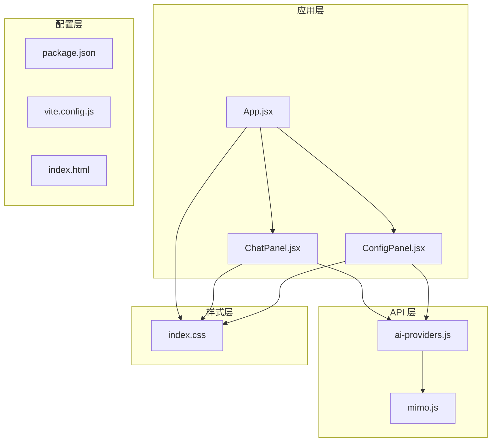
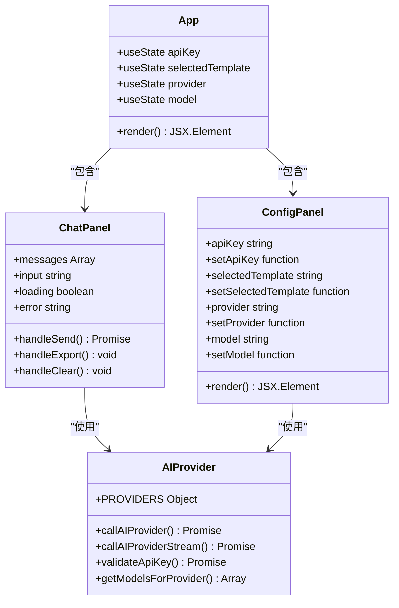
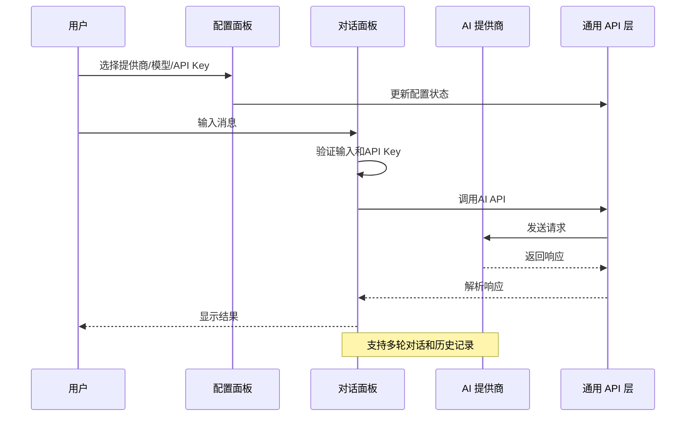
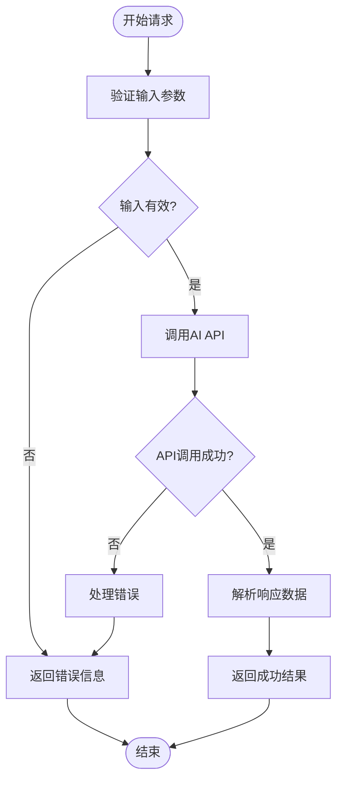

# 开发者指南

<cite>
**本文档引用的文件**
- [package.json](file://ai-doc-generator/package.json)
- [vite.config.js](file://ai-doc-generator/vite.config.js)
- [README.md](file://ai-doc-generator/README.md)
- [index.html](file://ai-doc-generator/index.html)
- [main.jsx](file://ai-doc-generator/src/main.jsx)
- [App.jsx](file://ai-doc-generator/src/App.jsx)
- [ChatPanel.jsx](file://ai-doc-generator/src/components/ChatPanel.jsx)
- [ConfigPanel.jsx](file://ai-doc-generator/src/components/ConfigPanel.jsx)
- [ai-providers.js](file://ai-doc-generator/src/api/ai-providers.js)
- [mimo.js](file://ai-doc-generator/src/api/mimo.js)
- [index.css](file://ai-doc-generator/src/index.css)
</cite>

## 目录
1. [简介](#简介)
2. [项目结构](#项目结构)
3. [核心组件](#核心组件)
4. [架构概览](#架构概览)
5. [详细组件分析](#详细组件分析)
6. [依赖关系分析](#依赖关系分析)
7. [性能考虑](#性能考虑)
8. [调试与开发工具](#调试与开发工具)
9. [新功能开发流程](#新功能开发流程)
10. [贡献指南](#贡献指南)
11. [扩展点与插件机制](#扩展点与插件机制)
12. [故障排除指南](#故障排除指南)
13. [结论](#结论)

## 简介

AI 文档生成器是一个基于 React 19 和 Vite 5 构建的智能文档生成与代码辅助工具。该项目支持多种 AI 提供商（MiMo、OpenAI、Claude、智谱、Kimi、DeepSeek、通义千问），提供多轮对话、实时 Markdown 渲染、代码语法高亮和一键导出等功能。

## 项目结构

项目采用模块化架构，主要分为以下几个层次：



**图表来源**
- [App.jsx:1-37](file://ai-doc-generator/src/App.jsx#L1-L37)
- [ChatPanel.jsx:1-278](file://ai-doc-generator/src/components/ChatPanel.jsx#L1-L278)
- [ConfigPanel.jsx:1-156](file://ai-doc-generator/src/components/ConfigPanel.jsx#L1-L156)
- [ai-providers.js:1-344](file://ai-doc-generator/src/api/ai-providers.js#L1-L344)
- [mimo.js:1-175](file://ai-doc-generator/src/api/mimo.js#L1-L175)

**章节来源**
- [package.json:1-28](file://ai-doc-generator/package.json#L1-L28)
- [vite.config.js:1-11](file://ai-doc-generator/vite.config.js#L1-L11)
- [index.html:1-14](file://ai-doc-generator/index.html#L1-L14)

## 核心组件

### 应用入口与主组件

应用采用 React 19 的严格模式，通过 main.jsx 进行初始化：

- **入口文件**：main.jsx 负责渲染根组件和应用样式
- **主应用**：App.jsx 管理全局状态和布局
- **样式系统**：采用 CSS 变量和现代 CSS 特性实现深色主题

### 组件架构



**图表来源**
- [App.jsx:6-36](file://ai-doc-generator/src/App.jsx#L6-L36)
- [ConfigPanel.jsx:13-155](file://ai-doc-generator/src/components/ConfigPanel.jsx#L13-L155)
- [ChatPanel.jsx:7-277](file://ai-doc-generator/src/components/ChatPanel.jsx#L7-L277)
- [ai-providers.js:60-181](file://ai-doc-generator/src/api/ai-providers.js#L60-L181)

**章节来源**
- [main.jsx:1-11](file://ai-doc-generator/src/main.jsx#L1-L11)
- [App.jsx:1-37](file://ai-doc-generator/src/App.jsx#L1-L37)

## 架构概览

### 数据流架构



**图表来源**
- [ChatPanel.jsx:13-46](file://ai-doc-generator/src/components/ChatPanel.jsx#L13-L46)
- [ai-providers.js:60-181](file://ai-doc-generator/src/api/ai-providers.js#L60-L181)

### 错误处理流程



**图表来源**
- [ChatPanel.jsx:26-45](file://ai-doc-generator/src/components/ChatPanel.jsx#L26-L45)
- [ai-providers.js:146-180](file://ai-doc-generator/src/api/ai-providers.js#L146-L180)

## 详细组件分析

### 配置面板组件

ConfigPanel.jsx 实现了完整的配置管理功能：

#### 模板系统
- **内置模板**：技术文档、代码生成、API文档、教程指南、代码审查、自定义
- **模板渲染**：支持占位符替换（{topic}、{code}）
- **动态配置**：根据模板类型显示相应的输入字段

#### 提供商管理
- **多提供商支持**：统一的 PROVIDERS 配置对象
- **模型选择**：根据提供商自动加载可用模型
- **图标显示**：每个提供商都有独特的表情符号标识

**章节来源**
- [ConfigPanel.jsx:4-11](file://ai-doc-generator/src/components/ConfigPanel.jsx#L4-L11)
- [ConfigPanel.jsx:19-26](file://ai-doc-generator/src/components/ConfigPanel.jsx#L19-L26)
- [ai-providers.js:4-47](file://ai-doc-generator/src/api/ai-providers.js#L4-L47)

### 对话面板组件

ChatPanel.jsx 提供了完整的对话交互功能：

#### 实时渲染
- **Markdown 渲染**：使用 react-markdown 和 rehype-highlight
- **代码高亮**：支持多种编程语言的语法高亮
- **动画效果**：消息进入和加载动画

#### 导出功能
- **Markdown 导出**：一键导出对话历史为 Markdown 文件
- **文件命名**：自动包含时间戳确保唯一性
- **内容格式化**：清晰的分隔线和角色标识

**章节来源**
- [ChatPanel.jsx:1-278](file://ai-doc-generator/src/components/ChatPanel.jsx#L1-L278)

### API 抽象层

ai-providers.js 实现了统一的 API 调用接口：

#### 多提供商兼容
- **统一接口**：callAIProvider 支持所有提供商
- **差异化处理**：针对不同提供商的 API 格式进行适配
- **错误映射**：将提供商特定的错误转换为统一格式

#### 流式处理
- **实时输出**：callAIProviderStream 支持流式响应
- **增量渲染**：逐字节处理，提供更好的用户体验
- **回调机制**：onChunk、onComplete、onError 回调

**章节来源**
- [ai-providers.js:60-181](file://ai-doc-generator/src/api/ai-providers.js#L60-L181)
- [ai-providers.js:190-309](file://ai-doc-generator/src/api/ai-providers.js#L190-L309)

### 样式系统

index.css 采用了现代化的 CSS 设计：

#### 深色主题设计
- **渐变背景**：使用 CSS 渐变创建科技感背景
- **发光效果**：通过 box-shadow 和 filter 实现发光边框
- **动画效果**：网格背景动画和元素悬停效果

#### 响应式设计
- **移动端适配**：媒体查询支持不同屏幕尺寸
- **网格布局**：使用 CSS Grid 实现自适应布局
- **字体系统**：Google Fonts 集成 Orbitron、Rajdhani、JetBrains Mono

**章节来源**
- [index.css:1-531](file://ai-doc-generator/src/index.css#L1-L531)

## 依赖关系分析

### 核心依赖

```mermaid
graph LR
subgraph "运行时依赖"
React[react@^19.2.5]
ReactDOM[react-dom@^19.2.5]
Axios[axios@^1.15.2]
Markdown[react-markdown@^10.1.0]
Highlight[rehype-highlight@^7.0.2]
Lucide[lucide-react@^1.14.0]
end
subgraph "开发依赖"
Vite[vite@^5.4.11]
ReactPlugin[@vitejs/plugin-react@^4.3.4]
end
App --> React
App --> ReactDOM
ChatPanel --> Markdown
ChatPanel --> Highlight
ChatPanel --> Axios
ConfigPanel --> React
API --> Axios
```

**图表来源**
- [package.json:14-26](file://ai-doc-generator/package.json#L14-L26)

### 构建配置

vite.config.js 提供了基础的开发服务器配置：

- **插件系统**：集成 React 插件支持 JSX 和 HMR
- **开发服务器**：默认监听 3000 端口，自动打开浏览器
- **构建优化**：Vite 默认的生产构建优化

**章节来源**
- [vite.config.js:4-10](file://ai-doc-generator/vite.config.js#L4-L10)

## 性能考虑

### 代码分割与懒加载

虽然当前项目规模较小，但可以考虑以下优化策略：

#### 组件懒加载
```javascript
// 建议的懒加载模式
const LazyChatPanel = React.lazy(() => import('./components/ChatPanel'));
const LazyConfigPanel = React.lazy(() => import('./components/ConfigPanel'));
```

#### 图片优化
- 使用现代图片格式（WebP）
- 实现图片懒加载
- 提供适当的图片尺寸

### 缓存策略

#### API 响应缓存
- 对于相同输入的请求结果进行缓存
- 设置合理的缓存失效时间
- 区分不同提供商的缓存策略

#### 本地存储
- 保存用户配置和偏好设置
- 缓存常用的模板内容
- 存储对话历史（可选）

### 性能监控

建议集成性能监控工具：
- Web Vitals 监控
- 错误追踪
- 性能指标收集

## 调试与开发工具

### 开发环境配置

#### 环境变量
- **API Key 管理**：支持 .env 文件配置
- **环境隔离**：区分开发和生产环境
- **安全考虑**：API Key 仅在客户端使用

#### 调试工具
- **React DevTools**：组件状态和性能分析
- **Vite Dev Server**：热重载和错误显示
- **浏览器控制台**：网络请求和错误日志

### 调试技巧

#### 状态调试
```javascript
// 在组件中添加调试输出
console.log('组件状态:', { apiKey, provider, model });
```

#### 网络请求调试
- 使用浏览器网络面板监控 API 请求
- 检查请求头和响应体
- 分析请求耗时和错误

#### 错误处理调试
- 实现详细的错误日志
- 提供用户友好的错误信息
- 支持错误报告功能

**章节来源**
- [README.md:142-147](file://ai-doc-generator/README.md#L142-L147)

## 新功能开发流程

### 需求分析阶段

1. **功能评估**
   - 分析现有架构的扩展性
   - 确定新功能对现有组件的影响
   - 评估性能影响

2. **技术方案设计**
   - 选择合适的设计模式
   - 确定组件边界和职责
   - 设计 API 接口

### 开发实现阶段

#### 代码组织原则
- **文件命名**：使用帕斯卡命名法（如 NewFeature.jsx）
- **组件拆分**：保持单一职责原则
- **状态管理**：合理使用 React Hooks

#### 开发规范
- **ESLint 配置**：遵循项目代码风格
- **TypeScript 支持**：可选的类型安全检查
- **注释规范**：为公共 API 添加 JSDoc 注释

### 测试验证阶段

#### 单元测试
```javascript
// 测试用例示例
describe('组件测试', () => {
  test('应该正确渲染', () => {
    // 测试逻辑
  });
});
```

#### 集成测试
- 测试组件间的交互
- 验证 API 调用流程
- 检查错误处理机制

#### 用户验收测试
- 功能完整性验证
- 用户体验测试
- 性能基准测试

## 贡献指南

### 代码提交规范

#### Commit Message 规范
```
<type>(<scope>): <subject>

<body>

<footer>
```

常见类型：
- **feat**: 新功能
- **fix**: 修复 bug
- **docs**: 文档更新
- **style**: 代码格式调整
- **refactor**: 代码重构
- **test**: 测试相关
- **chore**: 构建过程或辅助工具变动

#### Pull Request 流程
1. **分支管理**
   - 基于 main 分支创建功能分支
   - 分支命名：feature/功能名 或 fix/问题描述

2. **代码审查**
   - 至少一名维护者审查
   - 代码风格和架构一致性检查
   - 测试覆盖率要求

3. **合并策略**
   - Squash and Merge 策略
   - 保持提交历史整洁

### 开发工作流程

#### 本地开发
1. **环境准备**
   ```bash
   npm install
   npm run dev
   ```

2. **代码规范检查**
   ```bash
   npm run lint
   npm run test
   ```

3. **构建验证**
   ```bash
   npm run build
   npm run preview
   ```

#### 版本发布
1. **版本号管理**
   - 遵循语义化版本控制
   - 更新 package.json 中的版本号

2. **变更日志**
   - 记录重大变更
   - 更新 README.md

3. **发布流程**
   - 构建生产版本
   - 代码审查
   - 合并到 main 分支

**章节来源**
- [README.md:162-169](file://ai-doc-generator/README.md#L162-L169)

## 扩展点与插件机制

### 插件架构设计

#### API 提供商扩展
```javascript
// 扩展示例
const CUSTOM_PROVIDER = {
  name: '自定义提供商',
  apiUrl: 'https://api.example.com/v1/chat/completions',
  models: ['custom-model'],
  icon: '⭐'
};
```

#### 模板系统扩展
- **模板注册**：在 templates 数组中添加新模板
- **提示词定制**：支持更复杂的占位符系统
- **条件渲染**：根据模板类型动态显示输入字段

#### 组件扩展
- **新组件开发**：遵循现有组件模式
- **状态管理**：使用 React Context 管理全局状态
- **事件系统**：通过 props 和回调函数实现组件通信

### 配置系统

#### 动态配置
- **运行时配置**：支持在应用运行时修改配置
- **持久化存储**：使用 localStorage 保存用户偏好
- **配置验证**：确保配置的有效性和安全性

#### 插件接口
```javascript
// 插件接口定义
interface PluginInterface {
  name: string;
  version: string;
  init(): void;
  destroy(): void;
}
```

## 故障排除指南

### 常见问题诊断

#### API 连接问题
1. **检查 API Key**
   - 确认 API Key 格式正确
   - 验证账户状态和配额

2. **网络连接检查**
   - 测试网络连通性
   - 检查防火墙设置

3. **代理配置**
   - 配置正确的代理设置
   - 检查企业网络限制

#### 性能问题
1. **内存泄漏检测**
   - 使用浏览器性能面板
   - 检查事件监听器清理

2. **渲染性能优化**
   - 实施虚拟滚动
   - 减少不必要的重渲染

#### 样式问题
1. **CSS 优先级**
   - 检查 CSS 作用域
   - 避免样式冲突

2. **响应式布局**
   - 测试不同设备
   - 检查媒体查询

### 错误处理策略

#### 用户可见错误
- **友好提示**：提供清晰的错误信息
- **重试机制**：支持自动重试
- **降级方案**：在网络异常时提供基本功能

#### 开发者调试
- **详细日志**：记录完整的错误堆栈
- **上下文信息**：包含请求参数和响应数据
- **错误分类**：区分不同类型错误

**章节来源**
- [ChatPanel.jsx:15-18](file://ai-doc-generator/src/components/ChatPanel.jsx#L15-L18)
- [ai-providers.js:146-180](file://ai-doc-generator/src/api/ai-providers.js#L146-L180)

## 结论

AI 文档生成器项目展现了现代前端开发的最佳实践，包括：

### 技术优势
- **架构清晰**：模块化设计便于维护和扩展
- **性能优秀**：Vite 构建工具提供快速开发体验
- **用户体验**：丰富的交互和视觉效果

### 开发建议
- **持续优化**：定期评估和改进性能
- **文档完善**：保持代码注释和文档同步更新
- **测试覆盖**：增加自动化测试覆盖率

### 未来发展方向
- **功能扩展**：支持更多 AI 提供商和模型
- **性能提升**：实施更高级的优化策略
- **用户体验**：持续改进界面和交互设计

该项目为开发者提供了良好的学习和参考价值，展示了如何构建一个功能完整、性能优秀的现代 Web 应用。