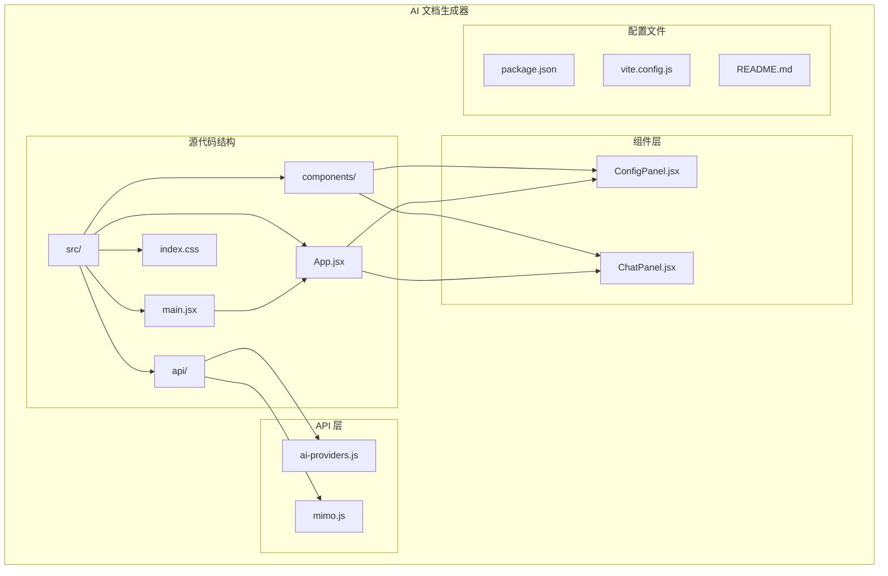
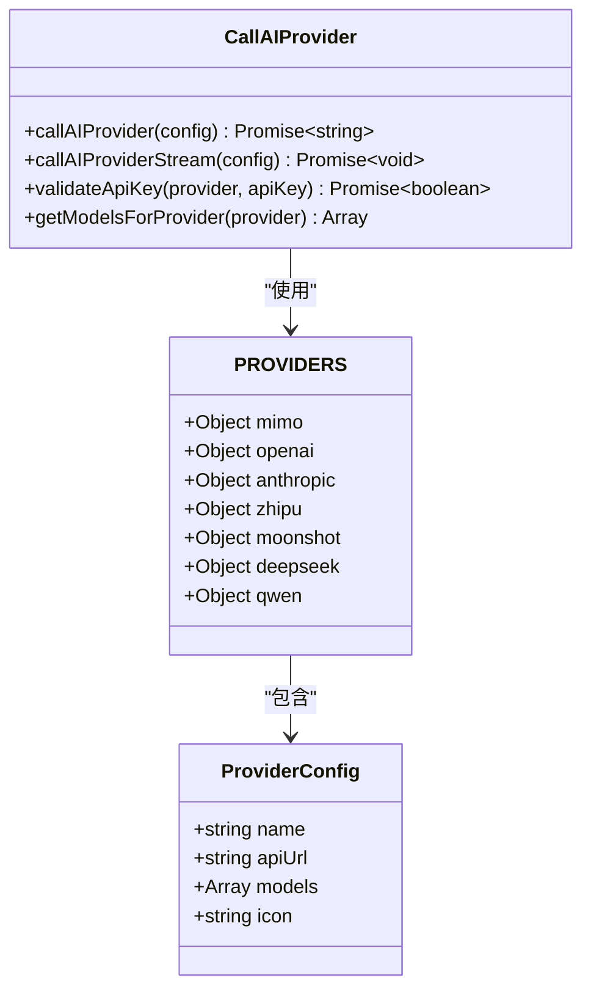
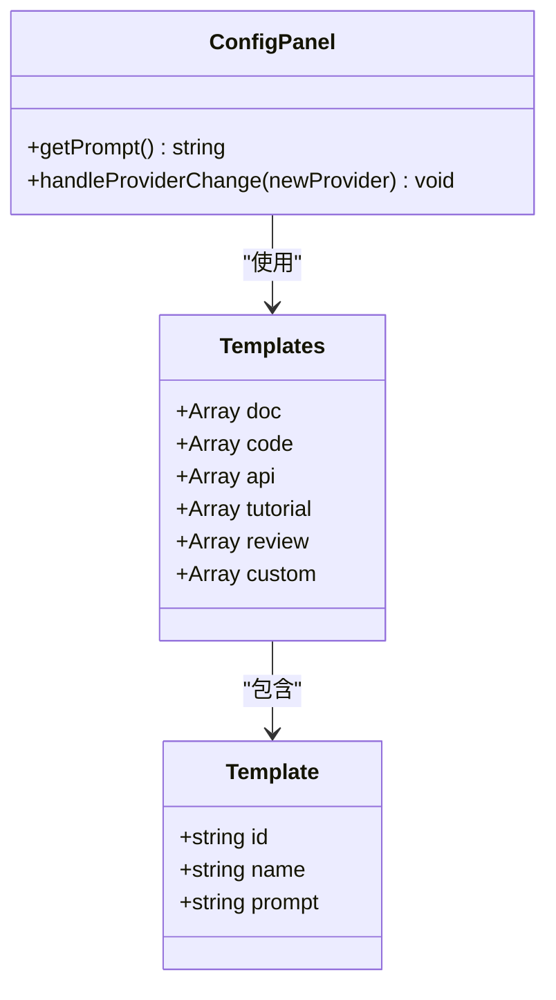
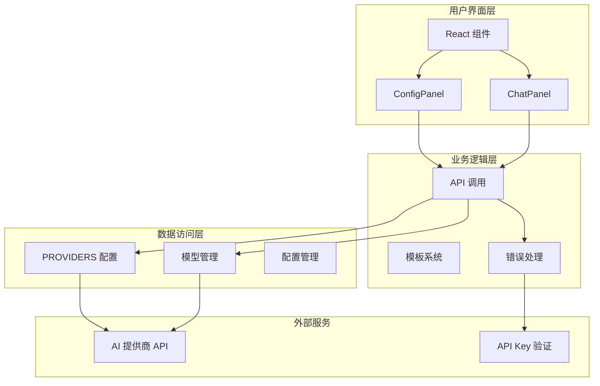
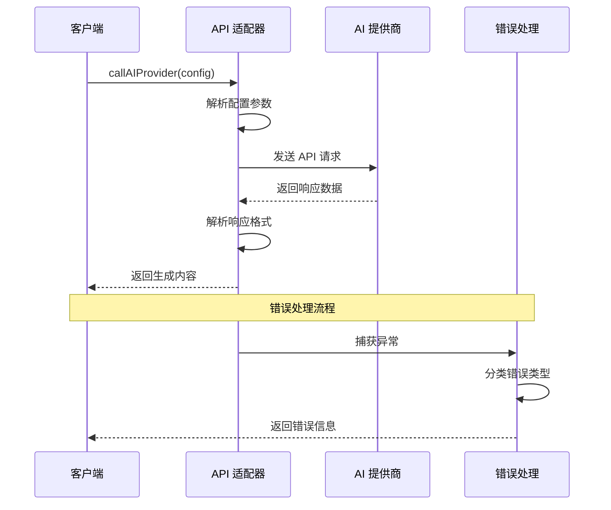
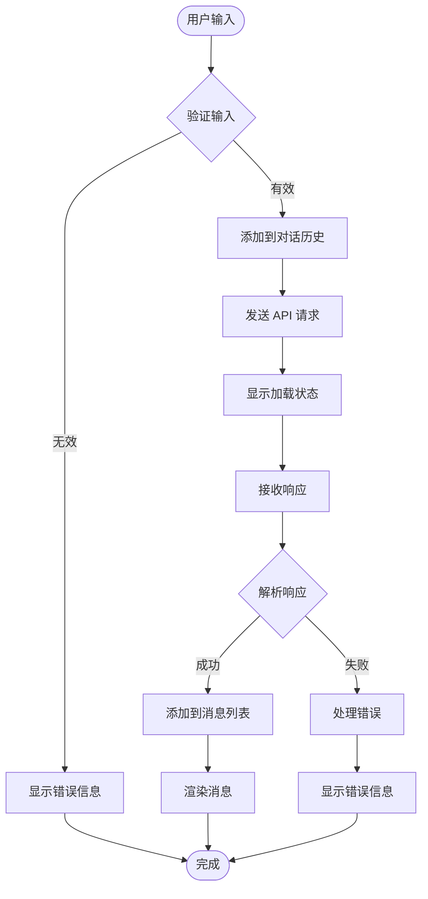
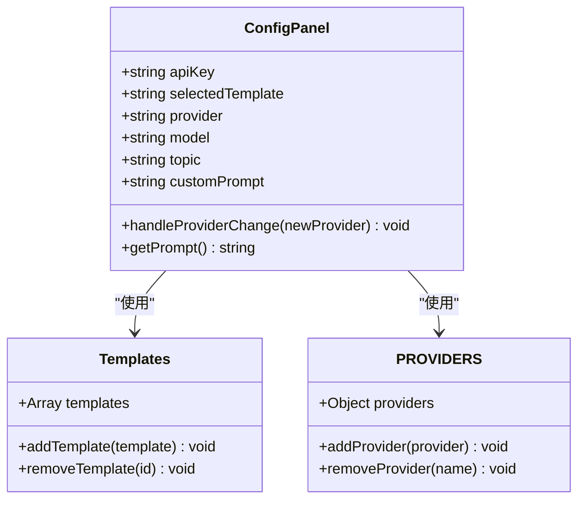

# 扩展与贡献

<cite>
**本文档引用的文件**
- [package.json](file://ai-doc-generator/package.json)
- [ai-providers.js](file://ai-doc-generator/src/api/ai-providers.js)
- [mimo.js](file://ai-doc-generator/src/api/mimo.js)
- [ChatPanel.jsx](file://ai-doc-generator/src/components/ChatPanel.jsx)
- [ConfigPanel.jsx](file://ai-doc-generator/src/components/ConfigPanel.jsx)
- [App.jsx](file://ai-doc-generator/src/App.jsx)
- [main.jsx](file://ai-doc-generator/src/main.jsx)
- [vite.config.js](file://ai-doc-generator/vite.config.js)
- [README.md](file://ai-doc-generator/README.md)
</cite>

## 目录
1. [简介](#简介)
2. [项目结构](#项目结构)
3. [核心组件](#核心组件)
4. [架构概览](#架构概览)
5. [详细组件分析](#详细组件分析)
6. [依赖关系分析](#依赖关系分析)
7. [性能考虑](#性能考虑)
8. [故障排除指南](#故障排除指南)
9. [结论](#结论)
10. [附录](#附录)

## 简介

AI 文档生成器是一个基于 React 19 和 Vite 5 的智能文档生成工具，支持多种 AI 提供商（MiMo、OpenAI、Anthropic Claude、智谱 AI、月之暗面 Kimi、DeepSeek、通义千问）。该项目提供了完整的前端界面，支持多轮对话、模板系统、实时 Markdown 渲染和代码语法高亮等功能。

## 项目结构

项目采用模块化的前端架构，主要分为以下几个核心部分：



**图表来源**
- [package.json:1-28](file://ai-doc-generator/package.json#L1-L28)
- [App.jsx:1-37](file://ai-doc-generator/src/App.jsx#L1-L37)
- [main.jsx:1-11](file://ai-doc-generator/src/main.jsx#L1-L11)

**章节来源**
- [package.json:1-28](file://ai-doc-generator/package.json#L1-L28)
- [README.md:121-138](file://ai-doc-generator/README.md#L121-L138)

## 核心组件

### PROVIDERS 配置系统

PROVIDERS 是项目的核心配置对象，定义了所有支持的 AI 提供商及其相关信息：



**图表来源**
- [ai-providers.js:4-47](file://ai-doc-generator/src/api/ai-providers.js#L4-L47)
- [ai-providers.js:60-181](file://ai-doc-generator/src/api/ai-providers.js#L60-L181)

### 模板系统

模板系统提供了预定义的文档生成模板，支持自定义模板开发：



**图表来源**
- [ConfigPanel.jsx:4-11](file://ai-doc-generator/src/components/ConfigPanel.jsx#L4-L11)
- [ConfigPanel.jsx:28-33](file://ai-doc-generator/src/components/ConfigPanel.jsx#L28-L33)

**章节来源**
- [ai-providers.js:4-47](file://ai-doc-generator/src/api/ai-providers.js#L4-L47)
- [ConfigPanel.jsx:4-11](file://ai-doc-generator/src/components/ConfigPanel.jsx#L4-L11)

## 架构概览

项目采用分层架构设计，清晰分离了 API 层、组件层和配置层：



**图表来源**
- [App.jsx:12-32](file://ai-doc-generator/src/App.jsx#L12-L32)
- [ChatPanel.jsx:13-46](file://ai-doc-generator/src/components/ChatPanel.jsx#L13-L46)
- [ConfigPanel.jsx:13-26](file://ai-doc-generator/src/components/ConfigPanel.jsx#L13-L26)

## 详细组件分析

### API 适配器实现

API 适配器负责统一处理不同 AI 提供商的 API 调用，支持同步和流式两种模式：



**图表来源**
- [ai-providers.js:60-181](file://ai-doc-generator/src/api/ai-providers.js#L60-L181)
- [ai-providers.js:190-309](file://ai-doc-generator/src/api/ai-providers.js#L190-L309)

### 对话面板组件

对话面板实现了完整的聊天交互功能，包括消息管理、实时渲染和导出功能：



**图表来源**
- [ChatPanel.jsx:13-46](file://ai-doc-generator/src/components/ChatPanel.jsx#L13-L46)
- [ChatPanel.jsx:55-75](file://ai-doc-generator/src/components/ChatPanel.jsx#L55-L75)

**章节来源**
- [ai-providers.js:60-181](file://ai-doc-generator/src/api/ai-providers.js#L60-L181)
- [ChatPanel.jsx:13-46](file://ai-doc-generator/src/components/ChatPanel.jsx#L13-L46)

### 配置面板组件

配置面板提供了完整的设置界面，支持提供商选择、模型配置和模板管理：



**图表来源**
- [ConfigPanel.jsx:13-33](file://ai-doc-generator/src/components/ConfigPanel.jsx#L13-L33)
- [ConfigPanel.jsx:4-11](file://ai-doc-generator/src/components/ConfigPanel.jsx#L4-L11)

**章节来源**
- [ConfigPanel.jsx:13-33](file://ai-doc-generator/src/components/ConfigPanel.jsx#L13-L33)
- [App.jsx:6-11](file://ai-doc-generator/src/App.jsx#L6-L11)

## 依赖关系分析

项目的主要依赖关系如下：

```mermaid
graph LR
subgraph "运行时依赖"
REACT[react@^19.2.5]
REACT_DOM[react-dom@^19.2.5]
AXIOS[axios@^1.15.2]
MARKDOWN[react-markdown@^10.1.0]
HIGHLIGHT[rehype-highlight@^7.0.2]
LUCIDE[lucide-react@^1.14.0]
HLJS[highlight.js@^11.11.1]
end
subgraph "开发依赖"
VITE[vite@^5.4.11]
VITE_PLUGIN[@vitejs/plugin-react@^4.3.4]
end
subgraph "应用模块"
MAIN[main.jsx]
APP[App.jsx]
CHAT[ChatPanel.jsx]
CONFIG[ConfigPanel.jsx]
API[ai-providers.js]
MIMO[mimo.js]
end
MAIN --> REACT
MAIN --> REACT_DOM
APP --> REACT
CHAT --> REACT
CONFIG --> REACT
CHAT --> AXIOS
CHAT --> MARKDOWN
CHAT --> HIGHLIGHT
CONFIG --> AXIOS
API --> AXIOS
MIMO --> AXIOS
VITE --> VITE_PLUGIN
```

**图表来源**
- [package.json:14-26](file://ai-doc-generator/package.json#L14-L26)
- [main.jsx:1-11](file://ai-doc-generator/src/main.jsx#L1-L11)
- [App.jsx:1-5](file://ai-doc-generator/src/App.jsx#L1-L5)

**章节来源**
- [package.json:14-26](file://ai-doc-generator/package.json#L14-L26)
- [vite.config.js:1-11](file://ai-doc-generator/vite.config.js#L1-L11)

## 性能考虑

### API 调用优化

1. **超时控制**: 所有 API 调用设置了 60 秒超时时间
2. **错误缓存**: 成功的 API Key 验证结果会被缓存
3. **流式处理**: 支持流式响应以提升用户体验

### 内存管理

1. **消息清理**: 提供清空对话历史的功能
2. **资源释放**: 导出文件后及时释放内存
3. **组件卸载**: React 组件正确处理卸载事件

### 网络优化

1. **连接复用**: 使用 axios 进行 HTTP 请求
2. **错误重试**: 网络错误时提供重试机制
3. **状态码处理**: 针对不同 HTTP 状态码提供友好的错误信息

## 故障排除指南

### 常见问题及解决方案

| 问题类型 | 错误代码 | 可能原因 | 解决方案 |
|---------|---------|---------|---------|
| 认证失败 | 401 | API Key 无效或过期 | 检查 API Key 设置，重新获取有效密钥 |
| 权限不足 | 403 | 账户状态异常 | 检查账户状态，确认有足够的配额 |
| 请求频繁 | 429 | 超过速率限制 | 等待一段时间后重试，降低请求频率 |
| 服务器错误 | 500 | 服务端临时故障 | 稍后重试，检查服务状态 |
| 网络连接 | 无响应 | 网络不稳定 | 检查网络连接，使用稳定网络 |

### 调试技巧

1. **API Key 验证**: 使用 `validateApiKey` 函数验证密钥有效性
2. **请求日志**: 在浏览器开发者工具中查看网络请求
3. **错误信息**: 查看详细的错误描述信息
4. **状态监控**: 监控应用状态变化

**章节来源**
- [ai-providers.js:146-180](file://ai-doc-generator/src/api/ai-providers.js#L146-L180)
- [mimo.js:54-77](file://ai-doc-generator/src/api/mimo.js#L54-L77)

## 结论

AI 文档生成器项目展现了良好的架构设计和模块化组织。通过 PROVIDERS 配置系统和模板系统，项目提供了高度的可扩展性和灵活性。现有的组件设计遵循了单一职责原则，便于维护和扩展。

对于未来的扩展，建议重点关注：
1. **API 适配器的标准化**: 统一不同提供商的 API 调用方式
2. **模板系统的增强**: 支持更复杂的模板组合和参数化
3. **错误处理的改进**: 提供更详细的错误诊断信息
4. **性能优化**: 实现请求缓存和智能重试机制

## 附录

### 扩展新 AI 提供商指南

要添加新的 AI 提供商支持，需要进行以下步骤：

1. **更新 PROVIDERS 配置**:
   ```javascript
   export const PROVIDERS = {
     // ... 现有提供商配置
     newProvider: {
       name: '新提供商名称',
       apiUrl: 'API 端点地址',
       models: ['模型1', '模型2'],
       icon: 'emoji 图标'
     }
   }
   ```

2. **实现 API 调用函数**:
   - 在 `ai-providers.js` 中添加新的调用函数
   - 处理特定提供商的请求格式和响应解析
   - 实现错误处理和重试机制

3. **更新组件集成**:
   - 在 `ConfigPanel.jsx` 中添加新的提供商选项
   - 更新模型选择逻辑
   - 添加提供商图标和名称显示

4. **测试验证**:
   - 编写单元测试验证 API 调用
   - 测试错误处理和边界情况
   - 验证流式响应处理

### 自定义模板开发流程

1. **模板定义**:
   ```javascript
   const templates = [
     {
       id: 'new-template',
       name: '新模板名称',
       prompt: '模板提示词，支持 {variable} 占位符'
     }
   ]
   ```

2. **模板渲染**:
   - 在 `getPrompt()` 函数中处理模板变量替换
   - 支持动态内容注入
   - 实现模板预览功能

3. **模板管理**:
   - 提供模板编辑界面
   - 支持模板导入导出
   - 实现模板版本控制

### 代码贡献流程

1. **Fork 项目**:
   - 在 GitHub 上 Fork 项目到个人仓库
   - 克隆 Fork 的仓库到本地

2. **创建分支**:
   ```bash
   git checkout -b feature/new-provider
   # 或
   git checkout -b fix/bug-fix
   ```

3. **开发和测试**:
   - 实现功能或修复问题
   - 编写必要的测试用例
   - 运行现有测试确保不破坏功能

4. **提交更改**:
   ```bash
   git add .
   git commit -m "feat: 添加新的 AI 提供商支持"
   git push origin feature/new-provider
   ```

5. **创建 Pull Request**:
   - 在 GitHub 上创建 PR
   - 详细描述变更内容
   - 回应审查意见

### 代码质量要求

1. **编码规范**:
   - 遵循 ES6+ 语法
   - 使用语义化命名
   - 保持代码简洁易懂

2. **测试覆盖**:
   - 新功能必须包含测试用例
   - 保持现有测试通过
   - 覆盖主要使用场景

3. **文档要求**:
   - 更新相关文档
   - 添加必要的注释
   - 提供使用示例

### 社区贡献指南

1. **问题反馈**:
   - 使用 GitHub Issues 提交 bug 报告
   - 提供详细的重现步骤
   - 包含环境信息和错误日志

2. **功能建议**:
   - 在 Discussions 中提出想法
   - 提供详细的使用场景
   - 讨论实现方案

3. **代码贡献**:
   - 遵循项目贡献流程
   - 保持代码质量和一致性
   - 积极参与代码审查

### 版本发布和变更日志

1. **版本管理**:
   - 遵循语义化版本控制
   - 使用标签标记版本发布
   - 维护变更日志

2. **发布流程**:
   - 确保所有测试通过
   - 更新版本号和依赖
   - 发布到 npm registry
   - 创建 GitHub Release

3. **变更日志维护**:
   - 记录重大功能变更
   - 列出已知问题和修复
   - 提供升级指导

**章节来源**
- [README.md:162-168](file://ai-doc-generator/README.md#L162-L168)
- [README.md:153-160](file://ai-doc-generator/README.md#L153-L160)