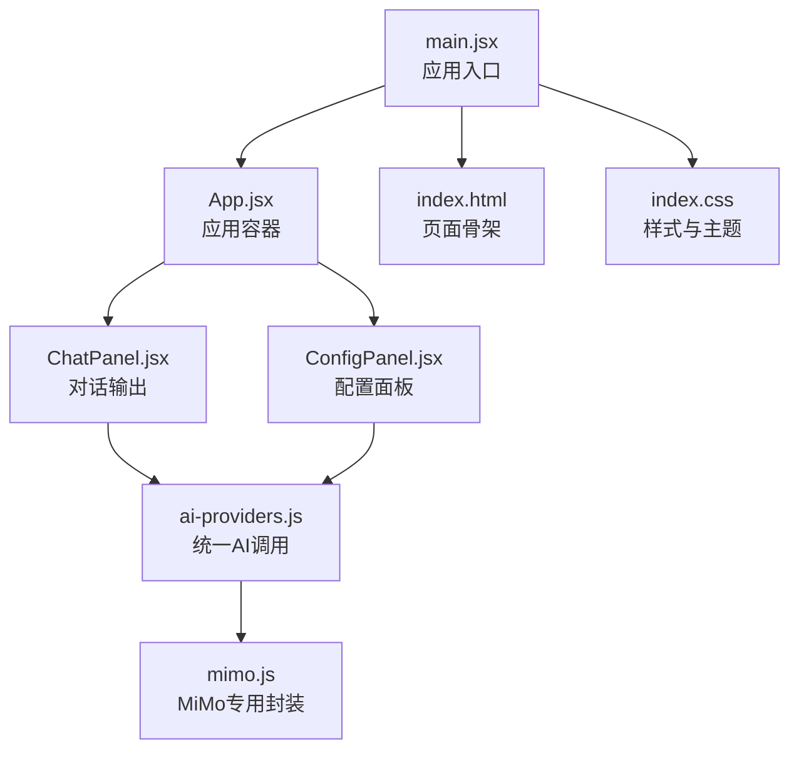
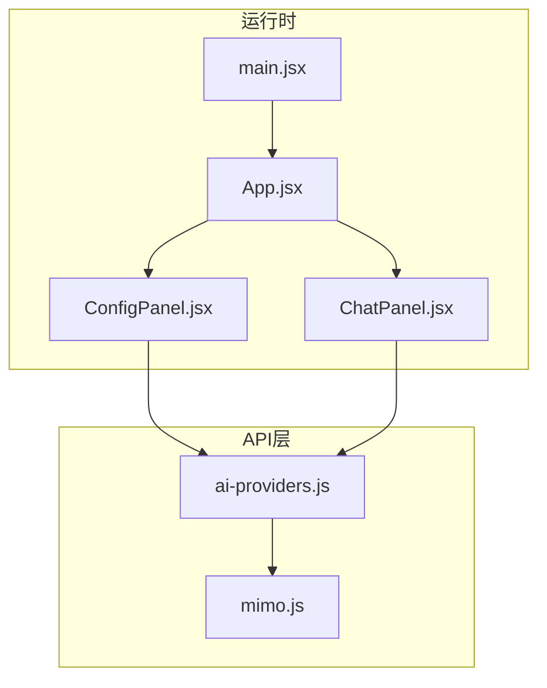
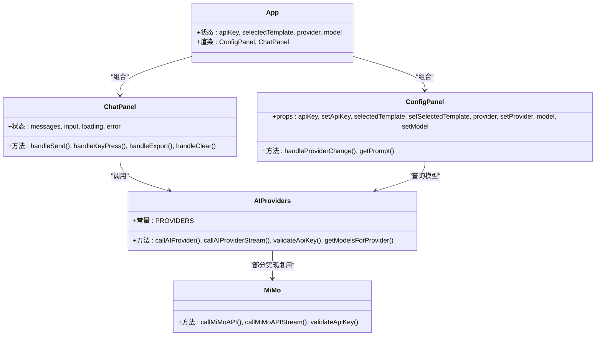
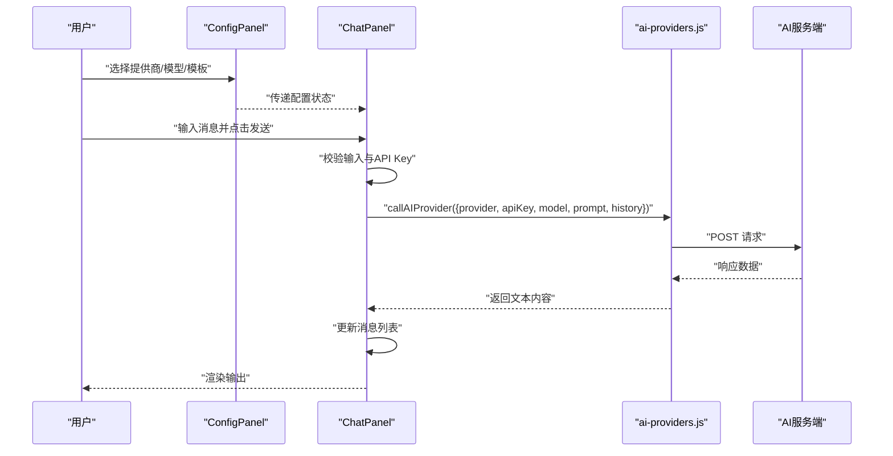
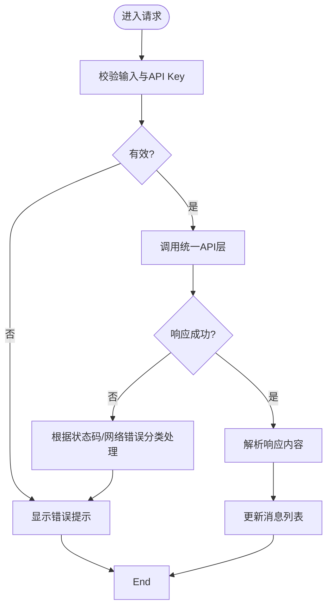

# 调试与性能优化

<cite>
**本文引用的文件**
- [main.jsx](file://ai-doc-generator/src/main.jsx)
- [App.jsx](file://ai-doc-generator/src/App.jsx)
- [ChatPanel.jsx](file://ai-doc-generator/src/components/ChatPanel.jsx)
- [ConfigPanel.jsx](file://ai-doc-generator/src/components/ConfigPanel.jsx)
- [ai-providers.js](file://ai-doc-generator/src/api/ai-providers.js)
- [mimo.js](file://ai-doc-generator/src/api/mimo.js)
- [index.css](file://ai-doc-generator/src/index.css)
- [package.json](file://ai-doc-generator/package.json)
- [vite.config.js](file://ai-doc-generator/vite.config.js)
- [index.html](file://ai-doc-generator/index.html)
</cite>

## 目录
1. [简介](#简介)
2. [项目结构](#项目结构)
3. [核心组件](#核心组件)
4. [架构总览](#架构总览)
5. [详细组件分析](#详细组件分析)
6. [依赖关系分析](#依赖关系分析)
7. [性能考虑](#性能考虑)
8. [故障排查指南](#故障排查指南)
9. [结论](#结论)
10. [附录](#附录)

## 简介
本指南面向使用本项目的开发者与运维人员，系统性讲解如何进行调试与性能优化，涵盖：
- React DevTools 使用与组件状态检查
- 网络请求调试与 API 响应分析
- 性能监控工具配置与使用（React Profiler、浏览器性能面板）
- 内存泄漏检测与优化策略
- 错误边界与异常处理最佳实践
- 生产环境调试与日志记录配置
- 常见性能瓶颈识别与解决方案

## 项目结构
该项目采用 Vite + React 的现代前端工程化方式，核心入口与组件分布如下：
- 应用入口：main.jsx 创建根节点并挂载 App
- 应用容器：App.jsx 维护全局状态并在主布局中组合 ConfigPanel 与 ChatPanel
- 组件层：ConfigPanel 负责配置与模板选择；ChatPanel 负责对话与输出展示
- API 层：ai-providers.js 封装多家 AI 提供商的统一调用；mimo.js 提供 MiMo 专属封装
- 样式层：index.css 提供深色科技风格的主题与动画
- 构建与开发：package.json 定义脚本；vite.config.js 配置开发服务器端口与插件；index.html 提供页面骨架

图表来源
- [main.jsx:1-11](file://ai-doc-generator/src/main.jsx#L1-L11)
- [App.jsx:1-37](file://ai-doc-generator/src/App.jsx#L1-L37)
- [ChatPanel.jsx:1-278](file://ai-doc-generator/src/components/ChatPanel.jsx#L1-L278)
- [ConfigPanel.jsx:1-156](file://ai-doc-generator/src/components/ConfigPanel.jsx#L1-L156)
- [ai-providers.js:1-344](file://ai-doc-generator/src/api/ai-providers.js#L1-L344)
- [mimo.js:1-175](file://ai-doc-generator/src/api/mimo.js#L1-L175)
- [index.html:1-14](file://ai-doc-generator/index.html#L1-L14)
- [index.css:1-531](file://ai-doc-generator/src/index.css#L1-L531)

章节来源
- [main.jsx:1-11](file://ai-doc-generator/src/main.jsx#L1-L11)
- [App.jsx:1-37](file://ai-doc-generator/src/App.jsx#L1-L37)
- [package.json:1-28](file://ai-doc-generator/package.json#L1-L28)
- [vite.config.js:1-11](file://ai-doc-generator/vite.config.js#L1-L11)
- [index.html:1-14](file://ai-doc-generator/index.html#L1-L14)

## 核心组件
- 应用入口与严格模式
  - 使用 React.StrictMode 包裹以启用额外的开发期检查
  - 通过 ReactDOM.createRoot 渲染 App
- 应用容器 App
  - 维护全局状态：API Key、模板、提供商、模型
  - 将状态传递给子组件，实现配置与对话的解耦
- 配置面板 ConfigPanel
  - 提供提供商选择、模型选择、API Key 输入、模板选择与预览
  - 根据提供商动态更新可用模型
- 对话面板 ChatPanel
  - 管理消息历史、输入框、加载态、错误态
  - 调用统一 API 层发起请求，渲染 Markdown 输出
  - 支持导出与清空功能

章节来源
- [main.jsx:6-10](file://ai-doc-generator/src/main.jsx#L6-L10)
- [App.jsx:6-34](file://ai-doc-generator/src/App.jsx#L6-L34)
- [ConfigPanel.jsx:13-153](file://ai-doc-generator/src/components/ConfigPanel.jsx#L13-L153)
- [ChatPanel.jsx:7-275](file://ai-doc-generator/src/components/ChatPanel.jsx#L7-L275)

## 架构总览
整体架构遵循“入口 -> 容器 -> 组件 -> API”的分层设计，API 层对多家 AI 提供商进行统一封装，便于扩展与维护。

图表来源
- [main.jsx:1-11](file://ai-doc-generator/src/main.jsx#L1-L11)
- [App.jsx:1-37](file://ai-doc-generator/src/App.jsx#L1-L37)
- [ChatPanel.jsx:1-6](file://ai-doc-generator/src/components/ChatPanel.jsx#L1-L6)
- [ConfigPanel.jsx:1-3](file://ai-doc-generator/src/components/ConfigPanel.jsx#L1-L3)
- [ai-providers.js:1-344](file://ai-doc-generator/src/api/ai-providers.js#L1-L344)
- [mimo.js:1-175](file://ai-doc-generator/src/api/mimo.js#L1-L175)

## 详细组件分析

### 组件类图（对象关系）

图表来源
- [App.jsx:6-34](file://ai-doc-generator/src/App.jsx#L6-L34)
- [ConfigPanel.jsx:13-153](file://ai-doc-generator/src/components/ConfigPanel.jsx#L13-L153)
- [ChatPanel.jsx:7-46](file://ai-doc-generator/src/components/ChatPanel.jsx#L7-L46)
- [ai-providers.js:4-47](file://ai-doc-generator/src/api/ai-providers.js#L4-L47)
- [mimo.js:10-78](file://ai-doc-generator/src/api/mimo.js#L10-L78)

### API 调用序列图（同步与流式）

图表来源
- [ChatPanel.jsx:13-46](file://ai-doc-generator/src/components/ChatPanel.jsx#L13-L46)
- [ai-providers.js:60-181](file://ai-doc-generator/src/api/ai-providers.js#L60-L181)

### 错误处理流程图

图表来源
- [ChatPanel.jsx:13-46](file://ai-doc-generator/src/components/ChatPanel.jsx#L13-L46)
- [ai-providers.js:146-180](file://ai-doc-generator/src/api/ai-providers.js#L146-L180)

## 依赖关系分析
- 运行时依赖
  - React 19 与 React DOM
  - Axios 用于 HTTP 请求
  - highlight.js 与 rehype-highlight 用于代码高亮渲染
  - react-markdown 用于 Markdown 渲染
- 开发依赖
  - @vitejs/plugin-react 与 Vite 用于开发与构建
- 构建与运行
  - 开发服务器默认端口 3000，自动打开浏览器
  - HTML 中通过模块脚本引入入口文件

章节来源
- [package.json:14-26](file://ai-doc-generator/package.json#L14-L26)
- [vite.config.js:4-10](file://ai-doc-generator/vite.config.js#L4-L10)
- [index.html:10-11](file://ai-doc-generator/index.html#L10-L11)

## 性能考虑
- 组件渲染与状态管理
  - ChatPanel 使用局部状态管理消息、输入、加载与错误，避免不必要的全局状态提升
  - ConfigPanel 根据提供商动态选择模型，减少无效渲染
- 网络请求与超时
  - API 层设置 60 秒超时，防止长时间阻塞
  - 对不同提供商采用兼容的请求格式，降低解析成本
- UI 渲染优化
  - 使用 CSS 动画与过渡，避免在 JS 中做复杂动画
  - Markdown 渲染使用客户端高亮，注意大段代码的性能影响
- 构建与打包
  - Vite 默认开启按需打包与热更新，适合开发阶段性能优化
- 性能监控建议
  - 使用 React Profiler 分析组件渲染次数与耗时
  - 使用浏览器性能面板观察主线程阻塞、长任务与内存增长
  - 结合网络面板观察请求耗时与缓存命中情况

[本节为通用性能指导，无需特定文件引用]

## 故障排查指南

### React DevTools 使用与组件状态检查
- 打开方式
  - 在浏览器中启用 React DevTools 扩展
  - 在应用页面右键检查元素，选择“显示 React 树”
- 关键操作
  - 切换到“Components”标签页，查看组件树与当前状态
  - 在“Profiler”标签页记录渲染时间线，定位渲染热点
  - 在“Hooks”标签页查看 useState/useEffect 等 Hook 的值与更新
- 实战技巧
  - 在 ChatPanel 中检查 messages、input、loading、error 状态是否符合预期
  - 在 ConfigPanel 中核对 provider/model/apiKey 等配置是否正确传递
  - 观察组件重新渲染频率，避免不必要的 props 变更导致的重渲染

[本节为通用调试方法，无需特定文件引用]

### 网络请求调试与 API 响应分析
- 浏览器网络面板
  - 打开开发者工具的 Network 面板，过滤 XHR/Fetch
  - 查看请求 URL、方法、请求头、请求体与响应体
  - 关注状态码与响应耗时，识别慢请求与错误请求
- API 层错误处理
  - 统一错误处理会根据状态码返回用户可读提示
  - 建议在开发阶段打印原始错误信息以便定位
- 实践步骤
  - 在 ChatPanel 中触发一次发送，观察 Network 面板中的请求
  - 检查 Authorization 或 x-api-key 等头部是否正确
  - 对比不同提供商的请求格式差异，确保消息数组与 system prompt 正确

章节来源
- [ChatPanel.jsx:13-46](file://ai-doc-generator/src/components/ChatPanel.jsx#L13-L46)
- [ai-providers.js:146-180](file://ai-doc-generator/src/api/ai-providers.js#L146-L180)

### 性能监控工具配置与使用
- React Profiler
  - 在开发环境中使用 React Profiler 记录渲染时间线
  - 关注 ChatPanel 与 ConfigPanel 的渲染次数与耗时
  - 通过调整 props 与状态更新策略减少不必要的重渲染
- 浏览器性能面板
  - 使用 Performance 面板录制交互过程
  - 关注主线程占用率、长任务、内存分配曲线
  - 对比启用/禁用高亮渲染与 Markdown 渲染的性能差异

[本节为通用性能工具使用方法，无需特定文件引用]

### 内存泄漏检测与优化策略
- 常见风险点
  - 长列表渲染：确保列表项 key 唯一且稳定
  - 事件监听：组件卸载时清理定时器与订阅
  - 大对象引用：避免在状态中保存过大的临时对象
- 检测手段
  - 使用 Performance 面板的内存快照对比
  - 使用 Memory 面板观察堆内存增长趋势
- 优化策略
  - 合理拆分组件，避免单个组件状态过大
  - 对 Markdown 渲染进行节流或懒加载
  - 及时释放 Blob URL 与 DOM 引用

[本节为通用内存优化方法，无需特定文件引用]

### 错误边界与异常处理最佳实践
- 异常处理现状
  - ChatPanel 在请求失败时设置错误状态并显示提示
  - API 层对 401/403/429/500 等状态码给出明确提示
- 建议改进
  - 在应用顶层添加错误边界组件，捕获未处理异常并降级显示
  - 对网络错误与 API 错误进行分类统计，便于后续优化
  - 在开发环境输出详细日志，在生产环境输出简要提示

章节来源
- [ChatPanel.jsx:15-46](file://ai-doc-generator/src/components/ChatPanel.jsx#L15-L46)
- [ai-providers.js:146-180](file://ai-doc-generator/src/api/ai-providers.js#L146-L180)

### 生产环境调试与日志记录配置
- 日志级别
  - 开发环境：详细日志（含请求/响应体）
  - 生产环境：精简日志（仅关键错误与性能指标）
- 配置建议
  - 使用环境变量控制日志开关
  - 对敏感信息（如 API Key）进行脱敏处理
  - 将错误上报至集中化日志平台（如 Sentry）

[本节为通用配置建议，无需特定文件引用]

### 常见性能瓶颈识别与解决方案
- 渲染瓶颈
  - 症状：输入框打字卡顿、消息列表滚动掉帧
  - 方案：拆分 ChatPanel 子元素、使用 React.memo 缓存稳定内容
- 网络瓶颈
  - 症状：请求超时、响应缓慢
  - 方案：增加超时时间、启用重试机制、选择更近的提供商节点
- 内存瓶颈
  - 症状：长时间使用后内存持续增长
  - 方案：限制消息历史长度、及时释放大对象引用、使用虚拟列表

[本节为通用性能问题处理方法，无需特定文件引用]

## 结论
本项目通过清晰的分层架构与统一的 API 封装，为调试与性能优化提供了良好基础。结合 React DevTools、浏览器性能面板与 React Profiler，可以高效定位问题并持续优化用户体验。建议在开发与生产环境中分别采用不同的日志策略，并建立完善的错误边界与异常上报机制，确保系统的稳定性与可观测性。

[本节为总结性内容，无需特定文件引用]

## 附录

### 快速调试清单
- 使用 React DevTools 检查组件状态与渲染次数
- 在 Network 面板观察请求与响应
- 使用 Performance 面板录制并分析长任务与内存
- 在 ChatPanel 中验证 API Key 与消息历史
- 在 ConfigPanel 中验证提供商与模型选择

[本节为通用清单，无需特定文件引用]