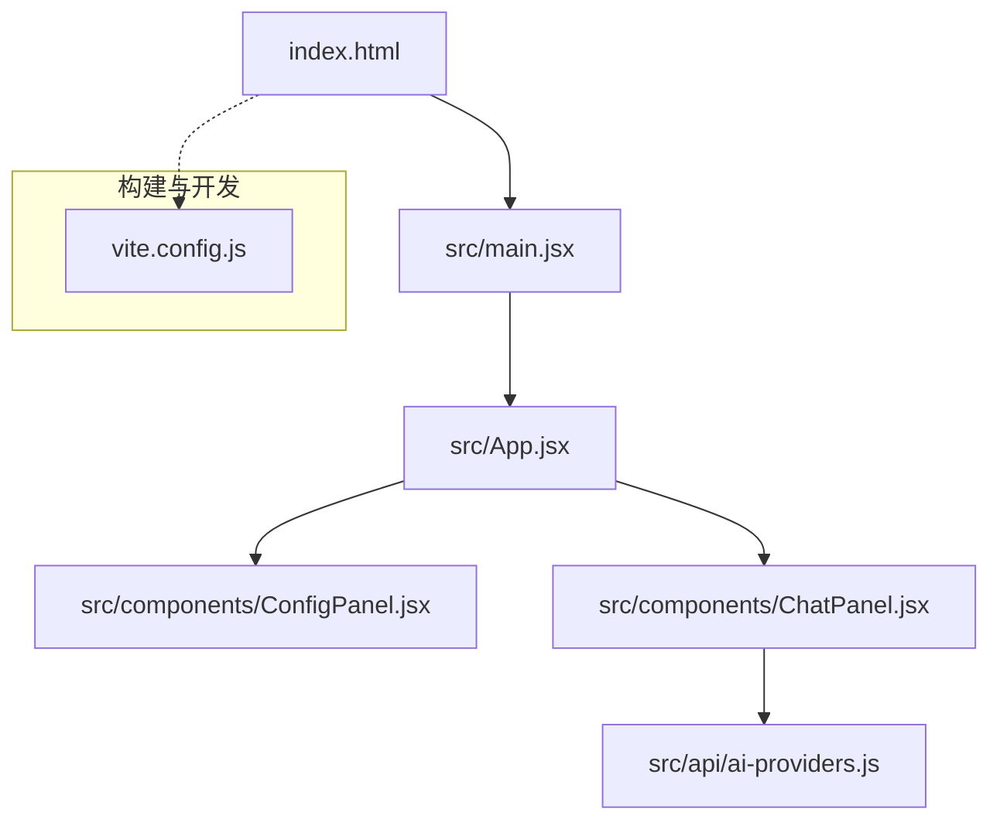
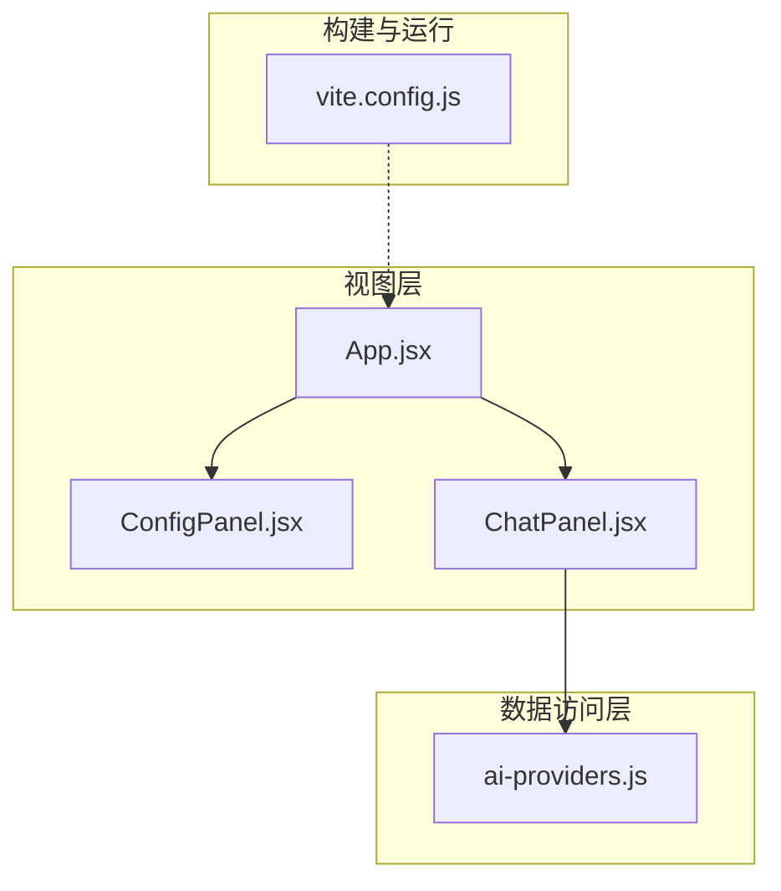
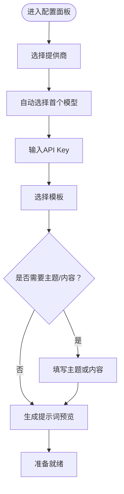
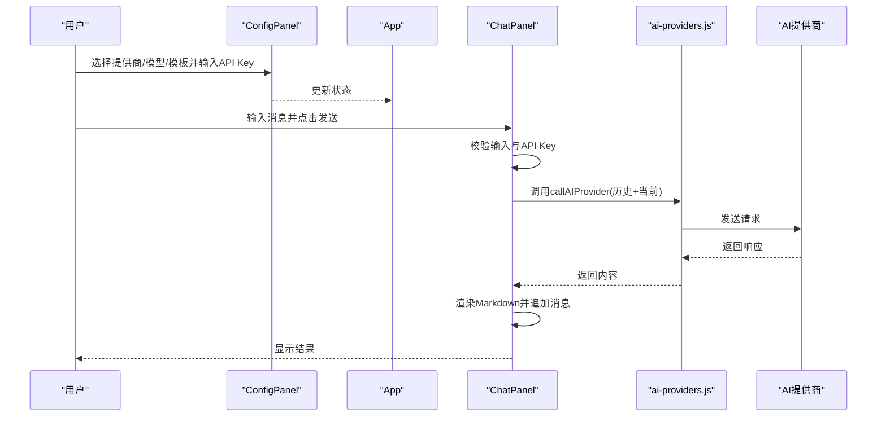
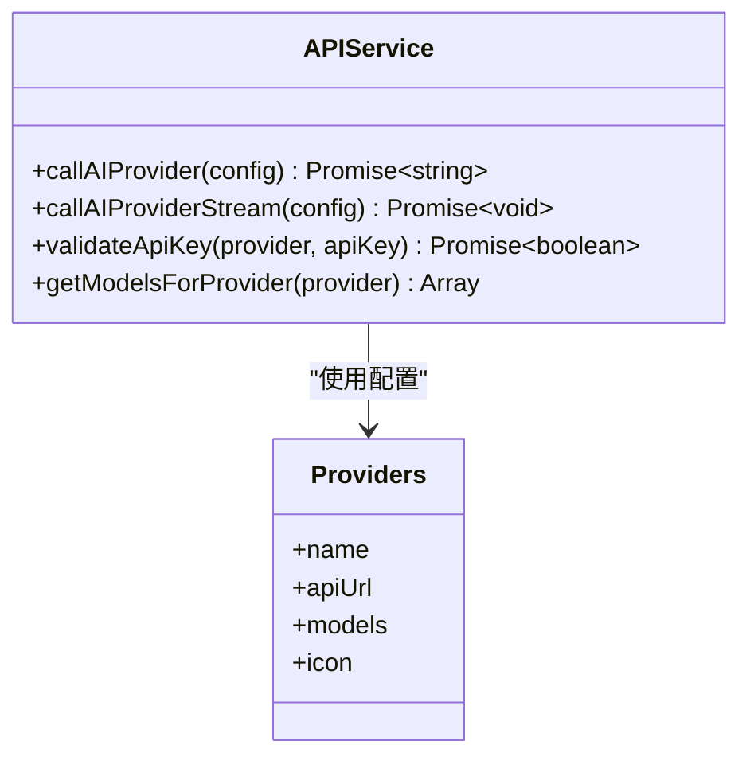
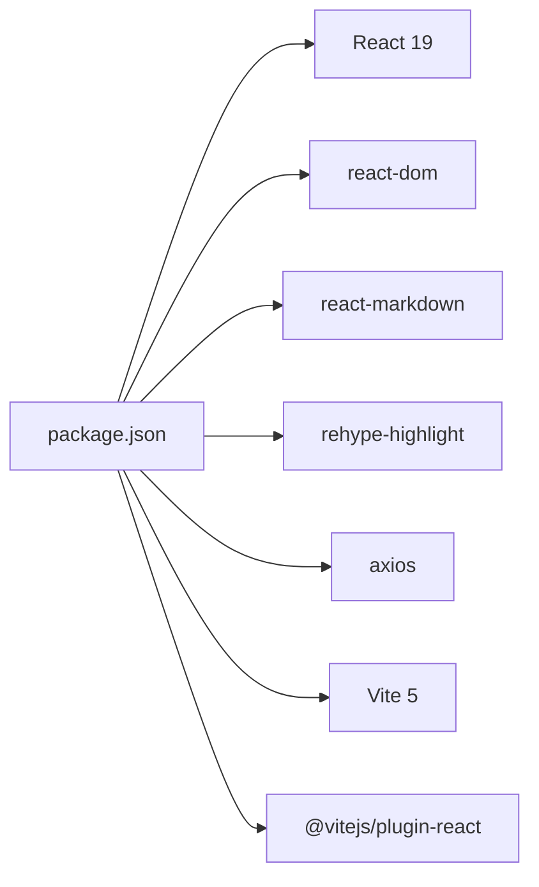

# 快速开始

<cite>
**本文引用的文件**
- [package.json](file://ai-doc-generator/package.json)
- [README.md](file://ai-doc-generator/README.md)
- [main.jsx](file://ai-doc-generator/src/main.jsx)
- [App.jsx](file://ai-doc-generator/src/App.jsx)
- [ai-providers.js](file://ai-doc-generator/src/api/ai-providers.js)
- [ChatPanel.jsx](file://ai-doc-generator/src/components/ChatPanel.jsx)
- [ConfigPanel.jsx](file://ai-doc-generator/src/components/ConfigPanel.jsx)
- [vite.config.js](file://ai-doc-generator/vite.config.js)
- [index.html](file://ai-doc-generator/index.html)
- [index.css](file://ai-doc-generator/src/index.css)
</cite>

## 目录
1. [简介](#简介)
2. [项目结构](#项目结构)
3. [核心组件](#核心组件)
4. [架构总览](#架构总览)
5. [详细组件分析](#详细组件分析)
6. [依赖关系分析](#依赖关系分析)
7. [性能考虑](#性能考虑)
8. [故障排除指南](#故障排除指南)
9. [结论](#结论)
10. [附录](#附录)

## 简介
本指南帮助你在5分钟内运行起AI文档生成器项目，涵盖Node.js环境要求、依赖安装、开发服务器启动、基础使用流程以及常见问题排查。该应用基于React 19与Vite 5构建，支持7种AI提供商（MiMo、OpenAI、Claude、智谱、Kimi、DeepSeek、通义千问），内置多套专业模板，支持实时对话、Markdown渲染与代码高亮、一键导出Markdown等功能。

## 项目结构
项目采用“功能模块化 + 组件化”的组织方式：
- 根目录包含主应用与子项目目录，其中 ai-doc-generator 是本次文档关注的核心。
- 应用入口通过 index.html 加载，React 应用在 main.jsx 中挂载。
- App.jsx 作为根组件，协调配置面板与聊天输出面板。
- API 层封装了多提供商统一调用逻辑。
- 组件层包含配置面板与聊天面板，负责UI与交互。
- 构建与开发服务器由 Vite 管理。

图表来源
- [index.html:1-14](file://ai-doc-generator/index.html#L1-L14)
- [main.jsx:1-11](file://ai-doc-generator/src/main.jsx#L1-L11)
- [App.jsx:1-37](file://ai-doc-generator/src/App.jsx#L1-L37)
- [ConfigPanel.jsx:1-156](file://ai-doc-generator/src/components/ConfigPanel.jsx#L1-L156)
- [ChatPanel.jsx:1-278](file://ai-doc-generator/src/components/ChatPanel.jsx#L1-L278)
- [ai-providers.js:1-344](file://ai-doc-generator/src/api/ai-providers.js#L1-L344)
- [vite.config.js:1-11](file://ai-doc-generator/vite.config.js#L1-L11)

章节来源
- [README.md:121-138](file://ai-doc-generator/README.md#L121-L138)

## 核心组件
- 应用入口与挂载
  - index.html 提供DOM容器与页面元信息。
  - main.jsx 负责创建根节点并渲染 App。
- 根组件 App
  - 管理全局状态（API Key、模板、提供商、模型）并传递给子组件。
- 配置面板 ConfigPanel
  - 选择AI提供商与模型、输入API Key、选择模板、输入主题或自定义提示词。
- 聊天面板 ChatPanel
  - 负责消息输入、发送、渲染Markdown、导出为Markdown、错误提示与加载态。
- API封装 ai-providers.js
  - 统一管理7个提供商的端点、模型列表与请求格式，支持同步与流式调用，并内置错误处理。

章节来源
- [main.jsx:1-11](file://ai-doc-generator/src/main.jsx#L1-L11)
- [App.jsx:1-37](file://ai-doc-generator/src/App.jsx#L1-L37)
- [ConfigPanel.jsx:1-156](file://ai-doc-generator/src/components/ConfigPanel.jsx#L1-L156)
- [ChatPanel.jsx:1-278](file://ai-doc-generator/src/components/ChatPanel.jsx#L1-L278)
- [ai-providers.js:1-344](file://ai-doc-generator/src/api/ai-providers.js#L1-L344)

## 架构总览
应用采用“单页应用 + 组件分层 + API适配层”的架构：
- 视图层：React组件负责UI与交互。
- 业务层：App.jsx集中管理状态，ConfigPanel与ChatPanel分别承担配置与对话职责。
- 数据访问层：ai-providers.js统一封装多提供商调用，屏蔽差异。
- 构建与运行：Vite提供开发服务器与打包能力。

图表来源
- [App.jsx:1-37](file://ai-doc-generator/src/App.jsx#L1-L37)
- [ConfigPanel.jsx:1-156](file://ai-doc-generator/src/components/ConfigPanel.jsx#L1-L156)
- [ChatPanel.jsx:1-278](file://ai-doc-generator/src/components/ChatPanel.jsx#L1-L278)
- [ai-providers.js:1-344](file://ai-doc-generator/src/api/ai-providers.js#L1-L344)
- [vite.config.js:1-11](file://ai-doc-generator/vite.config.js#L1-L11)

## 详细组件分析

### 安装与启动
- 环境要求
  - Node.js 与 npm（用于安装依赖与运行脚本）
- 安装依赖
  - 在 ai-doc-generator 目录执行安装命令
- 启动开发服务器
  - 运行开发脚本，默认监听端口3000（可在配置中调整）
  - 浏览器自动打开 http://localhost:3000
- 生产构建与预览
  - 构建产物：npm run build
  - 预览构建：npm run preview

章节来源
- [package.json:6-10](file://ai-doc-generator/package.json#L6-L10)
- [README.md:42-64](file://ai-doc-generator/README.md#L42-L64)
- [vite.config.js:4-10](file://ai-doc-generator/vite.config.js#L4-L10)

### 配置面板（ConfigPanel）
- 功能要点
  - 选择AI提供商（7种之一）
  - 选择具体模型（随提供商动态更新）
  - 输入API Key（本地存储，不上传）
  - 选择模板（技术文档、代码生成、API文档、教程指南、代码审查、自定义）
  - 输入主题或自定义提示词
  - 实时预览最终提示词
- 关键行为
  - 切换提供商时自动选择首个可用模型
  - 模板选择影响提示词生成逻辑

图表来源
- [ConfigPanel.jsx:13-33](file://ai-doc-generator/src/components/ConfigPanel.jsx#L13-L33)

章节来源
- [ConfigPanel.jsx:1-156](file://ai-doc-generator/src/components/ConfigPanel.jsx#L1-L156)

### 聊天面板（ChatPanel）
- 功能要点
  - 输入消息（支持多行，Enter发送，Shift+Enter换行）
  - 发送后调用API生成回复并渲染Markdown
  - 支持导出为Markdown文件
  - 支持清空对话
  - 显示加载态与错误提示
- 关键行为
  - 将历史消息与当前输入拼接为完整上下文
  - 使用Markdown渲染与代码高亮插件
  - 导出时将消息序列化为Markdown文本

图表来源
- [ChatPanel.jsx:13-46](file://ai-doc-generator/src/components/ChatPanel.jsx#L13-L46)
- [ai-providers.js:60-181](file://ai-doc-generator/src/api/ai-providers.js#L60-L181)

章节来源
- [ChatPanel.jsx:1-278](file://ai-doc-generator/src/components/ChatPanel.jsx#L1-L278)
- [ai-providers.js:1-344](file://ai-doc-generator/src/api/ai-providers.js#L1-L344)

### API封装（ai-providers.js）
- 支持的提供商与模型
  - MiMo、OpenAI、Anthropic Claude、智谱、Kimi、DeepSeek、通义千问
- 请求与响应
  - 统一请求格式（除Anthropic外均为OpenAI兼容格式）
  - 统一响应解析（Anthropic与OpenAI兼容格式）
  - 错误分类与友好提示（401、403、404、429、500等）
- 流式与非流式调用
  - 提供同步与流式两种调用方式，满足不同场景
- 辅助能力
  - 校验API Key有效性
  - 获取指定提供商的模型列表

图表来源
- [ai-providers.js:4-47](file://ai-doc-generator/src/api/ai-providers.js#L4-L47)
- [ai-providers.js:60-181](file://ai-doc-generator/src/api/ai-providers.js#L60-L181)
- [ai-providers.js:190-309](file://ai-doc-generator/src/api/ai-providers.js#L190-L309)
- [ai-providers.js:317-343](file://ai-doc-generator/src/api/ai-providers.js#L317-L343)

章节来源
- [ai-providers.js:1-344](file://ai-doc-generator/src/api/ai-providers.js#L1-L344)

### 根组件与入口
- App.jsx
  - 初始化全局状态（API Key、模板、提供商、模型）
  - 将状态传递给配置面板与聊天面板
- main.jsx
  - 创建根节点并渲染App
- index.html
  - 提供根容器与页面标题

章节来源
- [App.jsx:1-37](file://ai-doc-generator/src/App.jsx#L1-L37)
- [main.jsx:1-11](file://ai-doc-generator/src/main.jsx#L1-L11)
- [index.html:1-14](file://ai-doc-generator/index.html#L1-L14)

## 依赖关系分析
- 运行时依赖
  - React 19、react-dom、react-markdown、rehype-highlight、axios
- 开发依赖
  - Vite 5、@vitejs/plugin-react
- 关系概览

图表来源
- [package.json:14-26](file://ai-doc-generator/package.json#L14-L26)

章节来源
- [package.json:1-28](file://ai-doc-generator/package.json#L1-L28)

## 性能考虑
- 构建与开发
  - Vite提供快速冷启动与热更新，开发体验良好
  - 生产构建开启压缩与资源优化
- 运行时
  - Markdown渲染与代码高亮在浏览器端进行，建议控制消息长度以避免卡顿
  - API调用超时设置为60秒，避免长时间阻塞
- UI交互
  - 组件使用动画与渐变效果，注意在低端设备上的表现

## 故障排除指南
- 无法启动开发服务器
  - 确认已安装Node.js与npm
  - 在 ai-doc-generator 目录执行安装与启动命令
  - 若端口被占用，可在配置中调整端口
- API Key无效或网络错误
  - 检查API Key是否正确、是否过期
  - 确认网络连通性
  - 查看错误提示中的状态码与提供商名称
- 响应格式异常
  - 检查提供商端点与请求格式
  - 确认系统提示词与温度、最大token等参数设置
- 导出失败
  - 确保存在可导出的消息记录
  - 检查浏览器下载权限

章节来源
- [README.md:42-64](file://ai-doc-generator/README.md#L42-L64)
- [vite.config.js:6-9](file://ai-doc-generator/vite.config.js#L6-L9)
- [ai-providers.js:146-180](file://ai-doc-generator/src/api/ai-providers.js#L146-L180)
- [ChatPanel.jsx:55-75](file://ai-doc-generator/src/components/ChatPanel.jsx#L55-L75)

## 结论
通过本快速开始指南，你可以在5分钟内完成安装、启动与基本使用。项目提供了直观的配置面板与聊天界面，支持7种主流AI提供商与多套专业模板，满足从技术文档到代码生成的多样化需求。遇到问题时，可参考故障排除章节定位原因并解决。

## 附录

### 快速开始清单
- 安装依赖：在 ai-doc-generator 目录执行安装命令
- 启动开发服务器：运行开发脚本
- 打开浏览器访问：http://localhost:3000
- 配置API Key与模板：在左侧配置面板完成
- 开始对话：在右侧输入框输入内容并发送
- 导出文档：点击导出按钮保存为Markdown文件

章节来源
- [README.md:42-89](file://ai-doc-generator/README.md#L42-L89)
- [vite.config.js:6-9](file://ai-doc-generator/vite.config.js#L6-L9)