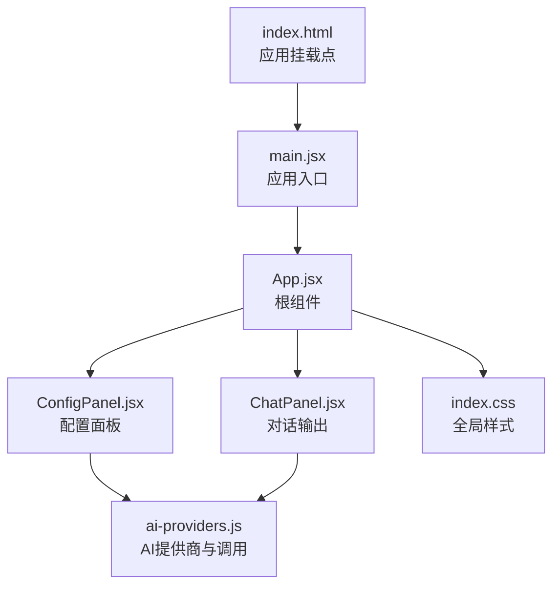
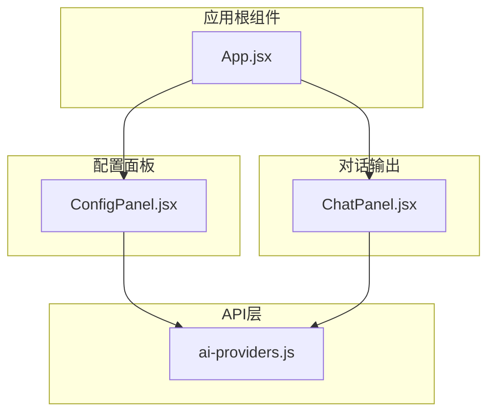
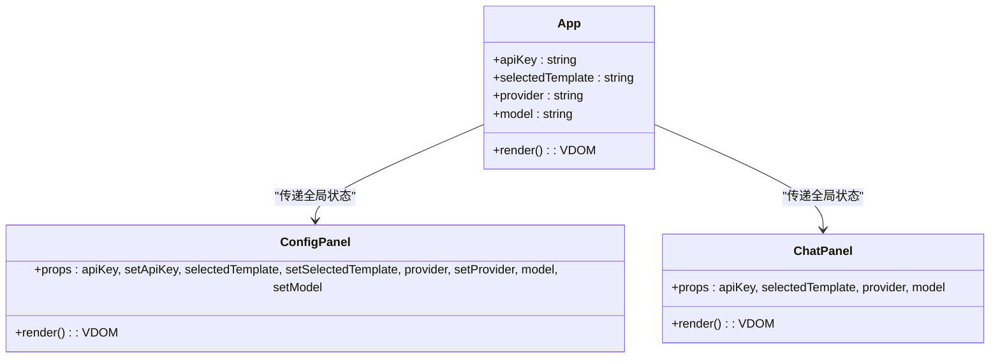
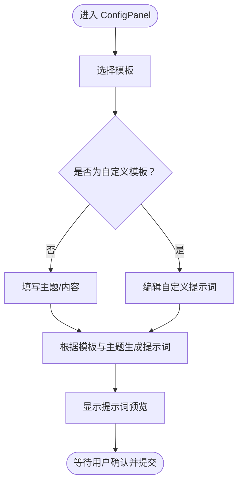
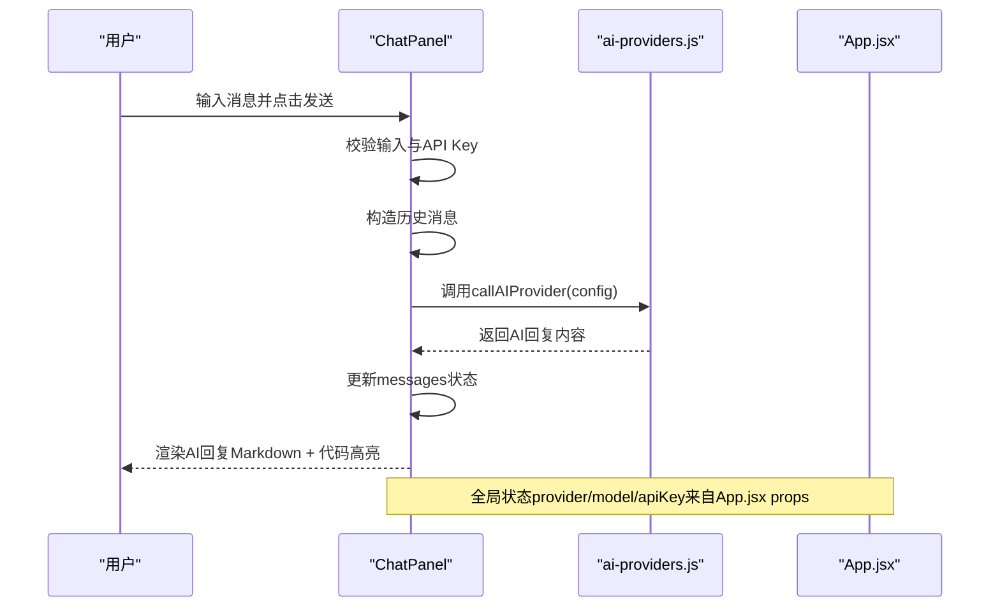
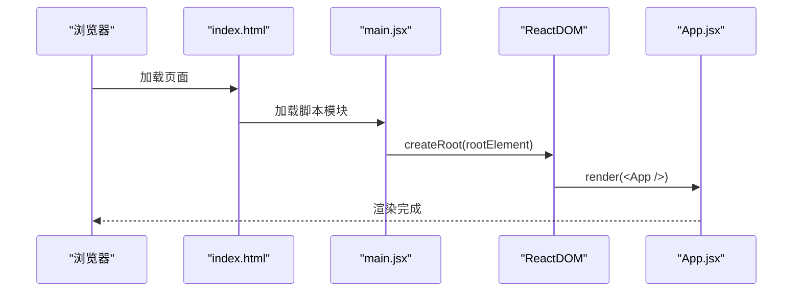
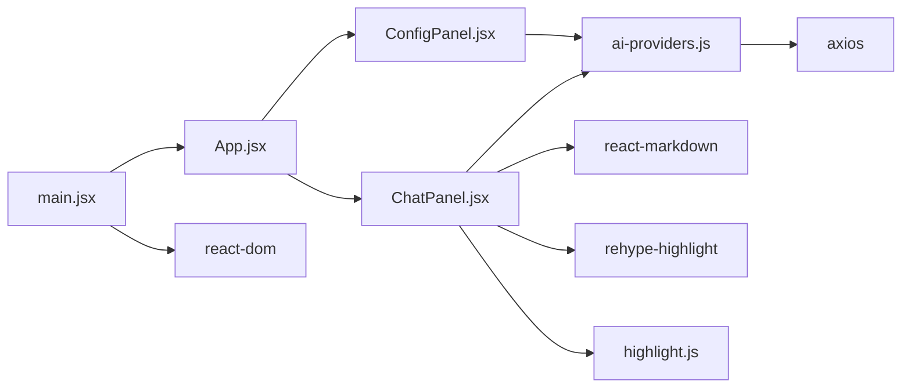

# App主容器组件

<cite>
**本文引用的文件**
- [App.jsx](file://ai-doc-generator/src/App.jsx)
- [main.jsx](file://ai-doc-generator/src/main.jsx)
- [ConfigPanel.jsx](file://ai-doc-generator/src/components/ConfigPanel.jsx)
- [ChatPanel.jsx](file://ai-doc-generator/src/components/ChatPanel.jsx)
- [ai-providers.js](file://ai-doc-generator/src/api/ai-providers.js)
- [index.css](file://ai-doc-generator/src/index.css)
- [package.json](file://ai-doc-generator/package.json)
- [index.html](file://ai-doc-generator/index.html)
- [vite.config.js](file://ai-doc-generator/vite.config.js)
</cite>

## 目录
1. [简介](#简介)
2. [项目结构](#项目结构)
3. [核心组件](#核心组件)
4. [架构总览](#架构总览)
5. [详细组件分析](#详细组件分析)
6. [依赖关系分析](#依赖关系分析)
7. [性能考虑](#性能考虑)
8. [故障排除指南](#故障排除指南)
9. [结论](#结论)
10. [附录](#附录)

## 简介
本文件聚焦于AI文档生成器的App主容器组件，系统性阐述App.jsx作为应用根组件的设计理念、架构职责以及与ConfigPanel和ChatPanel两大核心子组件的布局协调与通信机制。文档将深入解析全局状态的定义与传递方式、组件渲染逻辑与生命周期管理、main.jsx入口文件的应用初始化流程，并提供组件组合最佳实践与性能优化建议。同时，通过具体代码片段路径展示组件协作模式与状态同步机制，帮助开发者快速理解并扩展该应用。

## 项目结构
该项目采用以功能域划分的组织方式，核心文件分布如下：
- 应用入口与根组件：main.jsx、App.jsx
- 子组件：ConfigPanel.jsx（配置面板）、ChatPanel.jsx（对话输出）
- API层：ai-providers.js（统一AI提供商与调用封装）
- 样式：index.css（全局样式与主题变量）
- 构建与运行：index.html、vite.config.js、package.json

图表来源
- [index.html:1-14](file://ai-doc-generator/index.html#L1-L14)
- [main.jsx:1-11](file://ai-doc-generator/src/main.jsx#L1-L11)
- [App.jsx:1-37](file://ai-doc-generator/src/App.jsx#L1-L37)
- [ConfigPanel.jsx:1-156](file://ai-doc-generator/src/components/ConfigPanel.jsx#L1-L156)
- [ChatPanel.jsx:1-278](file://ai-doc-generator/src/components/ChatPanel.jsx#L1-L278)
- [ai-providers.js:1-344](file://ai-doc-generator/src/api/ai-providers.js#L1-L344)
- [index.css:1-531](file://ai-doc-generator/src/index.css#L1-L531)

章节来源
- [index.html:1-14](file://ai-doc-generator/index.html#L1-L14)
- [vite.config.js:1-11](file://ai-doc-generator/vite.config.js#L1-L11)
- [package.json:1-28](file://ai-doc-generator/package.json#L1-L28)

## 核心组件
本节聚焦App.jsx作为根组件，梳理其职责、状态管理策略与与子组件的协作关系。

- 设计理念与架构作用
  - App.jsx是应用的唯一根组件，负责承载全局状态与布局规划，协调ConfigPanel与ChatPanel的布局与通信。
  - 采用“自上而下”的单向数据流：父组件持有全局状态，通过props向下传递给子组件；子组件通过回调向上更新父组件状态。
  - 使用CSS Grid实现响应式布局：左侧固定宽度配置面板，右侧自适应聊天输出区域，适配不同屏幕尺寸。

- 全局状态定义与传递机制
  - App.jsx内部通过useState声明四个关键状态：apiKey、selectedTemplate、provider、model。这些状态贯穿整个应用，既用于配置面板的UI控制，也用于聊天面板的AI调用。
  - 通过props将状态与setter函数传递给ConfigPanel与ChatPanel，形成清晰的父子通信链路。
  - ConfigPanel内部还维护局部表单状态（如topic、customPrompt），用于即时编辑与模板预览，但最终仍由父组件统一管理对外可见的全局配置。

- 渲染逻辑与生命周期管理
  - 渲染逻辑简单直接：头部信息 + 主体内容（配置面板 + 聊天面板）。
  - 生命周期方面，App.jsx本身无复杂副作用，主要依赖React的默认渲染与事件处理。全局状态变更触发重新渲染，子组件按需消费最新props。

- 与子组件的协作模式
  - ConfigPanel：接收全局状态与setter，处理提供商切换、模型选择、API Key输入、模板选择与内容输入，并计算模板提示词预览。
  - ChatPanel：接收全局状态（apiKey、selectedTemplate、provider、model），维护自身对话历史、输入框与加载状态，发起AI调用并渲染结果。

章节来源
- [App.jsx:1-37](file://ai-doc-generator/src/App.jsx#L1-L37)
- [ConfigPanel.jsx:13-33](file://ai-doc-generator/src/components/ConfigPanel.jsx#L13-L33)
- [ChatPanel.jsx:7-53](file://ai-doc-generator/src/components/ChatPanel.jsx#L7-L53)

## 架构总览
App.jsx作为根组件，承担以下职责：
- 统一管理全局配置状态（API Key、模板、提供商、模型）
- 协调左右布局：ConfigPanel负责配置，ChatPanel负责输出
- 作为数据源，向下传递状态与回调
- 作为UI容器，提供一致的主题与样式

图表来源
- [App.jsx:1-37](file://ai-doc-generator/src/App.jsx#L1-L37)
- [ConfigPanel.jsx:1-156](file://ai-doc-generator/src/components/ConfigPanel.jsx#L1-L156)
- [ChatPanel.jsx:1-278](file://ai-doc-generator/src/components/ChatPanel.jsx#L1-L278)
- [ai-providers.js:1-344](file://ai-doc-generator/src/api/ai-providers.js#L1-L344)

## 详细组件分析

### App.jsx：根组件设计与状态管理
- 状态定义
  - apiKey：当前使用的API Key，影响ChatPanel的调用可用性与安全性。
  - selectedTemplate：当前选择的模板ID，决定提示词生成逻辑。
  - provider：当前AI提供商标识，决定调用目标与模型列表。
  - model：当前选择的模型名称，决定具体调用参数。
- 通信机制
  - 将上述状态与对应的setter函数以props形式传递给ConfigPanel与ChatPanel，实现双向绑定与状态同步。
- 布局策略
  - 使用CSS Grid将配置面板固定宽度（约400px）与右侧输出区域自适应结合，保证在桌面端的高效利用与移动端的流畅体验。

图表来源
- [App.jsx:6-34](file://ai-doc-generator/src/App.jsx#L6-L34)
- [ConfigPanel.jsx:13-33](file://ai-doc-generator/src/components/ConfigPanel.jsx#L13-L33)
- [ChatPanel.jsx:7-11](file://ai-doc-generator/src/components/ChatPanel.jsx#L7-L11)

章节来源
- [App.jsx:6-34](file://ai-doc-generator/src/App.jsx#L6-L34)

### ConfigPanel.jsx：配置面板的交互与模板生成
- 模板系统
  - 内置多种模板（技术文档、代码生成、API文档、教程指南、代码审查、自定义），根据selectedTemplate动态生成提示词。
  - 自定义模板支持用户直接输入提示词，提升灵活性。
- 提供商与模型联动
  - 切换provider时自动选择该提供商的第一个可用模型，避免配置不匹配。
  - 模型下拉菜单基于getModelsForProvider(provider)动态生成。
- 表单状态管理
  - 局部状态：topic（模板内容占位）、customPrompt（自定义提示词）。
  - 全局状态：通过setter函数更新App.jsx中的全局配置。
- 提示词预览
  - 实时计算并展示生成的提示词，便于用户校验与调整。

图表来源
- [ConfigPanel.jsx:28-33](file://ai-doc-generator/src/components/ConfigPanel.jsx#L28-L33)
- [ConfigPanel.jsx:78-114](file://ai-doc-generator/src/components/ConfigPanel.jsx#L78-L114)

章节来源
- [ConfigPanel.jsx:1-156](file://ai-doc-generator/src/components/ConfigPanel.jsx#L1-L156)

### ChatPanel.jsx：对话与输出渲染
- 对话状态管理
  - messages：存储完整的对话历史（用户与AI助手）。
  - input：当前输入文本。
  - loading：请求进行中状态。
  - error：错误信息。
- 发送与渲染流程
  - 输入校验：空内容或未设置API Key时阻止发送。
  - 构造历史：将messages映射为API所需的history格式。
  - 调用API：通过callAIProvider(provider, apiKey, model, prompt, history)发起请求。
  - 渲染：使用ReactMarkdown渲染AI回复，支持代码高亮；用户消息原样展示。
- 导出与清理
  - 导出：将对话历史导出为Markdown文件。
  - 清理：清空对话历史与错误信息。

图表来源
- [ChatPanel.jsx:13-46](file://ai-doc-generator/src/components/ChatPanel.jsx#L13-L46)
- [ai-providers.js:60-181](file://ai-doc-generator/src/api/ai-providers.js#L60-L181)
- [App.jsx:20-30](file://ai-doc-generator/src/App.jsx#L20-L30)

章节来源
- [ChatPanel.jsx:1-278](file://ai-doc-generator/src/components/ChatPanel.jsx#L1-L278)

### main.jsx：应用初始化与入口
- 初始化流程
  - 引入React、ReactDOM与App组件。
  - 通过ReactDOM.createRoot创建根节点，将App包裹在StrictMode中渲染。
  - index.html中提供id为root的挂载点，main.jsx在此处挂载应用。
- 运行时行为
  - 严格模式有助于捕获潜在问题，确保组件遵循最佳实践。
  - 应用启动后，App.jsx接管全局状态与布局，ConfigPanel与ChatPanel协同工作。

图表来源
- [index.html:9-12](file://ai-doc-generator/index.html#L9-L12)
- [main.jsx:6-10](file://ai-doc-generator/src/main.jsx#L6-L10)

章节来源
- [main.jsx:1-11](file://ai-doc-generator/src/main.jsx#L1-L11)
- [index.html:1-14](file://ai-doc-generator/index.html#L1-L14)

## 依赖关系分析
- 组件间依赖
  - App.jsx依赖ConfigPanel与ChatPanel；ConfigPanel与ChatPanel均依赖ai-providers.js进行AI调用。
- 外部依赖
  - axios：用于HTTP请求。
  - react-markdown + rehype-highlight：用于渲染Markdown与代码高亮。
  - highlight.js：提供代码高亮样式。
- 构建与开发
  - Vite + @vitejs/plugin-react：开发服务器与热更新。
  - 浏览器环境：通过index.html挂载应用。

图表来源
- [App.jsx:1-3](file://ai-doc-generator/src/App.jsx#L1-L3)
- [ConfigPanel.jsx:1-2](file://ai-doc-generator/src/components/ConfigPanel.jsx#L1-L2)
- [ChatPanel.jsx:1-5](file://ai-doc-generator/src/components/ChatPanel.jsx#L1-L5)
- [ai-providers.js](file://ai-doc-generator/src/api/ai-providers.js#L1)
- [main.jsx:1-3](file://ai-doc-generator/src/main.jsx#L1-L3)
- [package.json:14-21](file://ai-doc-generator/package.json#L14-L21)

章节来源
- [package.json:1-28](file://ai-doc-generator/package.json#L1-L28)
- [vite.config.js:1-11](file://ai-doc-generator/vite.config.js#L1-L11)

## 性能考虑
- 状态最小化与局部化
  - ConfigPanel内部的topic与customPrompt为局部状态，避免不必要的全局重渲染。
  - App.jsx仅持有影响全局行为的关键状态，减少渲染范围。
- 渲染优化
  - ChatPanel对消息列表使用稳定的key（索引），配合动画与Markdown渲染，注意在长对话场景下的滚动与内存占用。
  - 使用React Markdown与代码高亮时，建议在大量代码块场景下考虑分页或虚拟化。
- 网络与超时
  - ai-providers.js设置了60秒超时，避免长时间阻塞UI；同时对常见HTTP状态码提供明确错误提示。
- 样式与主题
  - index.css使用了大量渐变与动画效果，注意在低端设备上的性能表现；可通过媒体查询在小屏设备上简化动画。

[本节为通用性能建议，无需特定文件引用]

## 故障排除指南
- API Key无效或过期
  - 现象：ChatPanel显示“API Key 无效或已过期，请检查后重试”。
  - 处理：在ConfigPanel中重新输入正确的API Key，并确认提供商与模型配置正确。
- 请求过于频繁
  - 现象：出现“请求过于频繁，请稍后重试”。
  - 处理：降低请求频率，或升级提供商套餐。
- 网络错误
  - 现象：出现“网络错误，请检查网络连接”。
  - 处理：检查本地网络与代理设置，确保可访问对应AI提供商的API端点。
- 响应格式异常
  - 现象：出现“API 响应格式异常”。
  - 处理：确认所选模型与提供商兼容，必要时更换模型或提供商。

章节来源
- [ai-providers.js:146-180](file://ai-doc-generator/src/api/ai-providers.js#L146-L180)
- [ChatPanel.jsx:41-45](file://ai-doc-generator/src/components/ChatPanel.jsx#L41-L45)

## 结论
App.jsx作为应用根组件，通过简洁的状态管理与清晰的父子通信，实现了ConfigPanel与ChatPanel的高效协作。其采用的单向数据流与响应式布局，既保证了良好的用户体验，也为后续扩展（如新增提供商、模板或功能）提供了稳定的基础。配合完善的错误处理与性能优化建议，该组件体系具备良好的可维护性与可扩展性。

[本节为总结性内容，无需特定文件引用]

## 附录
- 最佳实践
  - 状态提升：将跨组件共享的状态提升至App.jsx，保持数据一致性。
  - 事件回调：子组件通过setter函数向上更新父组件状态，避免直接修改父组件状态。
  - 模板与提示词：优先使用内置模板，必要时启用自定义模板；在ConfigPanel中预览提示词后再发送。
  - 错误处理：在ChatPanel中统一展示错误信息，并引导用户检查API Key与网络。
- 性能优化建议
  - 控制消息数量：在长对话场景下定期清理历史消息，避免DOM过大。
  - 代码高亮：在大量代码块场景下考虑延迟加载或分页渲染。
  - 样式动画：在低端设备上适当减少动画复杂度，提升流畅度。
- 代码示例路径
  - 全局状态定义与传递：[App.jsx:6-30](file://ai-doc-generator/src/App.jsx#L6-L30)
  - 模板提示词生成：[ConfigPanel.jsx:28-33](file://ai-doc-generator/src/components/ConfigPanel.jsx#L28-L33)
  - AI调用与错误处理：[ChatPanel.jsx:13-46](file://ai-doc-generator/src/components/ChatPanel.jsx#L13-L46)、[ai-providers.js:60-181](file://ai-doc-generator/src/api/ai-providers.js#L60-L181)
  - 应用初始化与挂载：[main.jsx:6-10](file://ai-doc-generator/src/main.jsx#L6-L10)、[index.html:9-12](file://ai-doc-generator/index.html#L9-L12)

[本节为补充内容，无需特定文件引用]