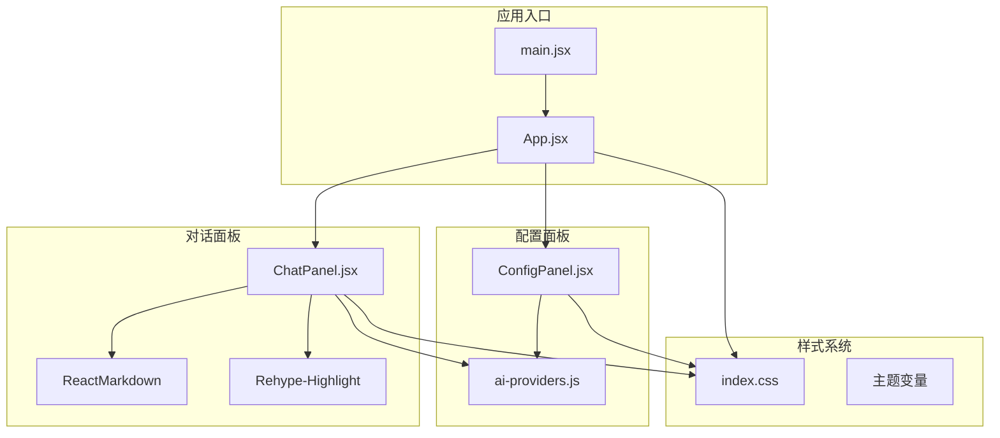
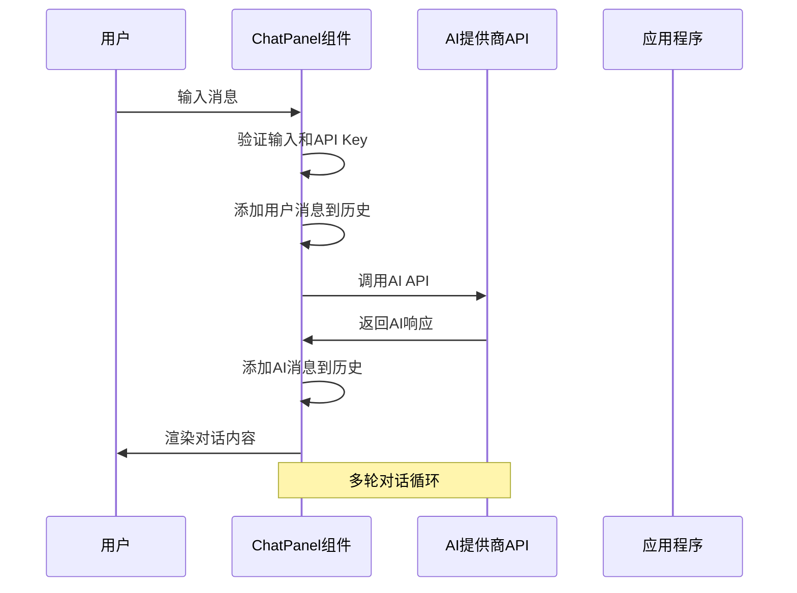
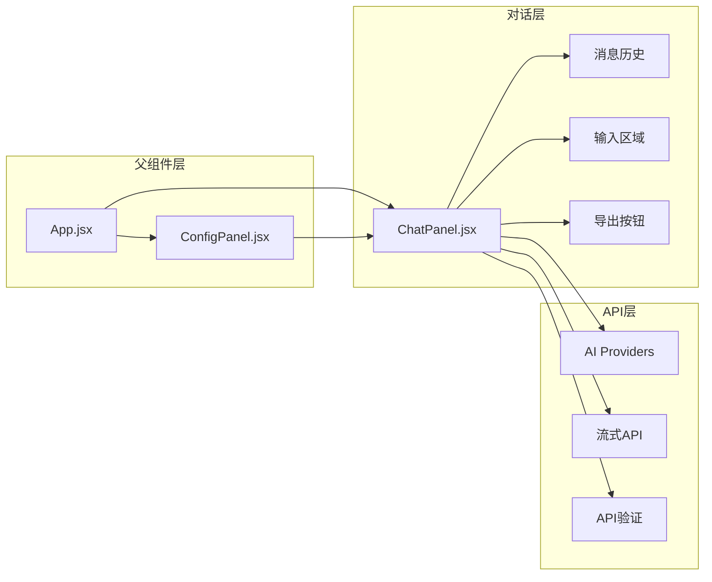
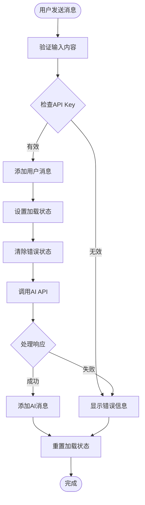
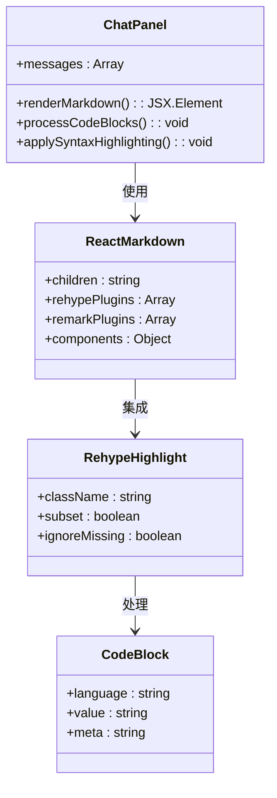
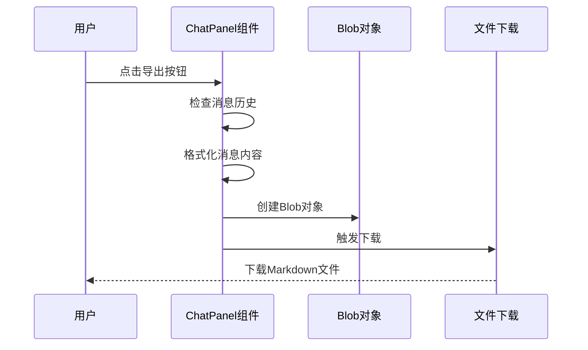
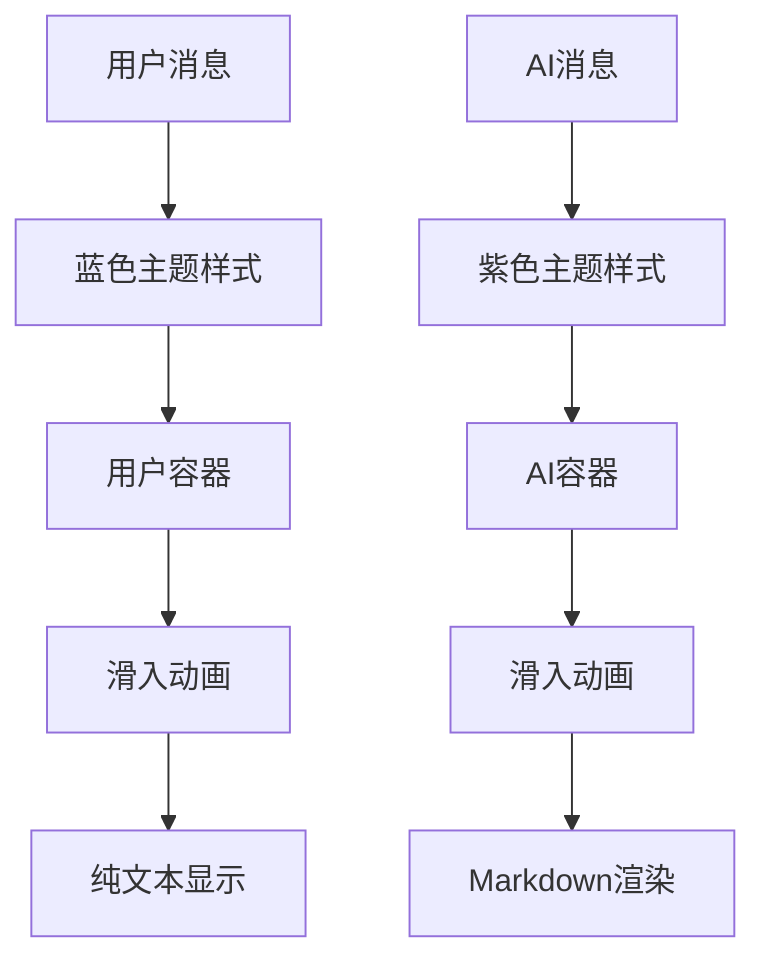
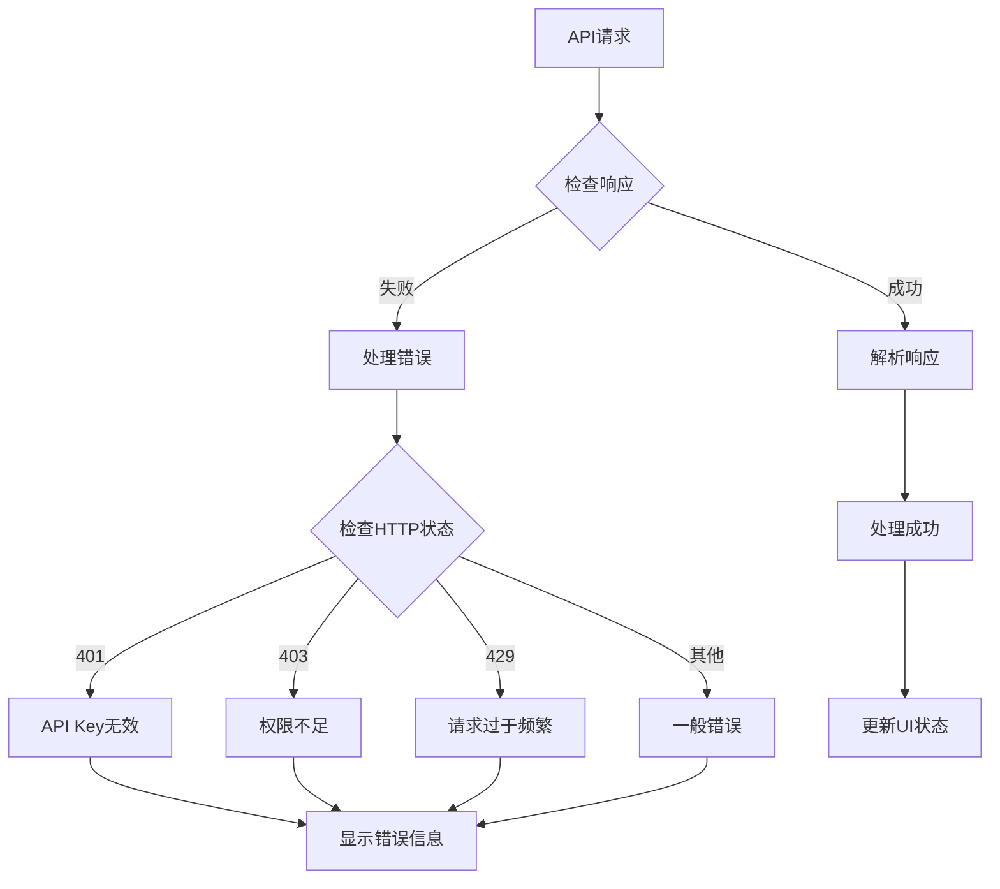
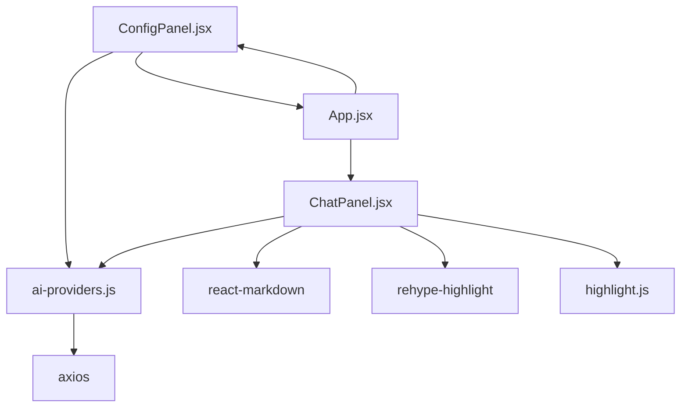

# 对话面板组件

<cite>
**本文档引用的文件**
- [ChatPanel.jsx](file://ai-doc-generator/src/components/ChatPanel.jsx)
- [ai-providers.js](file://ai-doc-generator/src/api/ai-providers.js)
- [App.jsx](file://ai-doc-generator/src/App.jsx)
- [ConfigPanel.jsx](file://ai-doc-generator/src/components/ConfigPanel.jsx)
- [index.css](file://ai-doc-generator/src/index.css)
- [main.jsx](file://ai-doc-generator/src/main.jsx)
- [package.json](file://ai-doc-generator/package.json)
</cite>

## 目录
1. [简介](#简介)
2. [项目结构](#项目结构)
3. [核心组件](#核心组件)
4. [架构概览](#架构概览)
5. [详细组件分析](#详细组件分析)
6. [依赖关系分析](#依赖关系分析)
7. [性能考虑](#性能考虑)
8. [故障排除指南](#故障排除指南)
9. [结论](#结论)

## 简介

AI文档生成器的对话面板组件（ChatPanel）是整个应用程序的核心交互界面，负责处理多轮对话、实时响应显示、Markdown渲染和代码高亮等功能。该组件采用React Hooks进行状态管理，集成了多种AI提供商的API，提供了流畅的用户体验和强大的文档生成功能。

## 项目结构

AI文档生成器采用模块化架构设计，主要由以下几个核心部分组成：

**图表来源**
- [main.jsx:1-11](file://ai-doc-generator/src/main.jsx#L1-L11)
- [App.jsx:1-37](file://ai-doc-generator/src/App.jsx#L1-L37)
- [ChatPanel.jsx:1-278](file://ai-doc-generator/src/components/ChatPanel.jsx#L1-L278)
- [ConfigPanel.jsx:1-156](file://ai-doc-generator/src/components/ConfigPanel.jsx#L1-L156)
- [ai-providers.js:1-344](file://ai-doc-generator/src/api/ai-providers.js#L1-L344)

**章节来源**
- [main.jsx:1-11](file://ai-doc-generator/src/main.jsx#L1-L11)
- [App.jsx:1-37](file://ai-doc-generator/src/App.jsx#L1-L37)
- [package.json:1-28](file://ai-doc-generator/package.json#L1-L28)

## 核心组件

### ChatPanel 组件概述

ChatPanel组件是AI文档生成器的对话核心，实现了以下关键功能：

- **多轮对话管理**：维护完整的对话历史记录
- **实时响应处理**：异步处理AI响应并更新UI
- **Markdown渲染**：支持丰富的文本格式化
- **代码高亮**：集成语法高亮功能
- **一键导出**：支持Markdown格式导出
- **错误状态管理**：完善的错误处理机制

### 状态管理系统

组件使用React Hooks进行状态管理，包含以下核心状态：

| 状态变量 | 类型 | 描述 | 默认值 |
|---------|------|------|--------|
| `messages` | Array | 对话历史记录 | [] |
| `input` | String | 用户输入内容 | '' |
| `loading` | Boolean | 加载状态 | false |
| `error` | String | 错误信息 | '' |

**章节来源**
- [ChatPanel.jsx:7-11](file://ai-doc-generator/src/components/ChatPanel.jsx#L7-L11)

## 架构概览

### 数据流架构

**图表来源**
- [ChatPanel.jsx:13-46](file://ai-doc-generator/src/components/ChatPanel.jsx#L13-L46)
- [ai-providers.js:60-181](file://ai-providers.js#L60-L181)

### 组件通信架构

**图表来源**
- [App.jsx:6-34](file://ai-doc-generator/src/App.jsx#L6-L34)
- [ChatPanel.jsx:1-278](file://ai-doc-generator/src/components/ChatPanel.jsx#L1-L278)
- [ai-providers.js:190-309](file://ai-providers.js#L190-L309)

## 详细组件分析

### 核心功能实现

#### 多轮对话交互

ChatPanel组件通过维护消息历史数组实现多轮对话：

**图表来源**
- [ChatPanel.jsx:13-46](file://ai-doc-generator/src/components/ChatPanel.jsx#L13-L46)

#### Markdown渲染机制

组件使用ReactMarkdown库实现Markdown渲染，并集成代码高亮功能：

**图表来源**
- [ChatPanel.jsx:165-169](file://ai-doc-generator/src/components/ChatPanel.jsx#L165-L169)
- [ChatPanel.jsx:2-3](file://ai-doc-generator/src/components/ChatPanel.jsx#L2-L3)

#### 一键导出功能

导出功能支持将对话历史保存为Markdown文件：

**图表来源**
- [ChatPanel.jsx:55-75](file://ai-doc-generator/src/components/ChatPanel.jsx#L55-L75)

### 状态管理详解

#### 消息历史记录

消息历史采用数组形式存储，每条消息包含角色和内容：

| 属性 | 类型 | 描述 |
|------|------|------|
| `role` | String | 消息角色（user/assistant） |
| `content` | String | 消息内容 |

消息渲染时根据角色应用不同的样式：

**图表来源**
- [ChatPanel.jsx:125-172](file://ai-doc-generator/src/components/ChatPanel.jsx#L125-L172)

#### 实时响应处理

组件支持两种响应模式：

1. **同步响应**：一次性返回完整内容
2. **流式响应**：逐步返回内容片段

流式响应通过callAIProviderStream函数实现：

**章节来源**
- [ChatPanel.jsx:13-46](file://ai-doc-generator/src/components/ChatPanel.jsx#L13-L46)
- [ai-providers.js:190-309](file://ai-providers.js#L190-L309)

### 错误状态管理

组件实现了全面的错误处理机制：

**图表来源**
- [ai-providers.js:146-180](file://ai-providers.js#L146-L180)

**章节来源**
- [ChatPanel.jsx:41-45](file://ai-doc-generator/src/components/ChatPanel.jsx#L41-L45)
- [ai-providers.js:146-180](file://ai-providers.js#L146-L180)

## 依赖关系分析

### 外部依赖

组件依赖以下关键外部库：

| 依赖包 | 版本 | 用途 |
|--------|------|------|
| react | ^19.2.5 | React框架核心 |
| react-markdown | ^10.1.0 | Markdown渲染 |
| rehype-highlight | ^7.0.2 | 代码高亮 |
| highlight.js | ^11.11.1 | 语法高亮引擎 |
| axios | ^1.15.2 | HTTP请求 |

### 内部依赖关系

**图表来源**
- [ChatPanel.jsx:1-5](file://ai-doc-generator/src/components/ChatPanel.jsx#L1-L5)
- [ConfigPanel.jsx:1-2](file://ai-doc-generator/src/components/ConfigPanel.jsx#L1-L2)
- [App.jsx:1-3](file://ai-doc-generator/src/App.jsx#L1-L3)

**章节来源**
- [package.json:14-22](file://ai-doc-generator/package.json#L14-L22)

## 性能考虑

### 渲染优化

1. **条件渲染**：空状态和加载状态使用条件渲染减少DOM操作
2. **动画优化**：使用CSS动画而非JavaScript动画
3. **懒加载**：代码高亮按需加载

### 内存管理

1. **消息清理**：提供清空功能释放内存
2. **事件监听**：正确清理DOM事件监听器
3. **Blob对象**：及时释放下载链接对象

### 网络优化

1. **超时控制**：设置60秒超时防止长时间等待
2. **错误重试**：合理的错误处理机制
3. **并发控制**：避免同时发起多个请求

## 故障排除指南

### 常见问题及解决方案

#### API Key相关问题

| 问题 | 可能原因 | 解决方案 |
|------|----------|----------|
| API Key无效 | 密钥格式错误或过期 | 检查密钥格式和有效期 |
| 权限不足 | 账户状态异常 | 联系提供商客服 |
| 请求过于频繁 | 超过配额限制 | 等待配额恢复或升级套餐 |

#### 网络连接问题

| 问题 | 可能原因 | 解决方案 |
|------|----------|----------|
| 网络超时 | 网络不稳定 | 检查网络连接 |
| DNS解析失败 | DNS服务器问题 | 更换DNS服务器 |
| 代理设置错误 | 代理配置问题 | 检查代理设置 |

#### 渲染问题

| 问题 | 可能原因 | 解决方案 |
|------|----------|----------|
| Markdown渲染异常 | 格式不正确 | 检查Markdown语法 |
| 代码高亮失效 | 语言类型不支持 | 指定正确的语言标识 |
| 样式错乱 | CSS冲突 | 检查样式优先级 |

**章节来源**
- [ai-providers.js:146-180](file://ai-providers.js#L146-L180)
- [ChatPanel.jsx:181-185](file://ai-doc-generator/src/components/ChatPanel.jsx#L181-L185)

## 结论

ChatPanel组件作为AI文档生成器的核心交互界面，展现了现代Web应用的最佳实践。通过精心设计的状态管理、优雅的UI交互和强大的功能集成，为用户提供了流畅的AI对话体验。

组件的主要优势包括：
- **模块化设计**：清晰的职责分离和依赖管理
- **用户体验优化**：流畅的动画效果和响应式设计
- **功能完整性**：从基础对话到高级导出的一站式解决方案
- **可扩展性**：支持多种AI提供商和模型的灵活配置

未来可以考虑的功能增强方向：
- 支持流式输出的实时渲染
- 增加对话上下文记忆功能
- 提供更多的导出格式选项
- 实现对话历史的持久化存储