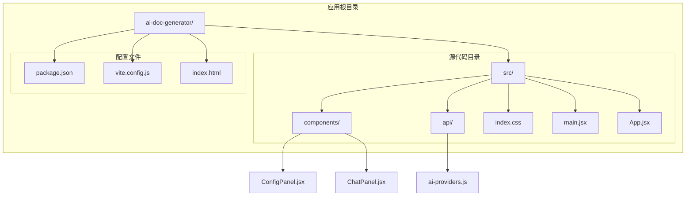
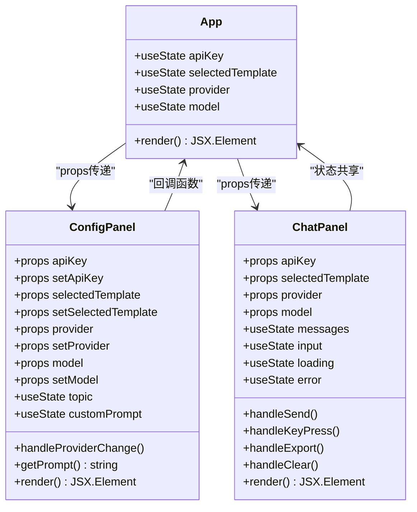
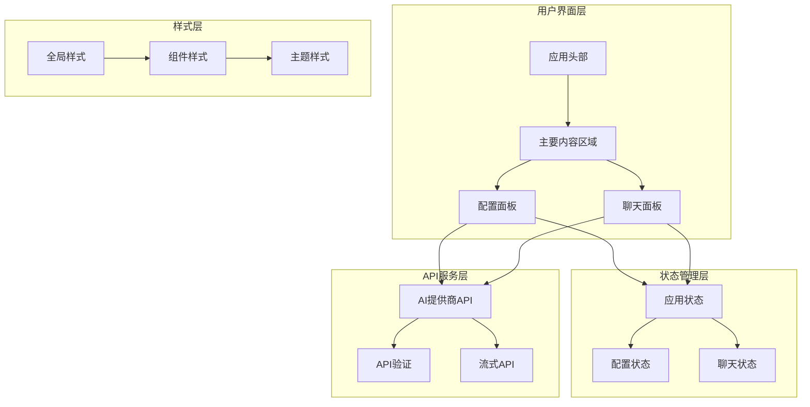
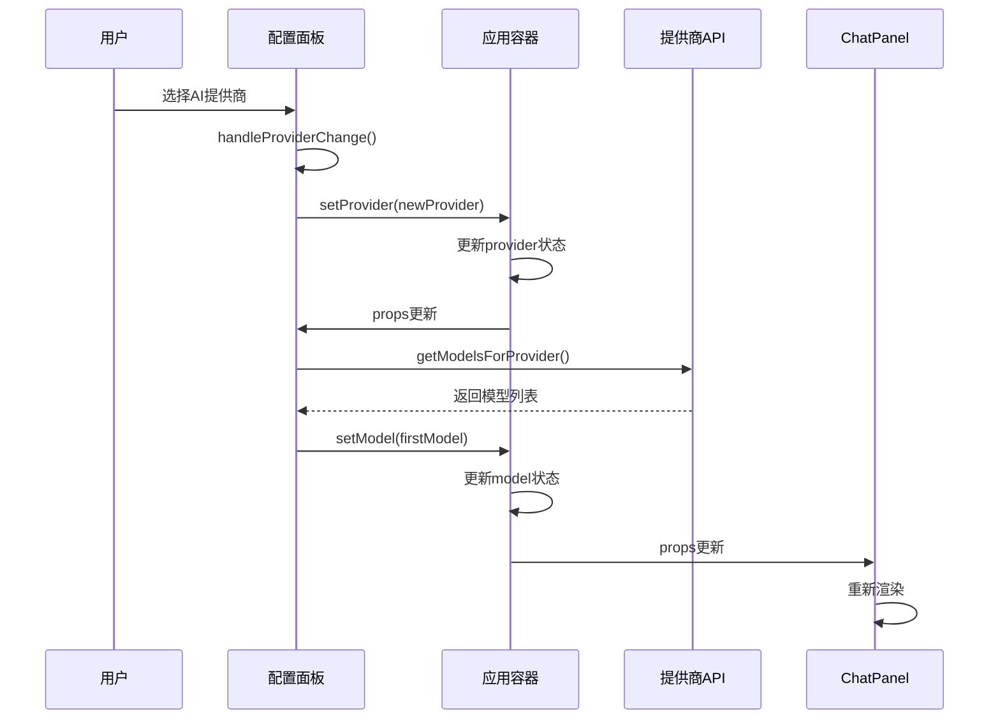
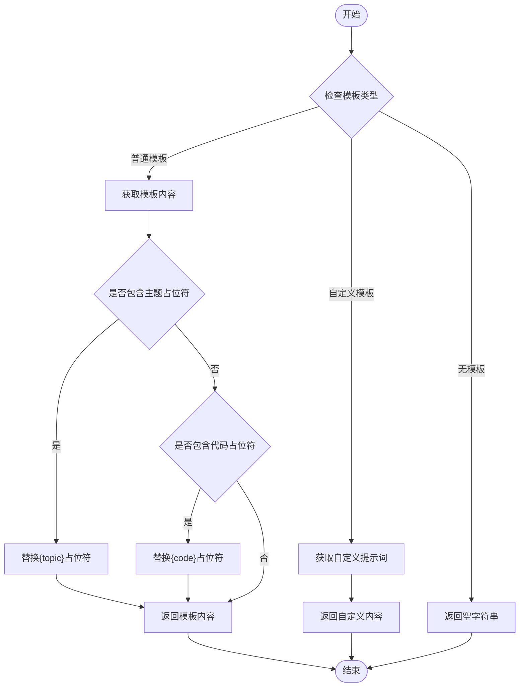
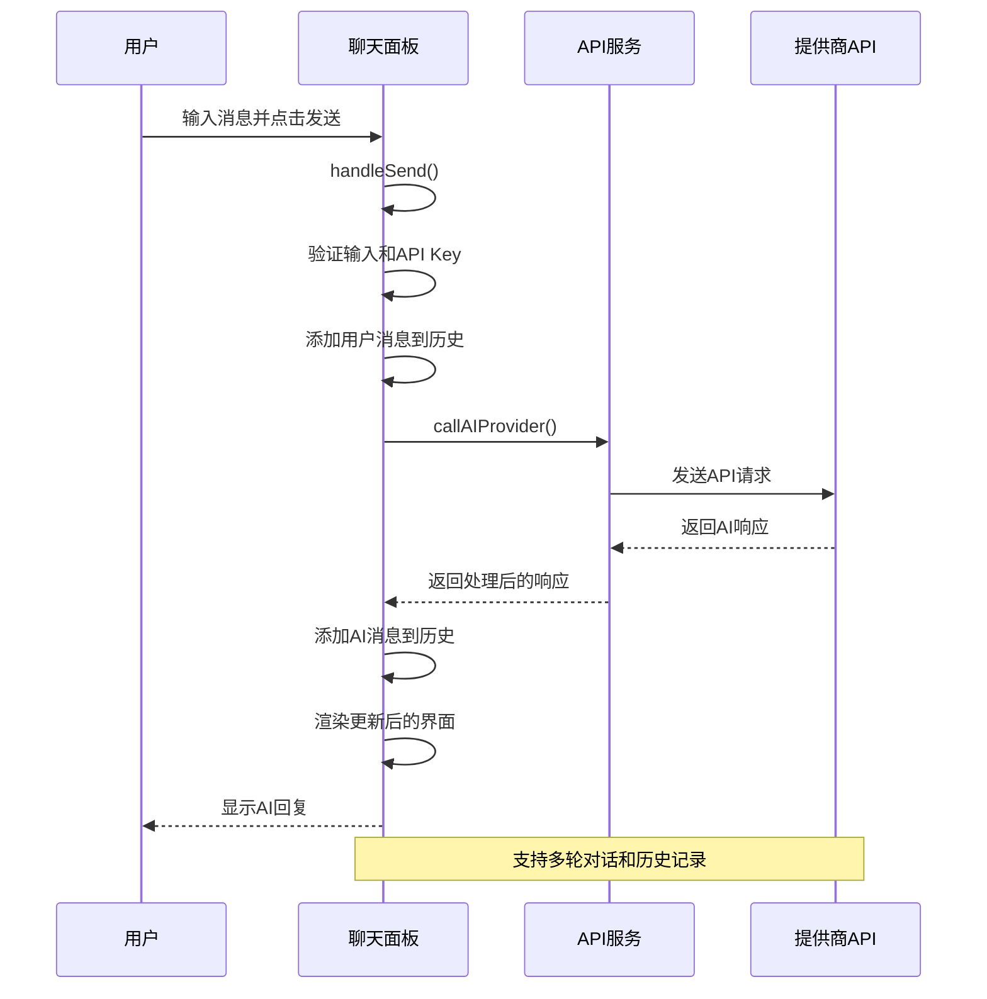

# 核心组件架构

<cite>
**本文档引用的文件**
- [App.jsx](file://ai-doc-generator/src/App.jsx)
- [ConfigPanel.jsx](file://ai-doc-generator/src/components/ConfigPanel.jsx)
- [ChatPanel.jsx](file://ai-doc-generator/src/components/ChatPanel.jsx)
- [main.jsx](file://ai-doc-generator/src/main.jsx)
- [ai-providers.js](file://ai-doc-generator/src/api/ai-providers.js)
- [index.css](file://ai-doc-generator/src/index.css)
- [package.json](file://ai-doc-generator/package.json)
</cite>

## 目录
1. [简介](#简介)
2. [项目结构](#项目结构)
3. [核心组件](#核心组件)
4. [架构概览](#架构概览)
5. [详细组件分析](#详细组件分析)
6. [依赖关系分析](#依赖关系分析)
7. [性能考虑](#性能考虑)
8. [故障排除指南](#故障排除指南)
9. [结论](#结论)

## 简介

AI文档生成器是一个基于React的现代化Web应用程序，旨在为开发者提供一个统一的界面来访问多个AI模型提供商的服务。该应用支持七种不同的AI提供商（MiMo、OpenAI、Claude、智谱、Kimi、DeepSeek、通义千问），允许用户通过简单的配置界面选择合适的AI模型和模板，然后进行智能文档生成和代码编写。

该应用采用模块化架构设计，主要由三个核心组件构成：App主容器、ConfigPanel配置面板和ChatPanel聊天面板。通过精心设计的状态管理和组件通信机制，实现了流畅的用户体验和高效的代码组织。

## 项目结构

AI文档生成器采用清晰的分层架构，将功能按职责分离到不同的模块中：



**图表来源**
- [App.jsx:1-37](file://ai-doc-generator/src/App.jsx#L1-L37)
- [main.jsx:1-11](file://ai-doc-generator/src/main.jsx#L1-L11)

**章节来源**
- [App.jsx:1-37](file://ai-doc-generator/src/App.jsx#L1-L37)
- [main.jsx:1-11](file://ai-doc-generator/src/main.jsx#L1-L11)
- [package.json:1-28](file://ai-doc-generator/package.json#L1-L28)

## 核心组件

### 组件层次结构

应用采用单向数据流架构，通过props向下传递状态，通过回调函数向上处理事件。这种设计确保了数据流向的清晰性和组件间的松耦合。



**图表来源**
- [App.jsx:6-34](file://ai-doc-generator/src/App.jsx#L6-L34)
- [ConfigPanel.jsx:13-153](file://ai-doc-generator/src/components/ConfigPanel.jsx#L13-L153)
- [ChatPanel.jsx:7-275](file://ai-doc-generator/src/components/ChatPanel.jsx#L7-L275)

### 组件间通信机制

应用实现了多种组件通信模式：

1. **Props传递**：App组件作为父组件，通过props向下传递状态给子组件
2. **状态提升**：ConfigPanel和ChatPanel通过回调函数向上更新App组件的状态
3. **事件处理**：组件内部使用React hooks管理本地状态

**章节来源**
- [App.jsx:20-30](file://ai-doc-generator/src/App.jsx#L20-L30)
- [ConfigPanel.jsx:13-153](file://ai-doc-generator/src/components/ConfigPanel.jsx#L13-L153)
- [ChatPanel.jsx:7-275](file://ai-doc-generator/src/components/ChatPanel.jsx#L7-L275)

## 架构概览

应用采用响应式布局设计，支持桌面和移动设备的自适应显示。整体架构遵循现代前端开发最佳实践，注重用户体验和性能优化。



**图表来源**
- [App.jsx:12-32](file://ai-doc-generator/src/App.jsx#L12-L32)
- [ConfigPanel.jsx:35-151](file://ai-doc-generator/src/components/ConfigPanel.jsx#L35-L151)
- [ChatPanel.jsx:82-274](file://ai-doc-generator/src/components/ChatPanel.jsx#L82-L274)

## 详细组件分析

### App主容器组件

App组件是整个应用的根容器，负责管理全局状态和协调子组件之间的交互。

#### 状态管理

App组件使用四个useState钩子管理核心状态：
- `apiKey`: 存储用户API密钥
- `selectedTemplate`: 当前选择的模板标识
- `provider`: 当前选择的AI提供商
- `model`: 当前选择的AI模型

#### 生命周期和渲染逻辑

App组件采用函数式组件设计，通过React的渲染机制自动响应状态变化。当任何状态发生变化时，组件会重新渲染以反映最新的UI状态。

**章节来源**
- [App.jsx:6-34](file://ai-doc-generator/src/App.jsx#L6-L34)

### ConfigPanel配置面板组件

ConfigPanel组件提供用户配置界面，支持多种AI提供商的选择和模板配置。

#### 模板系统

组件内置六种预定义模板：
- 技术文档生成
- 代码生成
- API文档创建
- 教程指南
- 代码审查
- 自定义提示词

每种模板都有特定的占位符替换逻辑，支持动态内容生成。

#### 模型选择机制

ConfigPanel根据选择的AI提供商动态加载可用模型列表。当提供商发生变化时，自动选择该提供商的第一个可用模型。



**图表来源**
- [ConfigPanel.jsx:19-26](file://ai-doc-generator/src/components/ConfigPanel.jsx#L19-L26)
- [ConfigPanel.jsx:20-26](file://ai-doc-generator/src/components/ConfigPanel.jsx#L20-L26)
- [ai-providers.js:336-343](file://ai-doc-generator/src/api/ai-providers.js#L336-L343)

#### 提示词生成逻辑

ConfigPanel实现了智能的提示词生成机制，根据用户选择的模板和输入内容动态生成最终的提示词。



**图表来源**
- [ConfigPanel.jsx:28-33](file://ai-doc-generator/src/components/ConfigPanel.jsx#L28-L33)

**章节来源**
- [ConfigPanel.jsx:13-153](file://ai-doc-generator/src/components/ConfigPanel.jsx#L13-L153)

### ChatPanel聊天面板组件

ChatPanel组件负责处理用户与AI模型的交互，提供实时的对话和文档生成体验。

#### 多轮对话管理

ChatPanel维护一个消息数组，支持多轮对话历史记录。每次用户发送消息时，都会将用户消息和AI回复分别存储在消息历史中。

#### Markdown渲染支持

组件集成了ReactMarkdown库，支持在AI回复中渲染Markdown格式的内容，包括代码高亮显示。



**图表来源**
- [ChatPanel.jsx:13-46](file://ai-doc-generator/src/components/ChatPanel.jsx#L13-L46)
- [ai-providers.js:60-181](file://ai-doc-generator/src/api/ai-providers.js#L60-L181)

#### 错误处理机制

ChatPanel实现了完善的错误处理机制，能够捕获和显示各种类型的错误：
- API Key验证失败
- 网络连接问题
- 服务器响应异常
- 请求超时

**章节来源**
- [ChatPanel.jsx:7-275](file://ai-doc-generator/src/components/ChatPanel.jsx#L7-L275)

## 依赖关系分析

应用的依赖关系相对简单且清晰，主要依赖于React生态系统中的核心库。

```mermaid
graph TB
subgraph "应用依赖"
React[react ^19.2.5]
ReactDOM[react-dom ^19.2.5]
Axios[axios ^1.15.2]
Markdown[react-markdown ^10.1.0]
Highlight[rehype-highlight ^7.0.2]
HLJS[highlight.js ^11.11.1]
Lucide[lucide-react ^1.14.0]
end
subgraph "开发依赖"
Vite[@vitejs/plugin-react ^4.3.4]
ViteDev[vite ^5.4.11]
end
App --> React
App --> ReactDOM
ConfigPanel --> React
ChatPanel --> React
ChatPanel --> Markdown
ChatPanel --> Highlight
ChatPanel --> HLJS
ConfigPanel --> Axios
App --> Axios
```

**图表来源**
- [package.json:14-26](file://ai-doc-generator/package.json#L14-L26)

### 外部API集成

应用通过统一的API抽象层集成多个AI提供商，支持以下功能：
- 统一的API调用接口
- 流式和非流式响应处理
- API Key验证
- 错误码映射和用户友好的错误消息

**章节来源**
- [ai-providers.js:1-344](file://ai-doc-generator/src/api/ai-providers.js#L1-L344)

## 性能考虑

### 渲染优化

应用采用了多项性能优化策略：

1. **状态最小化**：只在必要时更新相关组件的状态
2. **条件渲染**：使用条件渲染减少不必要的DOM元素创建
3. **样式优化**：使用CSS变量和预计算样式减少重排重绘

### 内存管理

- 合理使用React hooks避免内存泄漏
- 及时清理定时器和事件监听器
- 使用稳定引用避免不必要的重渲染

### 网络优化

- 实现请求超时控制
- 错误重试机制
- 缓存策略（可扩展）

## 故障排除指南

### 常见问题及解决方案

#### API Key相关问题

**症状**：发送消息时出现认证错误
**原因**：API Key无效或过期
**解决方案**：
1. 检查API Key格式是否正确
2. 确认API Key来自正确的AI提供商
3. 验证账户状态和配额

#### 网络连接问题

**症状**：请求超时或网络错误
**原因**：网络不稳定或API端点不可用
**解决方案**：
1. 检查网络连接状态
2. 尝试切换到其他AI提供商
3. 稍后重试请求

#### 模板生成问题

**症状**：提示词生成异常
**原因**：模板选择或输入内容问题
**解决方案**：
1. 确认选择了有效的模板
2. 检查输入内容是否符合模板要求
3. 尝试使用自定义模板

**章节来源**
- [ChatPanel.jsx:15-18](file://ai-doc-generator/src/components/ChatPanel.jsx#L15-L18)
- [ai-providers.js:146-180](file://ai-doc-generator/src/api/ai-providers.js#L146-L180)

## 结论

AI文档生成器展现了现代React应用开发的最佳实践，通过清晰的组件层次结构、合理的状态管理和优雅的用户界面设计，为用户提供了优秀的AI工具使用体验。

### 主要优势

1. **模块化设计**：组件职责明确，易于维护和扩展
2. **状态管理**：采用React hooks实现简洁高效的状态管理
3. **用户体验**：响应式设计和流畅的交互体验
4. **可扩展性**：支持新增AI提供商和功能模块

### 技术亮点

- 统一的API抽象层简化了多提供商集成
- 智能的模板系统提高了用户效率
- 完善的错误处理机制提升了应用稳定性
- 现代化的样式系统提供了优秀的视觉效果

该应用为开发者提供了一个良好的学习范例，展示了如何构建一个功能完整、性能优异的现代Web应用程序。