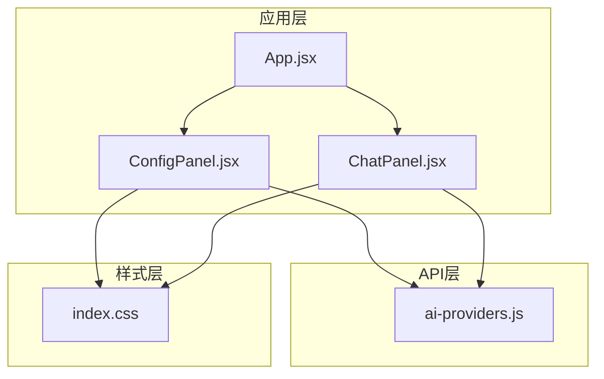
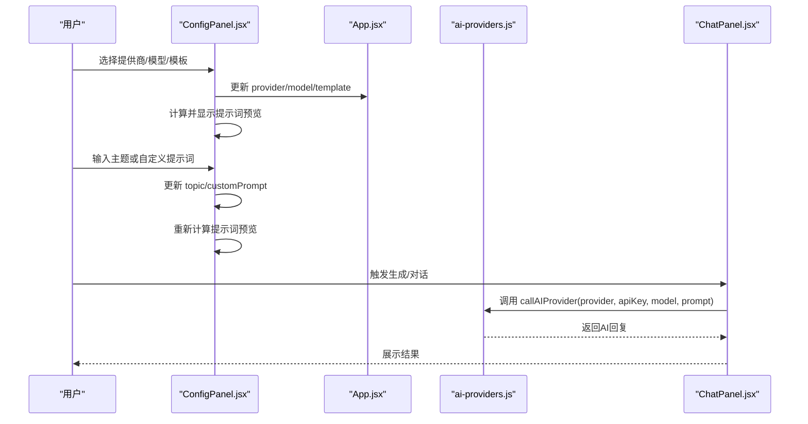
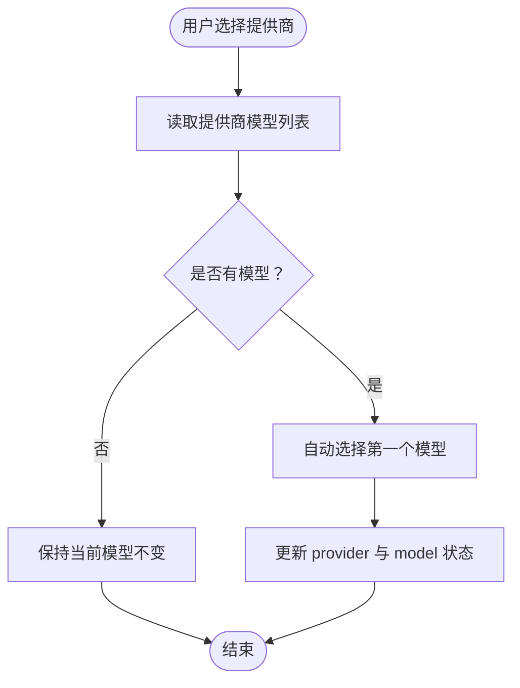
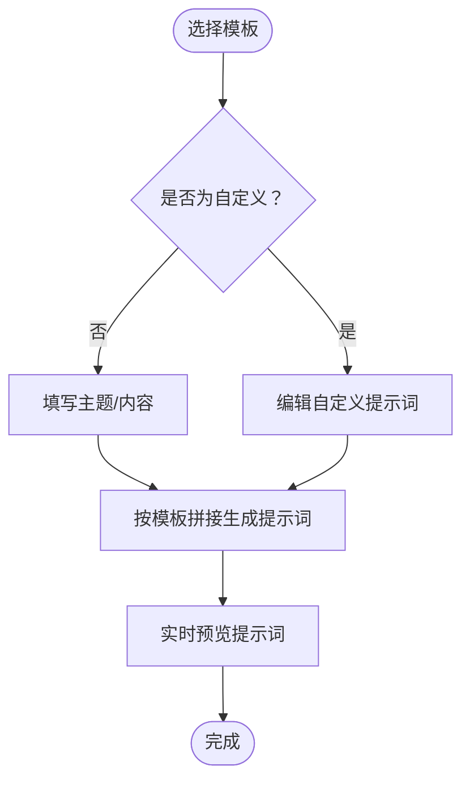
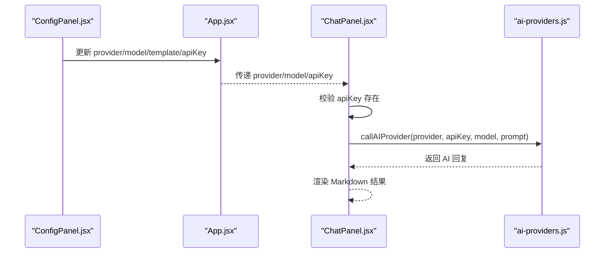
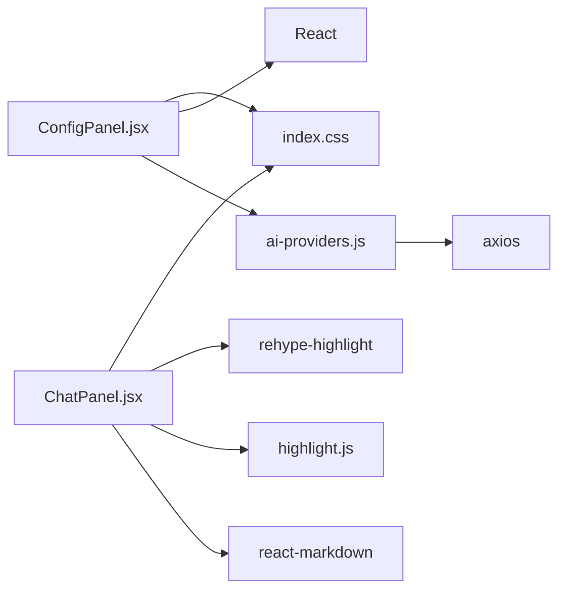

# 配置面板组件

<cite>
**本文引用的文件**
- [ConfigPanel.jsx](file://ai-doc-generator/src/components/ConfigPanel.jsx)
- [ai-providers.js](file://ai-doc-generator/src/api/ai-providers.js)
- [App.jsx](file://ai-doc-generator/src/App.jsx)
- [ChatPanel.jsx](file://ai-doc-generator/src/components/ChatPanel.jsx)
- [index.css](file://ai-doc-generator/src/index.css)
- [package.json](file://ai-doc-generator/package.json)
</cite>

## 目录
1. [简介](#简介)
2. [项目结构](#项目结构)
3. [核心组件](#核心组件)
4. [架构总览](#架构总览)
5. [详细组件分析](#详细组件分析)
6. [依赖关系分析](#依赖关系分析)
7. [性能考虑](#性能考虑)
8. [故障排除指南](#故障排除指南)
9. [结论](#结论)
10. [附录](#附录)

## 简介
本文件面向AI文档生成器的配置面板组件（ConfigPanel），系统性阐述其功能实现与使用方法，重点覆盖：
- AI提供商选择与模型配置联动
- 模板管理系统（预设模板与自定义模板）
- API Key输入与安全策略
- 组件状态管理与实时预览
- 使用示例与最佳实践
- 数据流与交互逻辑图解

该组件采用React函数式组件与受控表单模式，结合全局状态在应用层进行传递，确保配置变更能即时反映到聊天面板与后续的AI调用流程。

## 项目结构
配置面板位于组件目录下，配合API层与应用入口共同构成完整的配置-对话工作流。

图表来源
- [App.jsx:1-37](file://ai-doc-generator/src/App.jsx#L1-L37)
- [ConfigPanel.jsx:1-156](file://ai-doc-generator/src/components/ConfigPanel.jsx#L1-L156)
- [ChatPanel.jsx:1-278](file://ai-doc-generator/src/components/ChatPanel.jsx#L1-L278)
- [ai-providers.js:1-344](file://ai-doc-generator/src/api/ai-providers.js#L1-L344)
- [index.css:1-531](file://ai-doc-generator/src/index.css#L1-L531)

章节来源
- [App.jsx:1-37](file://ai-doc-generator/src/App.jsx#L1-L37)
- [package.json:1-28](file://ai-doc-generator/package.json#L1-L28)

## 核心组件
配置面板负责收集用户输入并生成最终提示词，同时提供实时预览。其关键职责包括：
- 提供AI提供商与模型选择，并在提供商切换时自动选择首个可用模型
- 管理模板选择（预设模板与自定义模板）
- 输入主题/内容或自定义提示词
- 实时渲染生成的提示词预览
- 通过受控表单更新父级状态（API Key、提供商、模型、模板）

章节来源
- [ConfigPanel.jsx:13-156](file://ai-doc-generator/src/components/ConfigPanel.jsx#L13-L156)

## 架构总览
配置面板与应用层、API层的交互关系如下：

图表来源
- [ConfigPanel.jsx:13-156](file://ai-doc-generator/src/components/ConfigPanel.jsx#L13-L156)
- [App.jsx:6-34](file://ai-doc-generator/src/App.jsx#L6-L34)
- [ai-providers.js:60-181](file://ai-doc-generator/src/api/ai-providers.js#L60-L181)
- [ChatPanel.jsx:13-46](file://ai-doc-generator/src/components/ChatPanel.jsx#L13-L46)

## 详细组件分析

### 组件状态与数据流
- 受控状态
  - provider：当前选择的AI提供商标识
  - model：当前选择的模型标识
  - apiKey：当前输入的API Key
  - selectedTemplate：当前选择的模板标识
  - topic：模板适用的主题/内容文本
  - customPrompt：自定义模板的提示词
- 状态更新链路
  - 用户在配置面板内修改任一表单项，触发对应setter，父组件App接收并更新全局状态
  - ChatPanel根据全局状态发起AI调用，返回结果后渲染

章节来源
- [ConfigPanel.jsx:13-156](file://ai-doc-generator/src/components/ConfigPanel.jsx#L13-L156)
- [App.jsx:6-34](file://ai-doc-generator/src/App.jsx#L6-L34)

### AI提供商选择与模型联动
- 提供商列表来源于API层的统一配置对象，包含名称、图标、API端点与模型数组
- 切换提供商时，组件会自动选择该提供商的第一个可用模型，避免用户手动选择导致的不匹配
- 模型下拉框基于当前提供商动态生成

图表来源
- [ConfigPanel.jsx:17-26](file://ai-doc-generator/src/components/ConfigPanel.jsx#L17-L26)
- [ai-providers.js:4-47](file://ai-doc-generator/src/api/ai-providers.js#L4-L47)

章节来源
- [ConfigPanel.jsx:17-26](file://ai-doc-generator/src/components/ConfigPanel.jsx#L17-L26)
- [ai-providers.js:336-343](file://ai-doc-generator/src/api/ai-providers.js#L336-L343)

### 模板管理系统
- 预设模板
  - 包含技术文档、代码生成、API文档、教程指南、代码审查、自定义等六类模板
  - 每个模板包含唯一标识与提示词模板，其中部分模板占位符支持替换
- 自定义模板
  - 当选择“自定义”时，显示自定义提示词输入区域
- 模板选择与内容输入
  - 非自定义模板：显示主题/内容输入框，用于填充模板中的占位符
  - 自定义模板：显示大文本域，允许直接编辑提示词
- 提示词生成
  - 根据所选模板与用户输入，动态拼接生成最终提示词
  - 非自定义模板会将主题/内容替换到模板中的占位符
  - 自定义模板直接使用用户输入

图表来源
- [ConfigPanel.jsx:4-11](file://ai-doc-generator/src/components/ConfigPanel.jsx#L4-L11)
- [ConfigPanel.jsx:28-33](file://ai-doc-generator/src/components/ConfigPanel.jsx#L28-L33)
- [ConfigPanel.jsx:93-114](file://ai-doc-generator/src/components/ConfigPanel.jsx#L93-L114)

章节来源
- [ConfigPanel.jsx:4-11](file://ai-doc-generator/src/components/ConfigPanel.jsx#L4-L11)
- [ConfigPanel.jsx:28-33](file://ai-doc-generator/src/components/ConfigPanel.jsx#L28-L33)
- [ConfigPanel.jsx:93-114](file://ai-doc-generator/src/components/ConfigPanel.jsx#L93-L114)

### API Key输入与安全策略
- 输入方式
  - 使用密码类型输入框，隐藏用户输入
  - 占位符动态显示当前提供商的名称，提升用户体验
- 安全策略
  - API Key仅在本地使用，不会上传至任何服务器
  - 组件未实现加密存储或持久化，建议用户在浏览器安全环境下使用
- 验证与错误处理
  - API层提供API Key有效性校验函数，可在需要时调用
  - 调用AI接口时，API层对常见HTTP状态码进行友好化错误提示

章节来源
- [ConfigPanel.jsx:68-76](file://ai-doc-generator/src/components/ConfigPanel.jsx#L68-L76)
- [ai-providers.js:317-329](file://ai-doc-generator/src/api/ai-providers.js#L317-L329)
- [ai-providers.js:146-180](file://ai-doc-generator/src/api/ai-providers.js#L146-L180)

### 实时预览功能
- 预览容器
  - 固定背景色、边框与字体，便于阅读
  - 支持滚动查看长文本，自动换行
- 预览内容
  - 基于当前模板与用户输入动态生成
  - 若未选择模板或无输入，则显示引导文案

章节来源
- [ConfigPanel.jsx:116-133](file://ai-doc-generator/src/components/ConfigPanel.jsx#L116-L133)

### 与聊天面板的数据衔接
- ChatPanel在发送消息前会检查API Key是否存在，若缺失则提示用户
- ChatPanel将当前provider、model、apiKey与用户输入作为prompt传入API层
- API层根据提供商差异构造请求体与头部，统一返回AI回复

图表来源
- [App.jsx:20-30](file://ai-doc-generator/src/App.jsx#L20-L30)
- [ChatPanel.jsx:13-46](file://ai-doc-generator/src/components/ChatPanel.jsx#L13-L46)
- [ai-providers.js:60-181](file://ai-doc-generator/src/api/ai-providers.js#L60-L181)

## 依赖关系分析
- 组件依赖
  - React状态钩子：用于管理本地输入状态
  - API层：提供提供商配置、模型查询与AI调用封装
- 外部依赖
  - axios：用于非流式调用的HTTP请求
  - highlight.js、react-markdown、rehype-highlight：用于聊天面板的代码高亮与Markdown渲染
- 样式依赖
  - 主题变量与组件样式均来自全局CSS文件

图表来源
- [ConfigPanel.jsx:1-2](file://ai-doc-generator/src/components/ConfigPanel.jsx#L1-L2)
- [ai-providers.js:1](file://ai-doc-generator/src/api/ai-providers.js#L1)
- [ChatPanel.jsx:2-5](file://ai-doc-generator/src/components/ChatPanel.jsx#L2-L5)
- [package.json:14-22](file://ai-doc-generator/package.json#L14-L22)
- [index.css:1-17](file://ai-doc-generator/src/index.css#L1-L17)

章节来源
- [package.json:14-22](file://ai-doc-generator/package.json#L14-L22)

## 性能考虑
- 渲染开销
  - 模板预览为纯文本渲染，开销极低
  - 下拉选择与按钮切换均为轻量DOM操作
- 网络调用
  - AI调用由API层统一封装，避免重复请求与跨组件耦合
  - 错误处理集中在API层，减少UI层复杂度
- 建议
  - 避免在模板选择与输入过程中进行昂贵的计算
  - 将API Key与模板状态保存在内存即可，无需持久化

## 故障排除指南
- 提示词为空
  - 检查是否选择了模板；若选择非自定义模板，需填写主题/内容
- API Key无效
  - 查看API层错误映射，确认状态码与提示信息
  - 使用API层提供的校验函数进行验证
- 网络问题
  - 确认网络连通性与提供商端点可用性
- 模型不可用
  - 切换到其他提供商或选择其他模型

章节来源
- [ai-providers.js:146-180](file://ai-doc-generator/src/api/ai-providers.js#L146-L180)
- [ai-providers.js:317-329](file://ai-doc-generator/src/api/ai-providers.js#L317-L329)

## 结论
配置面板以简洁直观的方式整合了AI提供商选择、模型配置、模板管理与API Key输入，并通过实时预览增强用户体验。其与应用层和API层的清晰边界使扩展与维护变得简单。建议在生产环境中结合API Key校验与本地存储策略，进一步提升安全性与易用性。

## 附录

### 使用示例与最佳实践
- 快速开始
  - 在配置面板中选择合适的提供商与模型
  - 选择一个预设模板或进入自定义模板
  - 输入主题/内容或自定义提示词
  - 在预览区确认提示词后，回到聊天面板发起对话
- 最佳实践
  - 优先使用预设模板以获得更稳定的提示词结构
  - 自定义模板适合特定领域或复杂场景，注意控制提示词长度
  - API Key仅在本地使用，避免在公共设备上长期保存
  - 如遇错误，先检查提供商端点与配额限制

### 关键交互与数据流路径
- 模板选择与输入
  - [ConfigPanel.jsx:78-114](file://ai-doc-generator/src/components/ConfigPanel.jsx#L78-L114)
- 提示词生成
  - [ConfigPanel.jsx:28-33](file://ai-doc-generator/src/components/ConfigPanel.jsx#L28-L33)
- 提供商与模型联动
  - [ConfigPanel.jsx:17-26](file://ai-doc-generator/src/components/ConfigPanel.jsx#L17-L26)
- API Key输入
  - [ConfigPanel.jsx:68-76](file://ai-doc-generator/src/components/ConfigPanel.jsx#L68-L76)
- 聊天面板调用
  - [ChatPanel.jsx:32-38](file://ai-doc-generator/src/components/ChatPanel.jsx#L32-L38)
- API层封装
  - [ai-providers.js:60-181](file://ai-doc-generator/src/api/ai-providers.js#L60-L181)