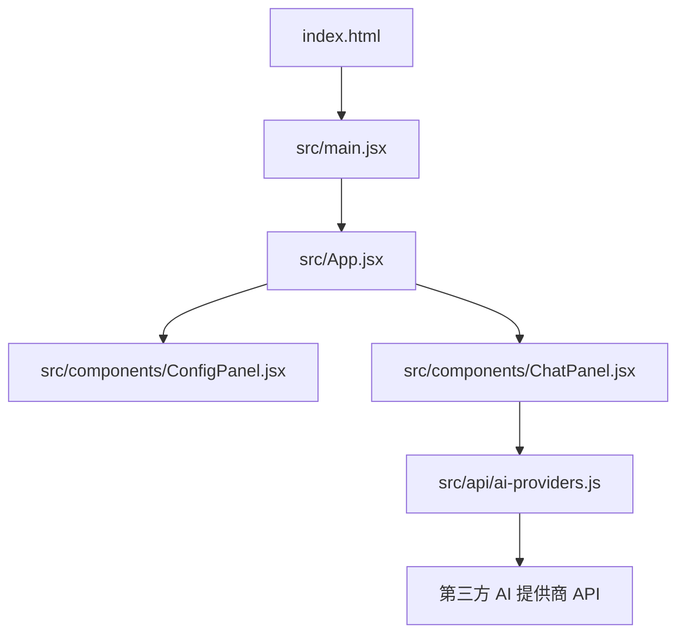
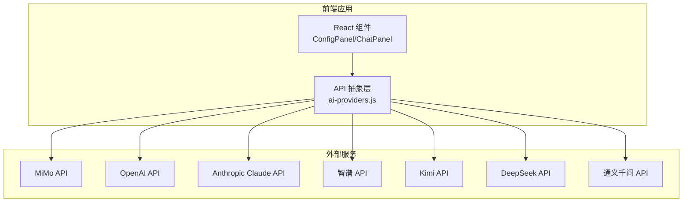
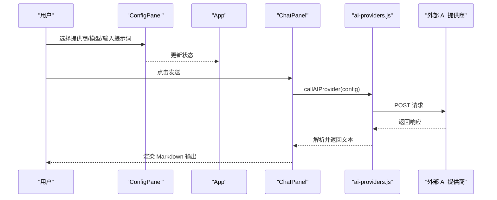
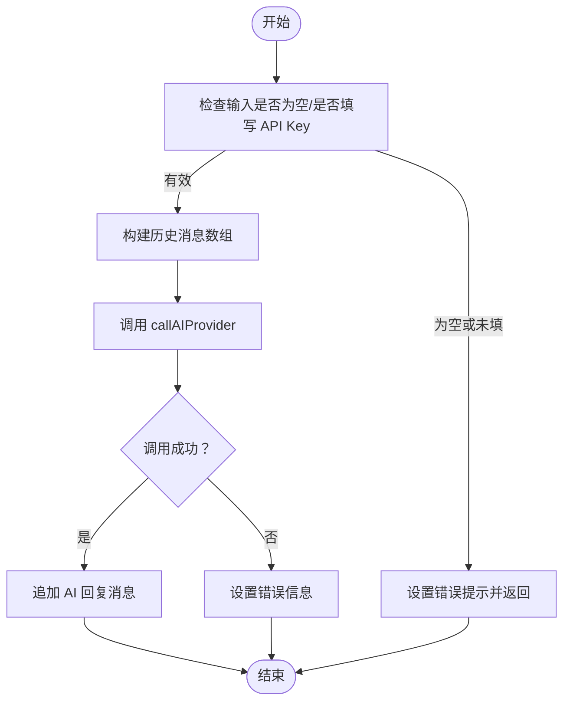
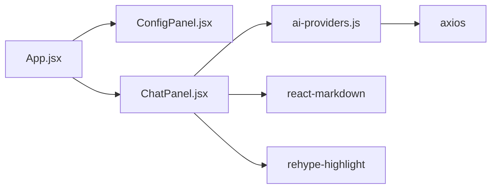

# 部署与运维

<cite>
**本文引用的文件**
- [package.json](file://ai-doc-generator/package.json)
- [vite.config.js](file://ai-doc-generator/vite.config.js)
- [index.html](file://ai-doc-generator/index.html)
- [main.jsx](file://ai-doc-generator/src/main.jsx)
- [App.jsx](file://ai-doc-generator/src/App.jsx)
- [ai-providers.js](file://ai-doc-generator/src/api/ai-providers.js)
- [mimo.js](file://ai-doc-generator/src/api/mimo.js)
- [ChatPanel.jsx](file://ai-doc-generator/src/components/ChatPanel.jsx)
- [ConfigPanel.jsx](file://ai-doc-generator/src/components/ConfigPanel.jsx)
- [index.css](file://ai-doc-generator/src/index.css)
- [README.md](file://ai-doc-generator/README.md)
</cite>

## 目录
1. [简介](#简介)
2. [项目结构](#项目结构)
3. [核心组件](#核心组件)
4. [架构总览](#架构总览)
5. [详细组件分析](#详细组件分析)
6. [依赖关系分析](#依赖关系分析)
7. [性能考虑](#性能考虑)
8. [运维与部署指南](#运维与部署指南)
9. [故障排除指南](#故障排除指南)
10. [结论](#结论)
11. [附录](#附录)

## 简介
本文件面向生产环境的部署与运维，围绕 AI 文档生成器项目提供系统化的构建、打包、静态资源处理、多平台部署（GitHub Pages、Netlify、Vercel）、容器化与 Kubernetes 集群部署、环境变量与 API 密钥安全、性能监控与日志记录最佳实践、故障排除与常见问题解决，以及版本管理与发布流程建议。文档以仓库现有源码为依据，结合实际工程实践给出可操作的步骤与图示。

## 项目结构
该应用采用 React + Vite 的前端单页应用（SPA），通过 Vite 进行开发与构建，核心入口为 HTML 页面与 React 应用根节点，API 层抽象了多家 AI 提供商的统一调用逻辑，组件层负责对话与配置面板的渲染与交互。

图表来源
- [index.html:1-14](file://ai-doc-generator/index.html#L1-L14)
- [main.jsx:1-11](file://ai-doc-generator/src/main.jsx#L1-L11)
- [App.jsx:1-37](file://ai-doc-generator/src/App.jsx#L1-L37)
- [ConfigPanel.jsx:1-156](file://ai-doc-generator/src/components/ConfigPanel.jsx#L1-L156)
- [ChatPanel.jsx:1-278](file://ai-doc-generator/src/components/ChatPanel.jsx#L1-L278)
- [ai-providers.js:1-344](file://ai-doc-generator/src/api/ai-providers.js#L1-L344)

章节来源
- [package.json:1-28](file://ai-doc-generator/package.json#L1-L28)
- [vite.config.js:1-11](file://ai-doc-generator/vite.config.js#L1-L11)
- [index.html:1-14](file://ai-doc-generator/index.html#L1-L14)
- [main.jsx:1-11](file://ai-doc-generator/src/main.jsx#L1-L11)
- [App.jsx:1-37](file://ai-doc-generator/src/App.jsx#L1-L37)
- [ConfigPanel.jsx:1-156](file://ai-doc-generator/src/components/ConfigPanel.jsx#L1-L156)
- [ChatPanel.jsx:1-278](file://ai-doc-generator/src/components/ChatPanel.jsx#L1-L278)
- [ai-providers.js:1-344](file://ai-doc-generator/src/api/ai-providers.js#L1-L344)

## 核心组件
- 应用入口与路由：HTML 页面声明根节点，React 根实例挂载 App 组件。
- 应用主体：App 组合配置面板与对话面板，维护全局状态（API Key、提供商、模型、模板）。
- 配置面板：提供提供商选择、模型选择、API Key 输入、模板选择与提示词预览。
- 对话面板：负责消息渲染（Markdown + 代码高亮）、发送消息、导出 Markdown、错误与加载态展示。
- API 抽象：统一调用多家 AI 提供商，兼容不同请求体与响应格式；提供同步与流式两种调用方式；内置错误映射与校验能力。

章节来源
- [App.jsx:1-37](file://ai-doc-generator/src/App.jsx#L1-L37)
- [ConfigPanel.jsx:1-156](file://ai-doc-generator/src/components/ConfigPanel.jsx#L1-L156)
- [ChatPanel.jsx:1-278](file://ai-doc-generator/src/components/ChatPanel.jsx#L1-L278)
- [ai-providers.js:1-344](file://ai-doc-generator/src/api/ai-providers.js#L1-L344)
- [mimo.js:1-175](file://ai-doc-generator/src/api/mimo.js#L1-L175)

## 架构总览
应用采用前端直连多家 AI 提供商的模式，通过统一的 API 抽象层屏蔽差异。构建阶段由 Vite 完成，生产包输出静态资源，部署于任意静态托管平台。

图表来源
- [ai-providers.js:1-47](file://ai-doc-generator/src/api/ai-providers.js#L1-L47)
- [ai-providers.js:60-181](file://ai-doc-generator/src/api/ai-providers.js#L60-L181)
- [ai-providers.js:190-309](file://ai-doc-generator/src/api/ai-providers.js#L190-L309)

## 详细组件分析

### API 抽象层（ai-providers.js）
- 统一提供商配置与模型列表，支持 MiMo、OpenAI、Claude、智谱、Kimi、DeepSeek、通义千问。
- 同步调用与流式调用两类接口，分别用于一次性响应与实时增量输出。
- 错误映射：对 401/403/404/429/500 等状态进行人性化提示；网络错误与未知错误分支处理。
- 校验能力：提供 API Key 校验与模型列表查询。

图表来源
- [ChatPanel.jsx:13-46](file://ai-doc-generator/src/components/ChatPanel.jsx#L13-L46)
- [ai-providers.js:60-181](file://ai-doc-generator/src/api/ai-providers.js#L60-L181)

章节来源
- [ai-providers.js:1-344](file://ai-doc-generator/src/api/ai-providers.js#L1-L344)

### 对话面板（ChatPanel.jsx）
- 状态管理：消息列表、输入框、加载态、错误信息。
- 交互逻辑：回车发送、Shift+Enter 换行、清空、导出 Markdown。
- 渲染逻辑：用户消息纯文本，AI 消息使用 Markdown + 代码高亮插件渲染。
- 错误与加载：统一错误提示与加载动画。

图表来源
- [ChatPanel.jsx:13-46](file://ai-doc-generator/src/components/ChatPanel.jsx#L13-L46)

章节来源
- [ChatPanel.jsx:1-278](file://ai-doc-generator/src/components/ChatPanel.jsx#L1-L278)

### 配置面板（ConfigPanel.jsx）
- 提供商与模型联动：切换提供商自动选择首个可用模型。
- 模板系统：内置模板与自定义提示词，支持预览。
- API Key 输入：密码输入框，提示对应提供商名称。

章节来源
- [ConfigPanel.jsx:1-156](file://ai-doc-generator/src/components/ConfigPanel.jsx#L1-L156)

### 构建与打包（Vite）
- 开发服务器：端口与自动打开浏览器。
- 生产构建：通过 npm scripts 触发 Vite 构建，输出静态资源。
- 依赖与脚本：React、Vite、Axios、react-markdown、highlight.js 等。

章节来源
- [vite.config.js:1-11](file://ai-doc-generator/vite.config.js#L1-L11)
- [package.json:1-28](file://ai-doc-generator/package.json#L1-L28)

## 依赖关系分析
- 组件耦合：App 作为状态容器，ConfigPanel/ChatPanel 与其松耦合，通过 props 传递状态与回调。
- API 层解耦：ai-providers.js 将 UI 与外部服务解耦，便于扩展新的提供商。
- 第三方依赖：Axios 用于同步请求，react-markdown + rehype-highlight 用于渲染与高亮。

图表来源
- [App.jsx:1-37](file://ai-doc-generator/src/App.jsx#L1-L37)
- [ConfigPanel.jsx:1-156](file://ai-doc-generator/src/components/ConfigPanel.jsx#L1-L156)
- [ChatPanel.jsx:1-278](file://ai-doc-generator/src/components/ChatPanel.jsx#L1-L278)
- [ai-providers.js:1-3](file://ai-doc-generator/src/api/ai-providers.js#L1-L3)
- [index.css:1-531](file://ai-doc-generator/src/index.css#L1-L531)

章节来源
- [App.jsx:1-37](file://ai-doc-generator/src/App.jsx#L1-L37)
- [ChatPanel.jsx:1-278](file://ai-doc-generator/src/components/ChatPanel.jsx#L1-L278)
- [ai-providers.js:1-344](file://ai-doc-generator/src/api/ai-providers.js#L1-L344)
- [index.css:1-531](file://ai-doc-generator/src/index.css#L1-L531)

## 性能考虑
- 构建优化
  - Vite 默认启用模块热替换与按需编译，生产构建时建议开启压缩与分包策略（可通过 Vite 插件扩展）。
  - 代码分割：将第三方库与业务代码分离，减少首屏体积。
  - 静态资源缓存：合理设置缓存头，利用浏览器缓存与 CDN 加速。
- 运行时优化
  - 对话渲染：Markdown 渲染与代码高亮在大文本场景下可能成为瓶颈，建议对长文本进行分段渲染或虚拟滚动。
  - 请求超时与重试：统一设置超时时间，对 429/5xx 场景进行指数退避重试。
  - 流式输出：优先使用流式接口以改善用户体验，避免长时间等待。
- 资源与样式
  - 字体与背景：项目引入了外部字体与背景网格动画，建议在生产环境使用 CDN 或内联关键 CSS，减少阻塞。
  - 代码高亮主题：当前使用 highlight.js 的样式文件，建议在构建时提取关键样式，避免全量引入。

章节来源
- [ai-providers.js:127-130](file://ai-doc-generator/src/api/ai-providers.js#L127-L130)
- [ChatPanel.jsx:165-169](file://ai-doc-generator/src/components/ChatPanel.jsx#L165-L169)
- [index.css:1-531](file://ai-doc-generator/src/index.css#L1-L531)

## 运维与部署指南

### 生产环境构建与静态资源处理
- 本地构建
  - 使用 npm scripts 执行生产构建，输出目录为 Vite 默认的 dist。
  - 构建产物包含 HTML、JS、CSS、媒体资源等静态文件。
- 静态资源处理
  - 图片与字体：确保路径正确，必要时使用相对路径或 Vite 的 public 目录。
  - 资源指纹：建议在生产环境启用文件名哈希，配合 CDN 缓存策略。
  - 压缩与合并：启用 JS/CSS 压缩与 HTML 压缩，减少传输体积。

章节来源
- [package.json:6-10](file://ai-doc-generator/package.json#L6-L10)
- [vite.config.js:1-11](file://ai-doc-generator/vite.config.js#L1-L11)

### GitHub Pages 部署
- 适用场景：个人或开源项目，无需后端，仅需静态托管。
- 配置要点
  - 设置仓库 Pages 源为构建产物目录（dist）。
  - 若项目位于子目录，需在构建时设置 base 路径（例如子路径部署）。
  - 在 CI 中执行构建并推送 dist 到 gh-pages 分支或直接推送到主分支的 docs 目录。
- 注意事项
  - SPA 路由：确保所有路由都指向 index.html，避免刷新 404。
  - API 跨域：由于前端直连多家提供商，需确保跨域策略允许浏览器端访问。

章节来源
- [README.md:1-179](file://ai-doc-generator/README.md#L1-L179)

### Netlify 部署
- 适用场景：快速上线，支持 CI/CD、域名绑定、SSL、函数代理。
- 配置要点
  - 构建命令：npm run build；发布目录：dist。
  - 环境变量：在 Netlify 控制台配置 API Key（加密存储）。
  - 净化规则：配置重写规则，使 SPA 路由指向 index.html。
- API 密钥管理
  - 使用 Netlify 环境变量注入，前端通过 Vite 的 VITE_ 前缀读取。

章节来源
- [README.md:140-147](file://ai-doc-generator/README.md#L140-L147)
- [package.json:6-10](file://ai-doc-generator/package.json#L6-L10)

### Vercel 部署
- 适用场景：Next.js/Vercel 生态友好，支持边缘网络与 ISR。
- 配置要点
  - 构建命令：npm run build；输出目录：dist。
  - 环境变量：在 Vercel 控制台配置，前端通过 Vercel 的环境变量机制读取。
  - SPA 路由：配置重写规则，将所有非静态资源请求重定向到 index.html。
- API 密钥管理
  - 使用 Vercel 环境变量，避免硬编码在前端。

章节来源
- [README.md:140-147](file://ai-doc-generator/README.md#L140-L147)
- [package.json:6-10](file://ai-doc-generator/package.json#L6-L10)

### Docker 容器化部署
- Dockerfile 建议
  - 基础镜像：使用 Nginx 或轻量镜像。
  - 构建阶段：安装 Node.js，执行 npm ci 与 npm run build。
  - 运行阶段：复制 dist 目录至 Nginx 静态目录，配置站点与反向代理（若需要）。
- docker-compose
  - 单容器运行：挂载 dist 目录或直接使用构建产物镜像。
  - 多容器：结合反向代理或边缘网关，实现负载均衡与 SSL。
- 环境变量
  - 通过 Docker 环境变量注入 API Key，避免在镜像中硬编码。

章节来源
- [package.json:6-10](file://ai-doc-generator/package.json#L6-L10)

### Kubernetes 集群部署
- 资源清单
  - Deployment：副本数、探针、资源限制与请求。
  - Service：ClusterIP/LoadBalancer，暴露静态站点。
  - Ingress：TLS 证书、路径转发、SPA 路由重写。
- 配置管理
  - ConfigMap：存放非敏感配置。
  - Secret：存放 API Key 等敏感信息。
- 滚动更新与回滚
  - 使用滚动更新策略，结合就绪/存活探针保障平滑升级。
- 日志与监控
  - 容器标准输出采集，结合日志聚合系统。
  - 指标采集：CPU/内存/请求延迟/错误率。

章节来源
- [package.json:6-10](file://ai-doc-generator/package.json#L6-L10)

### 环境变量与 API 密钥安全管理
- 前端注入
  - 使用 Vite 的 VITE_ 前缀注入环境变量，构建时替换。
  - 不要在前端代码中硬编码 API Key。
- 平台注入
  - GitHub Pages：使用仓库 Secrets 注入，CI 构建时注入。
  - Netlify/Vercel：在控制台配置环境变量，构建时注入。
- 最佳实践
  - 最小权限原则：为不同提供商分配最小必要的 API Key。
  - 定期轮换：建立轮换策略，避免长期不变。
  - 审计与告警：记录 API Key 使用情况，异常使用及时告警。

章节来源
- [README.md:140-147](file://ai-doc-generator/README.md#L140-L147)
- [ai-providers.js:60-181](file://ai-doc-generator/src/api/ai-providers.js#L60-L181)

### 性能监控与日志记录最佳实践
- 前端监控
  - 错误上报：捕获前端异常与网络错误，上报到日志系统。
  - 性能指标：记录首屏时间、交互延迟、API 响应时间。
- 后端监控（若存在）
  - API 调用链路追踪：为每条请求生成 Trace ID，串联前端与后端日志。
  - 指标采集：QPS、错误率、P95/P99 延迟。
- 日志记录
  - 结构化日志：统一字段（时间戳、级别、模块、消息、上下文）。
  - 敏感信息脱敏：避免记录 API Key、用户隐私数据。
  - 日志轮转与保留策略：控制磁盘占用与合规要求。

章节来源
- [ai-providers.js:146-180](file://ai-doc-generator/src/api/ai-providers.js#L146-L180)

### 版本管理与发布流程
- 版本号
  - 使用语义化版本（MAJOR.MINOR.PATCH），变更记录在 CHANGELOG 中。
- 分支策略
  - develop -> release -> main；hotfix 分支用于紧急修复。
- 发布流程
  - CI 触发：提交合并到 main 后自动构建并发布到目标平台。
  - 产物校验：校验构建产物完整性与关键资源存在。
  - 回滚策略：保留最近 N 个版本，支持一键回滚。

章节来源
- [package.json:1-28](file://ai-doc-generator/package.json#L1-L28)

## 故障排除指南
- API Key 无效/过期
  - 现象：出现 401 错误提示。
  - 处理：检查提供商控制台状态、额度与有效期；重新生成并更新环境变量。
- 请求过于频繁
  - 现象：出现 429 错误提示。
  - 处理：降低请求频率，增加退避重试；评估提供商配额与付费等级。
- 网络错误
  - 现象：网络错误提示。
  - 处理：检查网络连通性、DNS、防火墙；确认提供商域名可达。
- SPA 路由 404
  - 现象：刷新页面或直接访问深层路由返回 404。
  - 处理：配置静态托管的重写规则，将所有非静态资源重定向到 index.html。
- 构建失败
  - 现象：构建报错或产物缺失。
  - 处理：检查 Node 版本、依赖安装、Vite 配置与环境变量；清理缓存后重试。
- Markdown 渲染异常
  - 现象：代码块高亮缺失或渲染错乱。
  - 处理：确认 rehype-highlight 版本与样式文件加载；检查代码块格式。

章节来源
- [ai-providers.js:146-180](file://ai-doc-generator/src/api/ai-providers.js#L146-L180)
- [ChatPanel.jsx:181-185](file://ai-doc-generator/src/components/ChatPanel.jsx#L181-L185)
- [README.md:140-147](file://ai-doc-generator/README.md#L140-L147)

## 结论
本项目以 React + Vite 构建，前端直连多家 AI 提供商，具备良好的可扩展性与部署灵活性。生产部署可选择静态托管平台或容器/Kubernetes 集群，结合环境变量与密钥管理最佳实践，确保安全性与稳定性。通过合理的构建优化、监控与日志体系，以及规范的版本与发布流程，可实现高效可靠的交付与运维。

## 附录
- 关键文件与职责
  - package.json：定义脚本与依赖。
  - vite.config.js：开发服务器与插件配置。
  - index.html：应用入口页面。
  - main.jsx/App.jsx：应用根节点与状态容器。
  - ConfigPanel.jsx/ChatPanel.jsx：配置与对话交互。
  - ai-providers.js：统一 API 抽象与错误处理。
  - index.css：主题与样式。

章节来源
- [package.json:1-28](file://ai-doc-generator/package.json#L1-L28)
- [vite.config.js:1-11](file://ai-doc-generator/vite.config.js#L1-L11)
- [index.html:1-14](file://ai-doc-generator/index.html#L1-L14)
- [main.jsx:1-11](file://ai-doc-generator/src/main.jsx#L1-L11)
- [App.jsx:1-37](file://ai-doc-generator/src/App.jsx#L1-L37)
- [ConfigPanel.jsx:1-156](file://ai-doc-generator/src/components/ConfigPanel.jsx#L1-L156)
- [ChatPanel.jsx:1-278](file://ai-doc-generator/src/components/ChatPanel.jsx#L1-L278)
- [ai-providers.js:1-344](file://ai-doc-generator/src/api/ai-providers.js#L1-L344)
- [index.css:1-531](file://ai-doc-generator/src/index.css#L1-L531)