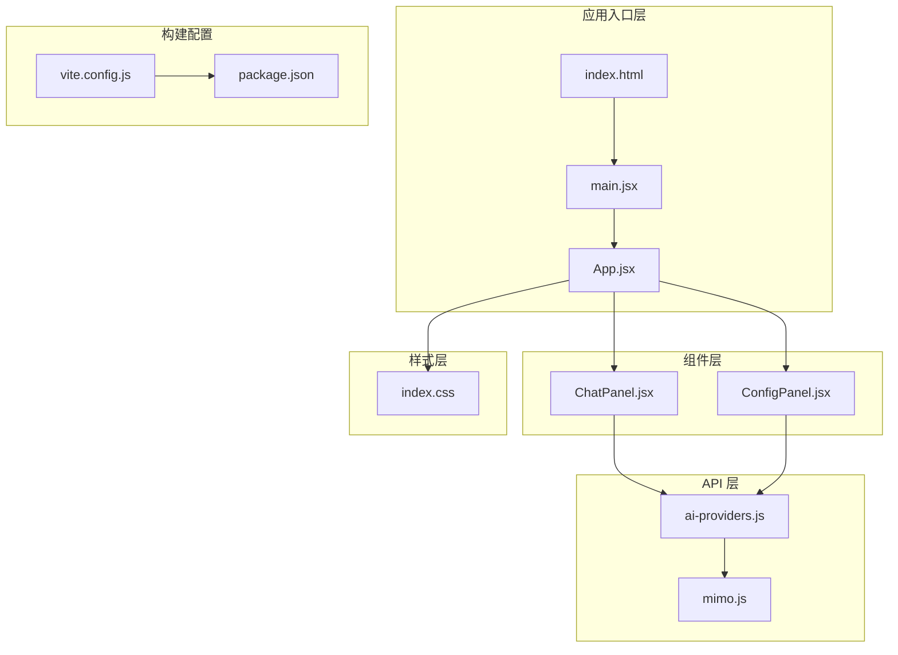
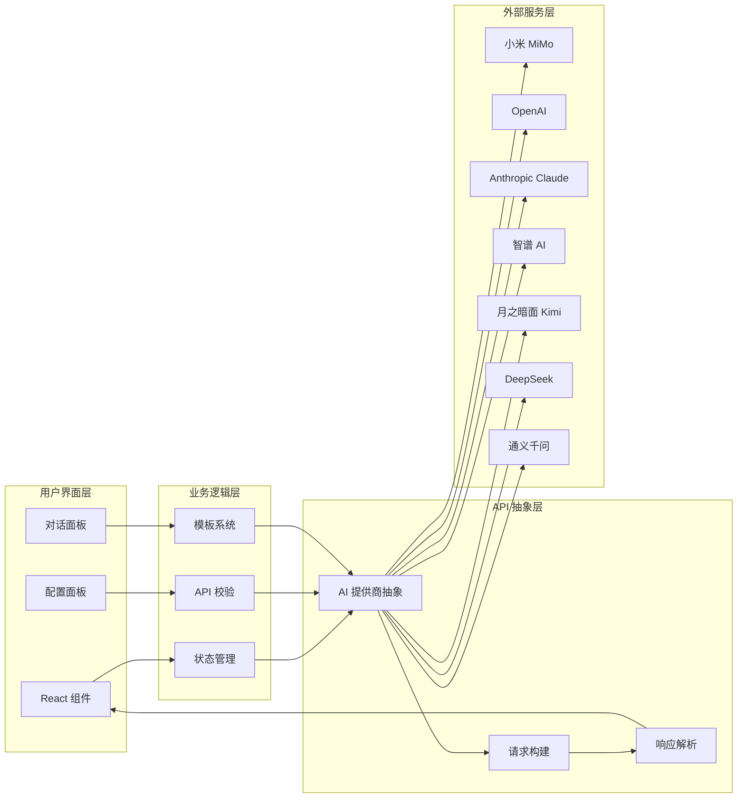
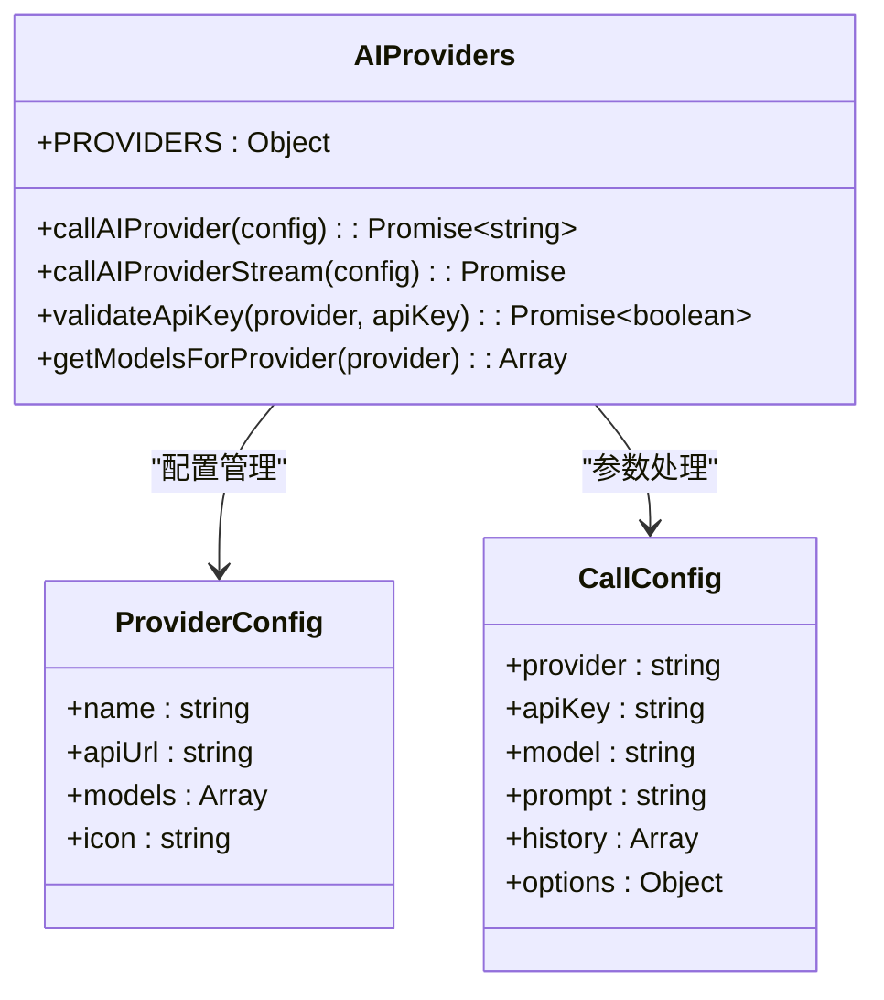
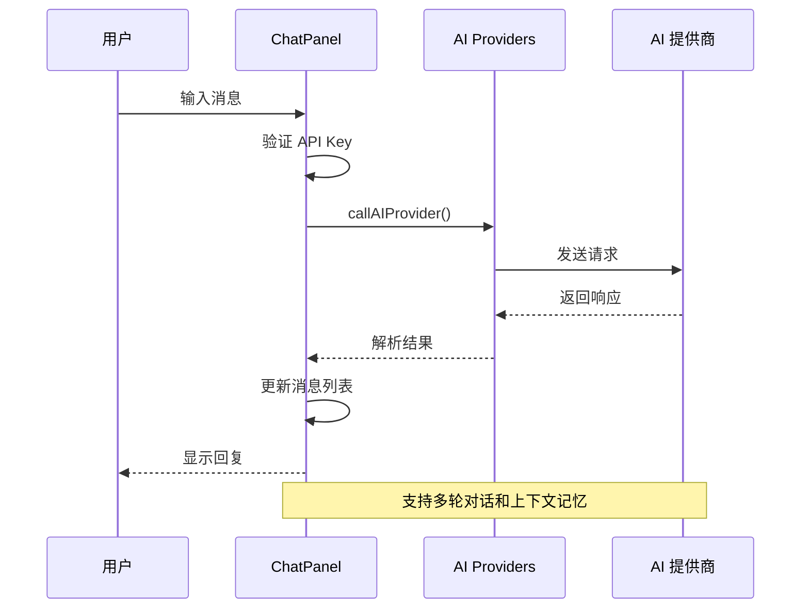
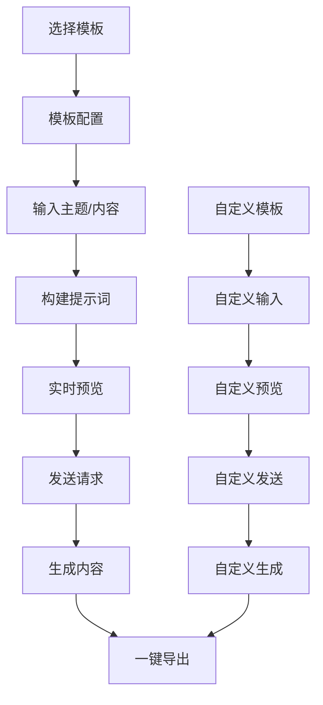

# 项目概述

<cite>
**本文档引用的文件**
- [package.json](file://ai-doc-generator/package.json)
- [README.md](file://ai-doc-generator/README.md)
- [App.jsx](file://ai-doc-generator/src/App.jsx)
- [main.jsx](file://ai-doc-generator/src/main.jsx)
- [ai-providers.js](file://ai-doc-generator/src/api/ai-providers.js)
- [mimo.js](file://ai-doc-generator/src/api/mimo.js)
- [ChatPanel.jsx](file://ai-doc-generator/src/components/ChatPanel.jsx)
- [ConfigPanel.jsx](file://ai-doc-generator/src/components/ConfigPanel.jsx)
- [vite.config.js](file://ai-doc-generator/vite.config.js)
- [index.css](file://ai-doc-generator/src/index.css)
- [index.html](file://ai-doc-generator/index.html)
</cite>

## 目录
1. [简介](#简介)
2. [项目结构](#项目结构)
3. [核心组件](#核心组件)
4. [架构总览](#架构总览)
5. [详细组件分析](#详细组件分析)
6. [依赖关系分析](#依赖关系分析)
7. [性能考虑](#性能考虑)
8. [故障排除指南](#故障排除指南)
9. [结论](#结论)

## 简介
AI 文档生成器是一个基于 React 19 + Vite 5 的现代化前端应用，专注于多模型 AI 文档生成与代码辅助。该项目集成了 7 种主流 AI 提供商（小米 MiMo、OpenAI、Anthropic Claude、智谱 AI、月之暗面 Kimi、DeepSeek、阿里云通义千问），提供智能对话、实时 Markdown 渲染、代码高亮、模板系统和一键导出等功能。项目采用模块化架构设计，支持多轮对话、上下文记忆和灵活的模板定制，适用于技术文档生成、API 文档编写、代码生成和教学指导等多种场景。

## 项目结构
项目采用清晰的分层架构，主要分为以下几个层次：



**图表来源**
- [main.jsx:1-11](file://ai-doc-generator/src/main.jsx#L1-L11)
- [App.jsx:1-37](file://ai-doc-generator/src/App.jsx#L1-L37)
- [ConfigPanel.jsx:1-156](file://ai-doc-generator/src/components/ConfigPanel.jsx#L1-L156)
- [ChatPanel.jsx:1-278](file://ai-doc-generator/src/components/ChatPanel.jsx#L1-L278)
- [ai-providers.js:1-344](file://ai-doc-generator/src/api/ai-providers.js#L1-L344)

**章节来源**
- [package.json:1-28](file://ai-doc-generator/package.json#L1-L28)
- [README.md:121-138](file://ai-doc-generator/README.md#L121-L138)

## 核心组件
项目的核心组件围绕三个主要模块构建：

### 应用主组件
App.jsx 作为根组件，负责管理全局状态（API Key、模板选择、提供商和模型配置），并协调配置面板和对话面板的交互。

### 配置面板组件
ConfigPanel.jsx 提供了完整的 AI 配置界面，支持：
- 多提供商选择（7 种 AI 提供商）
- 模型选择和切换
- 模板系统（技术文档、代码生成、API 文档、教程指南、代码审查、自定义）
- 实时提示词预览
- API Key 管理

### 对话面板组件
ChatPanel.jsx 实现了完整的对话交互功能：
- 实时 Markdown 渲染
- 代码语法高亮
- 多轮对话支持
- 加载状态和错误处理
- 一键导出功能

**章节来源**
- [App.jsx:6-34](file://ai-doc-generator/src/App.jsx#L6-L34)
- [ConfigPanel.jsx:13-152](file://ai-doc-generator/src/components/ConfigPanel.jsx#L13-L152)
- [ChatPanel.jsx:7-275](file://ai-doc-generator/src/components/ChatPanel.jsx#L7-L275)

## 架构总览
项目采用前后端分离的架构模式，前端负责用户界面和交互逻辑，通过统一的 API 抽象层与多个 AI 提供商进行通信。



**图表来源**
- [ai-providers.js:4-47](file://ai-doc-generator/src/api/ai-providers.js#L4-L47)
- [ai-providers.js:60-181](file://ai-doc-generator/src/api/ai-providers.js#L60-L181)
- [ConfigPanel.jsx:13-152](file://ai-doc-generator/src/components/ConfigPanel.jsx#L13-L152)
- [ChatPanel.jsx:7-275](file://ai-doc-generator/src/components/ChatPanel.jsx#L7-L275)

## 详细组件分析

### AI 提供商抽象层
AI 提供商抽象层是整个系统的核心，提供了统一的接口来处理不同 AI 提供商的差异。



**图表来源**
- [ai-providers.js:4-47](file://ai-doc-generator/src/api/ai-providers.js#L4-L47)
- [ai-providers.js:60-181](file://ai-doc-generator/src/api/ai-providers.js#L60-L181)

该抽象层支持以下特性：
- **统一接口**：所有 AI 提供商通过相同的函数签名进行调用
- **差异化处理**：针对 Anthropic Claude 等特殊提供商进行专门的请求格式处理
- **错误处理**：标准化的错误响应和用户友好的错误信息
- **流式支持**：支持实时数据流的处理和展示

**章节来源**
- [ai-providers.js:1-344](file://ai-doc-generator/src/api/ai-providers.js#L1-L344)

### 对话交互流程
系统实现了完整的多轮对话功能，支持上下文记忆和实时反馈。



**图表来源**
- [ChatPanel.jsx:13-46](file://ai-doc-generator/src/components/ChatPanel.jsx#L13-L46)
- [ai-providers.js:60-181](file://ai-doc-generator/src/api/ai-providers.js#L60-L181)

**章节来源**
- [ChatPanel.jsx:1-278](file://ai-doc-generator/src/components/ChatPanel.jsx#L1-L278)

### 模板系统架构
模板系统提供了预定义的文档生成模板，支持自定义提示词。



**图表来源**
- [ConfigPanel.jsx:4-11](file://ai-doc-generator/src/components/ConfigPanel.jsx#L4-L11)
- [ConfigPanel.jsx:28-33](file://ai-doc-generator/src/components/ConfigPanel.jsx#L28-L33)

**章节来源**
- [ConfigPanel.jsx:1-156](file://ai-doc-generator/src/components/ConfigPanel.jsx#L1-L156)

## 依赖关系分析
项目采用了现代化的前端技术栈，具有良好的可维护性和扩展性。

```mermaid
graph TB
subgraph "运行时依赖"
REACT[react@^19.2.5]
REACTDOM[react-dom@^19.2.5]
AXIOS[axios@^1.15.2]
MARKDOWN[react-markdown@^10.1.0]
HIGHLIGHT[highlight.js@^11.11.1]
REHYPE[rehype-highlight@^7.0.2]
LUCIDE[lucide-react@^1.14.0]
end
subgraph "开发依赖"
VITE[vite@^5.4.11]
VITEPLUGIN[@vitejs/plugin-react@^4.3.4]
end
subgraph "应用层"
APP[App.jsx]
CONFIG[ConfigPanel.jsx]
CHAT[ChatPanel.jsx]
API[ai-providers.js]
end
REACT --> APP
REACTDOM --> APP
AXIOS --> API
MARKDOWN --> CHAT
HIGHLIGHT --> CHAT
REHYPE --> CHAT
VITEPLUGIN --> VITE
APP --> CONFIG
APP --> CHAT
CHAT --> API
CONFIG --> API
```

**图表来源**
- [package.json:14-26](file://ai-doc-generator/package.json#L14-L26)

**章节来源**
- [package.json:1-28](file://ai-doc-generator/package.json#L1-L28)

## 性能考虑
项目在性能方面采用了多项优化策略：

### 前端性能优化
- **React 19 新特性**：利用最新的 React 性能改进，包括并发特性和优化的渲染算法
- **懒加载策略**：组件按需加载，减少初始包体积
- **虚拟滚动**：对于大量消息的场景，可以考虑实现虚拟滚动以提升性能

### 网络性能优化
- **请求超时控制**：设置合理的超时时间（60秒）避免长时间等待
- **错误重试机制**：对临时性错误提供重试机会
- **流式响应处理**：支持实时数据流，提升用户体验

### 样式性能优化
- **CSS 变量**：使用 CSS 变量减少重复定义，便于主题切换
- **动画优化**：使用 GPU 加速的 CSS 动画效果
- **响应式设计**：适配不同屏幕尺寸，提升移动端体验

## 故障排除指南
项目提供了完善的错误处理机制和调试工具：

### 常见问题及解决方案
1. **API Key 无效**
   - 检查 API Key 格式是否正确
   - 确认账户状态正常
   - 验证网络连接稳定性

2. **请求超时**
   - 检查网络连接状态
   - 调整超时时间设置
   - 降低模型复杂度

3. **渲染问题**
   - 确认 Markdown 语法正确
   - 检查代码块语言标识
   - 验证 highlight.js 样式加载

### 调试工具
- **浏览器开发者工具**：监控网络请求和响应
- **React DevTools**：检查组件状态和性能
- **Vite 开发服务器**：热重载和错误堆栈追踪

**章节来源**
- [ai-providers.js:146-180](file://ai-doc-generator/src/api/ai-providers.js#L146-L180)
- [ChatPanel.jsx:181-185](file://ai-doc-generator/src/components/ChatPanel.jsx#L181-L185)

## 结论
AI 文档生成器项目展现了现代前端开发的最佳实践，通过模块化的架构设计、统一的 API 抽象和丰富的功能特性，为用户提供了强大的 AI 文档生成能力。项目的技术选型合理，具有良好的扩展性和维护性，能够满足不同场景下的文档生成需求。

### 项目优势
- **多模型支持**：集成 7 种主流 AI 提供商，提供灵活的选择空间
- **模板系统**：预设多种专业模板，支持自定义扩展
- **实时交互**：支持多轮对话和实时渲染，提升用户体验
- **代码高亮**：内置语法高亮功能，改善代码可读性
- **一键导出**：支持 Markdown 格式导出，便于分享和存档

### 适用场景
- **技术文档生成**：自动生成完整的技术文档和 API 接口说明
- **代码辅助**：提供代码生成、审查和优化建议
- **教学培训**：创建教程指南和实践案例
- **产品文档**：快速生成产品介绍和使用说明

### 目标用户群体
- **软件开发者**：需要快速生成技术文档和代码示例
- **技术写作人员**：需要高效的文档生成工具
- **产品经理**：需要产品说明和使用指南
- **教育工作者**：需要教学材料和教程内容